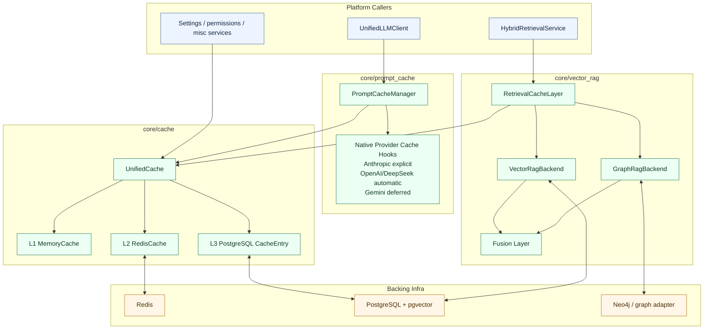

# Caching Architecture

## Decision

CyberSecSuite uses **three distinct caching concerns** that must stay conceptually separate:

1. **`core/cache/`** — platform-wide KV cache facade
2. **`core/prompt_cache/`** — LLM prompt/response caching
3. **`core/vector_rag/` retrieval cache** — query/result caching built on top of `core/cache/`

They may share Redis and PostgreSQL infrastructure, but they are **not the same subsystem** and must not collapse into one generic “cache blob”.

## Why Separate Them

- `core/cache/` solves generic cache storage, TTLs, namespaces, and invalidation
- `core/prompt_cache/` solves provider-specific LLM request caching and native-provider cache integration
- retrieval caching solves semantic/graph query acceleration, embedding reuse, and provenance-aware invalidation

This separation prevents prompt-caching rules from leaking into retrieval, and prevents retrieval invalidation rules from polluting generic app caches.

## Architecture Graph

## 1. `core/cache/` — Platform KV Cache

### Role

`core/cache/` is the shared cache facade for non-provider-specific application caching.

### Planned Layers

- **L1 MemoryCache**: in-process hot cache with TTL eviction
- **L2 RedisCache**: shared cross-process hot cache via `redis.asyncio`
- **L3 PostgreSQL CacheEntry**: durable / auditable cache storage

### Responsibilities

- namespaced keys
- TTL enforcement
- read-through / write-through orchestration
- invalidation APIs
- cache metrics / stats
- cross-service reuse for settings, permissions, retrieval, and similar app concerns

### Non-Responsibilities

- provider-native prompt cache control markers
- semantic retrieval ranking logic
- graph query planning

## 2. `core/prompt_cache/` — LLM Prompt Caching

### Role

`core/prompt_cache/` sits in front of provider calls and decides whether to:
- serve a cached response
- inject native provider cache hints
- observe native cache usage stats
- store the resulting response for later reuse

### Planned Tiers

- **Tier 1 Redis exact-match** for all supported providers
- **Tier 2 provider-native caching**
  - Anthropic explicit cache breakpoints
  - OpenAI / DeepSeek automatic native caching stats
  - Gemini deferred for now

### Key Todos

- `cache-caching-capability-enum`
- `cache-prompt-cache-manager`
- `cache-redis-exact-match`
- `cache-redis-streaming-buffer`
- `cache-anthropic-breakpoint-injector`
- `cache-automatic-native-tracking`
- `cache-cost-savings-tracker`
- `cache-metrics-openobserve`

### Important Boundary

Prompt caching is about **LLM request/response reuse**, not general application object caching.

## 3. Retrieval Cache on `core/vector_rag/`

### Role

Retrieval caching accelerates:
- vector search results
- graph traversal results
- hybrid fused results
- embedding reuse
- route hints for `auto` mode

This cache is implemented through `core/cache/`, but the invalidation and keying policy belongs to retrieval.

### Planned Todo

- `rag-cache-layer`

### Cache Domains

- `retrieval:embedding:*`
- `retrieval:vector:*`
- `retrieval:graph:*`
- `retrieval:hybrid:*`
- `retrieval:route:*`

Exact key format can change, but the namespaces should stay explicit and separate.

### Retrieval Cache Rules

- cached results must preserve provenance
- hybrid cache entries must record contributing backends
- cache bypass must be possible for freshness-sensitive calls
- invalidation must happen on ingest, update, delete, re-embed, and graph mutation

## Invalidation Model

### Generic KV Cache

Use namespace + scope invalidation:
- by subsystem
- by entity
- by organization / project / session where applicable

### Prompt Cache

Primarily TTL-driven, plus model/provider/config key changes.

Invalidate prompt-cache entries when:
- prompt payload changes
- model changes
- cache-affecting provider params change

### Retrieval Cache

Invalidate on:
- document ingest/update/delete
- chunk re-splitting
- embedding regeneration
- graph entity/relationship/community changes
- retrieval-mode routing policy changes that affect `auto`

## TTL Strategy

Use different TTL profiles by cache purpose:

- **L1 memory**: shortest TTL, highest churn
- **Redis**: medium TTL, cross-worker hot cache
- **PostgreSQL cache entries**: longest TTL or explicit retention for audit/debug

Suggested retrieval defaults:
- route hints: short TTL
- embedding reuse: medium/long TTL
- vector/graph result sets: medium TTL
- hybrid fused results: short/medium TTL because invalidation surface is larger

## Observability

Every cache layer should expose:
- hit / miss
- backend used
- lookup latency
- write latency
- invalidation count
- approximate savings where meaningful

Prompt caching additionally tracks:
- native cache read/write tokens
- estimated USD savings

Retrieval caching additionally tracks:
- backend provenance (`vector`, `graph`, `hybrid`)
- cache hit by retrieval mode
- stale-bypass / forced-refresh events

## System Integration

- `modules/triage/` uses `core/prompt_cache/` for repeated local-model prompt/response reuse; it should not store classification outputs in retrieval cache namespaces.
- `core/vector_rag/` uses retrieval caching through `core/cache/` only; it must not bypass cache policy with ad-hoc Redis keys.
- `core/memory/` remains the source of truth for session state; caches accelerate access but do not replace memory persistence.
- `modules/graphs/` and `modules/workflows/` keep graph snapshots and workflow state in their own persistence models; if they later need hot caching, they should consume `core/cache/` rather than invent a fourth cache subsystem.

See [intelligence-retrieval-graph.md](./intelligence-retrieval-graph.md) for how cache roles fit into the wider runtime.

## Phase Mapping

- **Phase 3**: `cache-move-to-core` completed the move to `core/cache/`
- **Phase 11**: prompt caching architecture (`core/prompt_cache/`)
- **Phase 20**: retrieval caching on top of `core/cache/` (`rag-cache-layer`)

## Operational Rules

- Do not merge `core/prompt_cache/` into `core/cache/`
- Do not let retrieval caching invent its own storage layer outside `core/cache/`
- Keep Redis shared, but keep namespaces and invalidation policies separate
- Treat caching as part of system behavior, not a late optimization pass
