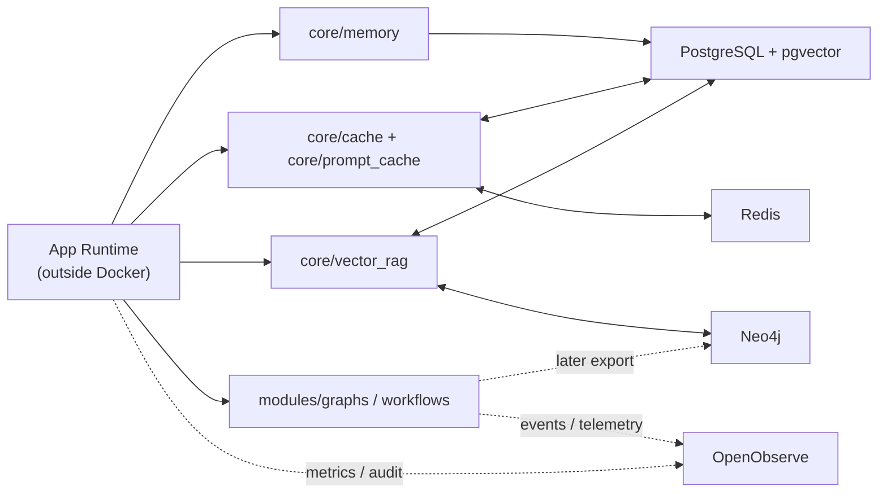

# Database Architecture

## Overview

`docker-compose.yml` currently runs the platform's **storage and observability infrastructure only**. The ASGI app, frontend dev server, and Ollama run outside Docker.

## Storage Map

| Service | Role | Port(s) | Persistence | Primary Consumers |
|---------|------|---------|-------------|-------------------|
| `cybersec-postgres` | Primary relational database + pgvector home + durable cache tier | `5432` | `pg_data`, `pg_socket` | core models, memory, vector retrieval, cache L3 |
| `cybersec-redis` | Shared hot cache / coordination store | `6379` | `redis_data`, `redis_socket` | `core/cache`, prompt cache, session state, workers |
| `cybersec-neo4j` | Graph database for GraphRAG and future graph projections | `7474`, `7687` | `neo_data`, `neo_logs`, `neo_import`, `neo_plugins` | `core/vector_rag`, future workflow graph exports |
| `cybersec-openobserve` | Telemetry, audit, and time-series observability store | `5080` | `oo_data` | events, metrics, cost telemetry, dashboards |

## Architecture Graph

## Boundaries

- **PostgreSQL** is the main system of record for transactional data and vector-backed retrieval.
- **Redis** accelerates runtime behavior; it does not replace durable memory or relational state.
- **Neo4j** is reserved for graph retrieval and later graph projections. It is not the primary source of truth for workflow execution state.
- **OpenObserve** is observability storage only, not application state storage.

## Compose Reality

- Compose is **infra-only** right now.
- App runtime depends on these services over the internal `cybersec` network.
- Neo4j is now a first-class infra service, which matches the GraphRAG plan.
