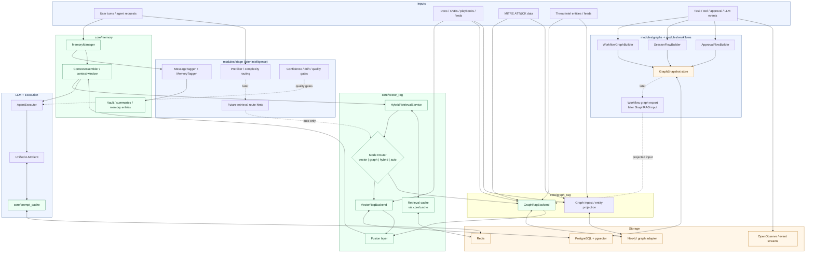

# Intelligence, Retrieval & Workflow Graph Architecture

## Decision

CyberSecSuite will treat **local intelligence, memory, hybrid retrieval, and workflow graphs** as one coordinated architecture with clear ownership boundaries.

- `src/css/core/memory/` owns conversation turns, summaries, session state, canvas, and vault persistence
- `src/css/modules/triage/` owns lightweight local intelligence: tagging, complexity/routing, confidence, and future retrieval hints
- `src/css/core/vector_rag/` owns vector retrieval plus hybrid routing, fusion, and context handoff
- `src/css/core/graph_rag/` owns graph ingestion, graph queries, and GraphRAG retrieval
- `src/css/modules/graphs/` owns workflow/session/approval graph building, snapshots, and live graph APIs
- `src/css/modules/workflows/` owns executable workflow definitions and graph-backed workflow authoring later
- `src/css/core/cache/` and `src/css/core/prompt_cache/` provide cache infrastructure, not business logic

## Core Principles

- Keep **two graph domains** separate:
  - **knowledge graph** for GraphRAG retrieval
  - **operational workflow graph** for workflow execution, approvals, and live visualization
- `auto` retrieval starts with simple policy logic; Phase 21 intelligence may later supply route hints.
- `core/memory` is the handoff point between conversation history and retrieval.
- Workflow/session graphs may later be **projected** into GraphRAG, but GraphRAG must not depend on live UI graph builders.
- Keep cache responsibilities split:
  - `core/cache/` for generic KV + retrieval caching
  - `core/prompt_cache/` for LLM prompt/response reuse

## Architecture Graph

## End-to-End Runtime Loop

1. A user turn is stored in `core/memory`.
2. Phase 21 intelligence can tag the turn, score confidence, and later provide route hints.
3. Stable intelligence outputs can also emit extracted entities, ATT&CK hints, and confidence-scored relationships into the graph ingest path.
4. `ContextAssembler` asks `core/vector_rag` for supporting context.
5. `HybridRetrievalService` chooses `vector`, `graph`, `hybrid`, or `auto`.
6. Results are fused, deduplicated, and returned to the agent context.
7. The agent calls the LLM through `UnifiedLLMClient`, with prompt caching handled separately.
8. Execution events feed workflow/session/approval graph builders for live and historical graph views.

## Boundary Rules

- `modules/triage/` does not own retrieval or graph persistence.
- `core/vector_rag/` does not own workflow authoring, graph persistence, or graph UI.
- `core/graph_rag/` owns graph retrieval internals, not workflow authoring or graph UI.
- `modules/graphs/` does not decide retrieval mode.
- `modules/workflows/` owns executable DAG logic; `modules/graphs/` owns rendering/snapshots.
- Workflow graphs may enrich GraphRAG only through explicit projection/export.
- MITRE and threat-intel remain canonically owned by their domain modules; graph ingest is a projection layer.
- Only stable intelligence outputs belong in graph ingest; ephemeral routing or quality-gate state does not.

## Phase Mapping

- **Phase 20**: memory expansion + hybrid retrieval core
- **Phase 21**: local intelligence features, memory tagging, pre-filtering, future `auto` retrieval hints
- **Phase 27**: workflow/session/approval graph builders and telemetry graphs
- **Phase 29**: cybersec retrieval ingestion on top of `core/vector_rag/` + `core/graph_rag/`
- **Phase 30**: workflow engine + IPC on top of memory, events, approvals, and graph infrastructure

## Related Docs

- [rag-knowledgebase.md](./rag-knowledgebase.md)
- [caching-architecture.md](./caching-architecture.md)
- [system-overview.md](./system-overview.md)
- [module-relationships.md](./module-relationships.md)
