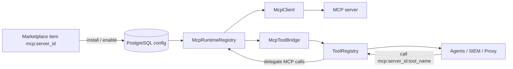
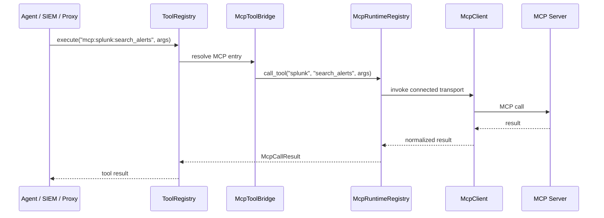

# MCP Integration — Server-Scoped Runtime Architecture

**Status**: 🚧 Planning Complete  
**Updated**: 2026-05-08 | **Phase**: 22 (MCP Protocol Layer)

---

## Core Concept

Treat MCP as a **runtime server layer**, not as a bag of global tool names.

Use three different identifiers:
- **Marketplace / package slug**: `mcp:{server_id}`
- **Tool provider namespace**: `mcp:{server_id}`
- **Runtime tool ID**: `mcp:{server_id}:{tool_name}`

This avoids collisions and matches how the current `tools` planning already models MCP providers.

## System Role Split

| Layer | Owns | Does not own |
|------|------|--------------|
| `core/marketplace` | install state, package metadata, enable/disable state | live MCP connections |
| `modules/mcps` | server config, transport connect/disconnect, discovery, tool calls | builtin provider tools |
| `modules/tools` | shared tool registry surface, builtin provider tool metadata | MCP transport lifecycle |

## Architecture Diagram

## Runtime Call Contract

## Practical Design Rules

- `modules/mcps/registry.py` already exists; Phase 22 must finish and normalize it rather than recreate it.
- `PYTHON_DIRECT` is the preferred path for trusted built-in local cybersec MCP servers.
- MCP tool IDs must stay server-scoped at runtime.
- The MCP runtime layer must be able to serve:
  - agents
  - SIEM/EDR ingestion and response
  - the future local proxy module

## Known Foundation Prerequisite

Before Phase 22 can be considered import-safe, the registry foundation issue must be fixed:
- `BaseRegistry` and `BaseToolRegistry` currently mix `ABC` with `AsyncSafeSingletonMeta`
- dependent registries trip import-time metaclass conflicts
- the new Phase 9 prerequisite in `session.db` blocks MCP runtime completion until that is repaired

## Phase 22 Deliverables

| Todo ID | Deliverable |
|---------|-------------|
| `mcp-enums` | transport + status enums |
| `mcp-exceptions` | MCP-specific error types |
| `mcp-types-struct` | config/tool/call structs |
| `mcp-client` | unified async transport wrapper |
| `mcp-python-direct` | in-process FastMCP path |
| `mcp-server-registry` | finished runtime registry around existing `registry.py` |
| `mcp-tool-bridge` | ToolRegistry bridge with server-scoped MCP IDs |
| `mcp-models` | persisted server configuration |
| `mcp-endpoints` | runtime CRUD / connect / discovery / call API |
| `mcp-startup-wire` | ASGI restore, auto-connect, and tool sync |
| `mcp-builtin-servers` | built-in local cybersec MCP registration |
