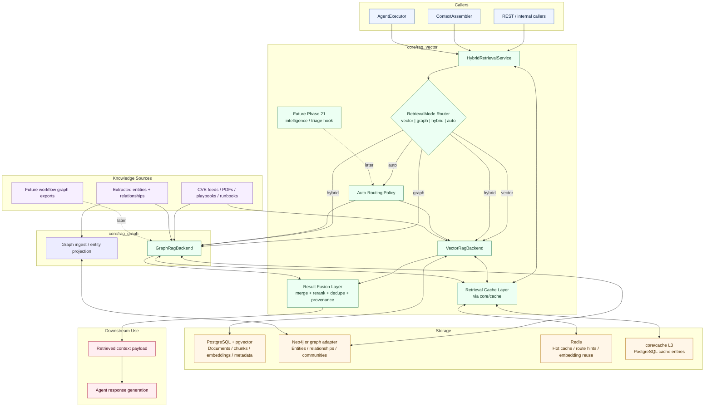

# RAG & Knowledgebase

## Decision

`rag_vector` and `rag_graph` are planned as **core-owned retrieval subsystems**, not long-term business modules.

Target ownership:
- Runtime homes:
  - `src/css/core/rag_vector/`
  - `src/css/core/rag_graph/`
- Current legacy path until migration: `src/css/modules/rag_vector/`
- Domain integrations stay in feature phases, but shared retrieval logic lives in `core/`
- `core/rag_vector/` owns vector retrieval plus hybrid routing, fusion, cache integration, and context handoff
- `core/rag_graph/` owns graph ingestion, graph queries, and Neo4j-backed traversal retrieval

## Goal

Build a **hybrid retrieval stack** with:
- **VectorRAG** on PostgreSQL + pgvector for fast semantic/document retrieval
- **GraphRAG** on a graph store (Neo4j first) for entity/relationship/community traversal
- **Mode selection** so callers can force `vector`, `graph`, `hybrid`, or `auto`
- **Fusion layer** that merges, reranks, deduplicates, and preserves provenance
- **Cache layer** on top of `core/cache` for query results, embedding reuse, route hints, and invalidation-aware retrieval acceleration

`auto` mode may later delegate backend choice to the intelligence/triage model, but the first design must work without that dependency.

## Architecture Graph



## Retrieval Flow

```text
Caller
  -> HybridRetrievalService
  -> router decides vector / graph / hybrid / auto
  -> selected backend(s) execute
  -> fusion layer merges and reranks
  -> context payload returns to agent/context assembly
```

## Storage Roles

- PostgreSQL + pgvector: documents, chunks, embeddings, metadata, semantic search
- Neo4j / graph adapter: entities, relationships, communities, traversal queries
- `core/cache`: retrieval cache facade with L1 memory, L2 Redis, and optional L3 PostgreSQL cache entries
- Redis: hot cache, embedding reuse, route hints, and short-lived hybrid retrieval state

## Core Components

- `VectorRagBackend`: document/chunk ingestion, pgvector search, metadata filtering
- `GraphRagBackend` (`core/rag_graph`): entity extraction pipeline, graph ingest/query, path/community retrieval
- `RetrievalCacheLayer`: query-result caching, embedding reuse, route hints, and invalidation rules via `core/cache`
- `HybridRetrievalService`: single entry point for callers
- `QueryRouter`: mode resolution for `VECTOR`, `GRAPH`, `HYBRID`, `AUTO`
- `FusionLayer`: score normalization, provenance, deduplication, reranking
- `RetrievalMode`: explicit caller-visible mode enum

## Mode Policy

- `vector`: prefer speed and broad recall
- `graph`: prefer entity-heavy or relationship-heavy reasoning
- `hybrid`: execute both paths and fuse results
- `auto`: start with a routing policy; later it may call Phase 21 intelligence/triage

Future hook:
- Phase 21 intelligence can classify retrieval complexity and help choose backend(s) in `auto`

## GraphRAG Scope

GraphRAG is not only for workflow graphs.

Primary graph inputs:
- MITRE ATT&CK entities and relationships: tactics, techniques, groups, software, mitigations, procedures
- threat-intelligence entities and relationships: actors, malware, campaigns, tools, observables, CVEs, infrastructure
- extracted entities from cybersec documents
- relationships between CVEs, malware, tools, actors, campaigns, mitigations, incidents
- stable intelligence/triage outputs such as extracted entities, ATT&CK candidate mappings, and confidence-scored relationships
- future workflow / execution graph exports where useful

Important boundary:
- Phase 27 graphs are mainly visualization and live graph UX
- GraphRAG uses graph data for retrieval and reasoning
- The systems may share graph data later, but should not be hard-coupled at first implementation
- MITRE and threat-intel stay canonically owned by their domain modules; Neo4j is a projection and retrieval layer, not their only source of truth

## Phase Mapping

- **Phase 20**: core hybrid retrieval foundation (`rag-*` todos)
- **Phase 29**: cybersec retrieval ingestion and domain-facing usage on top of `core/rag_vector/` + `core/rag_graph/`
- **Phase 21**: optional intelligence/triage participation in `AUTO` route choice
- **Future workflow graph DB work**: may later feed GraphRAG as an additional graph source

## System Integration

`core/rag_vector` sits between memory/intelligence on the input side and agent execution on the output side, while `core/rag_graph` supplies the graph retrieval implementation it can call in `graph` or `hybrid` mode.

- `core/memory`: `ContextAssembler` and memory-backed session state are the main retrieval callers.
- `modules/triage/`: Phase 21 can tag memory, pre-filter trivial requests, and later provide `AUTO` route hints.
- `modules/graphs/` + `modules/workflows/`: operational workflow graphs stay separate from the knowledge graph, but later workflow graph exports may become an additional GraphRAG source.
- `modules/mitre/` + `modules/threat_intel/`: retain canonical relational ownership and project graph-native entities/relationships into `core/rag_graph`.
- `modules/triage/`: may emit stable extracted entities, ATT&CK hints, and confidence-scored relationships into the graph ingest path; ephemeral routing state should not be projected.
- `core/cache/`: retrieval caching is required from day one for embeddings, query results, and route hints.
- `core/prompt_cache/`: prompt caching remains separate and applies to LLM calls, not retrieval result storage.

See [intelligence-retrieval-graph.md](./intelligence-retrieval-graph.md) for the combined system view.

## Immediate Planning Consequences

- `domain-rag-ingestion` is an ingestion layer on top of the shared retrieval core
- the shared retrieval substrate is planned under `core/rag_vector/` + `core/rag_graph/`
- the old `modules/rag_vector/` package is now legacy migration surface until the core move lands
- caching is part of the retrieval design from day one; it is not a later optimization pass
