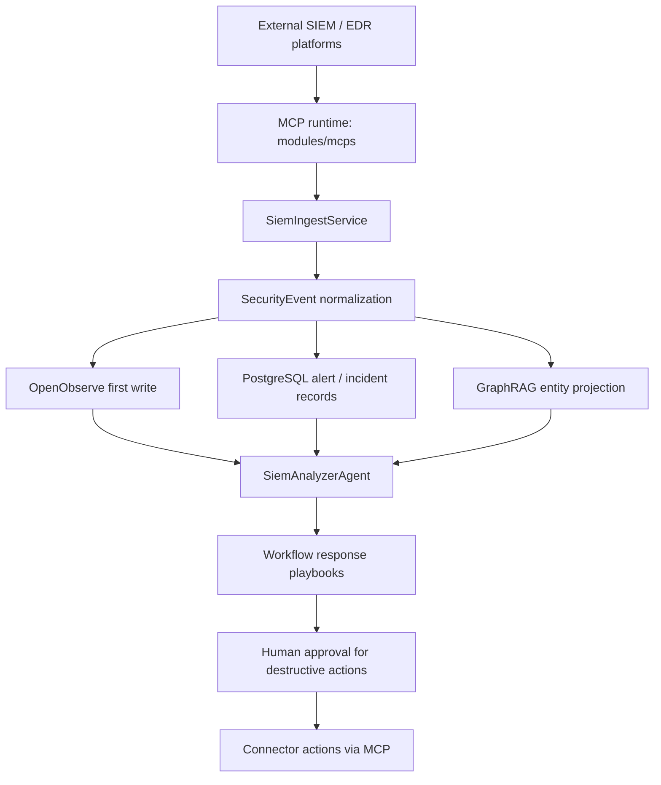

# SIEM/EDR Integration Architecture

**Status**: 🚧 Phase 37 — Planning Complete | **Updated**: 2026-05-08
**Owner**: `modules/siem/` + planned `core/siem/` services

---

## Overview

CyberSecSuite SIEM/EDR integration is a **three-store pipeline**:
- **OpenObserve** for raw/high-volume telemetry, dashboards, audit streams, and operational search
- **PostgreSQL** for curated alerts, incidents, response state, and application-facing records
- **Neo4j / GraphRAG** for entity graphs, MITRE ATT&CK links, and attack-path traversal

The local-first connector path is:
- external SIEM/EDR platform
- MCP runtime (`modules/mcps`)
- SIEM normalization
- multi-store fan-out
- analysis and response

## Data Store Allocation

| Store | Primary use in SIEM |
|------|----------------------|
| **OpenObserve** | first write target for raw detections, telemetry fan-out, dashboards, alert streams, approval/audit visibility |
| **PostgreSQL** | curated `siem_alerts`, `edr_detections`, `incidents`, response bookkeeping |
| **Neo4j / GraphRAG** | entities, relationships, MITRE technique links, path traversal |

## Architecture Flow

## Core Services

### `core/siem/types.py`

- `SecurityEvent` as `msgspec.Struct`
- SIEM event namespaces added to `EventType`

### `core/siem/ingest.py`

- consume external SIEM/EDR data through MCP runtime tools
- normalize connector-specific payloads into `SecurityEvent`
- ensure OpenObserve-ready fields exist before storage fan-out

### Storage fan-out

- **OpenObserve first**: raw telemetry, dashboards, operational query path
- **PostgreSQL**: incident/application records and structured alert state
- **GraphRAG**: project IP/host/process/file/technique entities and relationships

### `core/siem/analyzer.py`

- correlate OpenObserve telemetry with GraphRAG and VectorRAG context
- generate remediation context using the shared LLM harness

### `core/siem/response.py`

- execute response playbooks through workflows
- require approval gates for destructive actions
- call connector actions back through MCP runtime tools

## Integration Points

| Component | Relationship |
|-----------|--------------|
| `css.modules.mcps` | connector discovery, ingest, and action execution |
| `css.core.observability` | OpenObserve client + stream definitions |
| `css.core.events` | event stream + instrumentation |
| `css.core.rag_graph` | graph ingest and retrieval |
| `css.core.rag_vector` | similar incident retrieval |
| `css.modules.workflows` | response orchestration |
| `css.modules.approvals` | human approval gate |
| `css.modules.permissions` | policy guardrails for actions |

## Planning Rule

For SIEM in this codebase, **OpenObserve is not optional garnish**.  
It is the primary telemetry surface. PostgreSQL and GraphRAG are layered on top of that telemetry path, not substitutes for it.
