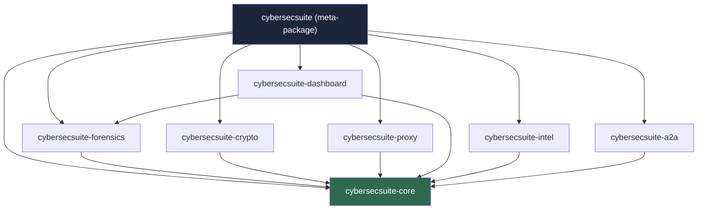
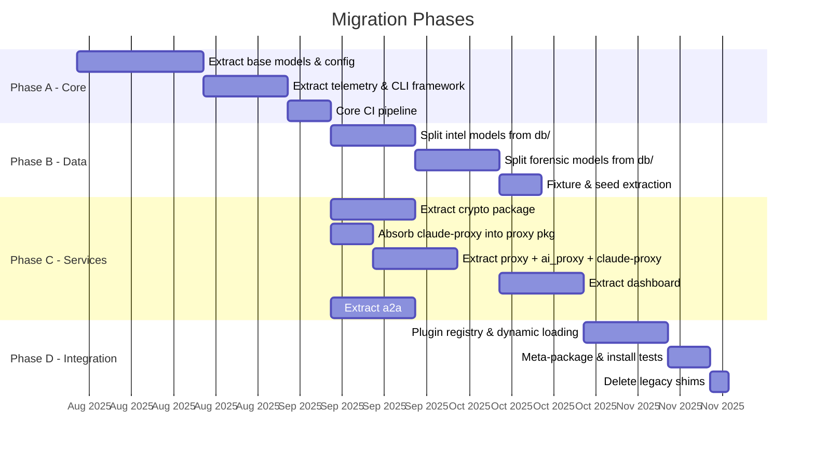

# CyberSecSuite Plugin Separation Proposal

## 1. Executive Summary

CyberSecSuite has grown into a monolith with 9 top-level modules, 82+ ORM models, 44 model files, and 1000+ line registries. This coupling creates concrete problems:

- **Deployment rigidity** — deploying a dashboard fix requires shipping the entire crypto stack and AI proxy.
- **Version lock-step** — a breaking change in `ai_proxy/` blocks releases for unrelated `crypto/` work.
- **Onboarding friction** — contributors must understand the full dependency graph to work on a single module.
- **Test overhead** — CI runs all 70 model migrations even for a template change in `dashboard/`.

Splitting into 7 independently versioned plugins solves these issues while preserving the single-install experience via a meta-package.

## 2. Proposed Plugin Architecture



### Plugin Breakdown

| Plugin                      | Source Modules                                             | Responsibility                                                                                                                 |
|-----------------------------|------------------------------------------------------------|--------------------------------------------------------------------------------------------------------------------------------|
| **cybersecsuite-core**      | `db/` (base models, connection), `telemetry/`, `manage.py` | DB connection pool, config loading, structured logging, base `Model`/`TimestampMixin` classes, CLI framework                   |
| **cybersecsuite-forensics** | `mcp/`                                                     | ForensicProject, Session, Finding models; MCP tool servers (findings, IOCs, cache, layers, sessions); forensic slash commands  |
| **cybersecsuite-crypto**    | `crypto/`                                                  | Ed25519 key management, SSL CLI, vault operations, artifact signing/verification                                               |
| **cybersecsuite-proxy**     | `ai_proxy/`, `proxy/`, ~~`claude-proxy/`~~                 | Provider registry (60 providers), routing strategies, format translation, ASGI server (Starlette mounting, health checks, TLS); **absorbs** GitHub Copilot Device Flow, Grok auth, token persistence, OpenAI-compat `/v1/*` passthrough from `claude-proxy` |
| **cybersecsuite-dashboard** | `dashboard/`, `templates/`                                 | 36 REST + SSE endpoints, SPA HTML template, static assets                                                                       |
| **cybersecsuite-intel**     | `db/` (intel models, fixtures, seeds)                      | CVE, MITRE ATT&CK, CWE, CAPEC models; threat actors, software families; 6 fixture files; seed data loaders                     |
| **cybersecsuite-a2a**       | `a2a/`                                                     | JSON-RPC 2.0 A2A server, agent cards, `agent_sdk.py`, team dispatch                                                            |

### Dependency Rules

1. All plugins depend on `cybersecsuite-core`. No exceptions.
2. `cybersecsuite-dashboard` depends on `cybersecsuite-forensics` (renders forensic data).
3. No other cross-plugin dependencies are permitted. Violations indicate misplaced code.
4. `cybersecsuite-core` depends on **no** other plugin.

## 3. Shared Interfaces

### Core Exports

```python
# cybersecsuite.core — public API surface
from cybersecsuite.core.db import get_connection, init_db, close_db
from cybersecsuite.core.config import Settings, get_settings
from cybersecsuite.core.logging import get_logger, configure_logging
from cybersecsuite.core.models import BaseModel, TimestampMixin
from cybersecsuite.core.cli import cli_group  # Click/Typer group for sub-commands
```

### Entry Point Discovery

Each plugin registers itself via `pyproject.toml` entry points:

```toml
# Example: cybersecsuite-forensics/pyproject.toml
[project.entry-points."cybersecsuite.plugins"]
forensics = "cybersecsuite.forensics:plugin"

[project.entry-points."cybersecsuite.cli"]
forensics = "cybersecsuite.forensics.cli:commands"

[project.entry-points."cybersecsuite.models"]
forensics = "cybersecsuite.forensics.models"
```

### Plugin Protocol

Every plugin exposes a `PluginSpec` object:

```python
@dataclass
class PluginSpec:
    name: str                          # e.g. "forensics"
    version: str                       # semver
    models: list[str]                  # Tortoise ORM model module paths
    cli_commands: Callable | None      # Click/Typer command group
    asgi_routes: list[Route] | None    # Starlette routes to mount
    startup_hook: Callable | None      # async def on_startup()
    shutdown_hook: Callable | None     # async def on_shutdown()
```

### Discovery at Runtime

```python
# cybersecsuite.core.plugins
from importlib.metadata import entry_points

def discover_plugins() -> list[PluginSpec]:
    eps = entry_points(group="cybersecsuite.plugins")
    return [ep.load() for ep in eps]
```

Core calls `discover_plugins()` at startup to:
- Register Tortoise ORM model modules for migration generation.
- Mount ASGI routes onto the Starlette application.
- Attach CLI sub-commands to `manage.py`.

## 4. Migration Path



### Phase A: Extract Core

1. Create `~/Projects/AI/plugins/cybersecsuite-core/` with its own `pyproject.toml` and git repo.
2. Move `src/db/base.py`, `src/db/connection.py`, `src/telemetry/`, config loading, and `TimestampMixin` into it.
3. Root `pyproject.toml` adds `cybersecsuite-core` as a path dependency: `cybersecsuite-core = {path = "../AI/plugins/cybersecsuite-core", editable = true}`.
4. All existing imports rewritten: `from src.db.base import ...` → `from cybersecsuite.core.models import ...`.
5. CI must pass with the monolith consuming core as a local package before proceeding.

### Phase B: Split Intel and Forensics

1. Identify the 82 model classes; categorize each as `core`, `intel`, or `forensics`.
2. Intel models (CVE, MITRE technique, CWE, CAPEC, threat actor, software family) move to `~/Projects/AI/plugins/cybersecsuite-intel/`.
3. Forensic models (ForensicProject, Session, Finding, IOC, Layer) move to `~/Projects/AI/plugins/cybersecsuite-forensics/`.
4. Fixture JSON files and seed scripts move to `cybersecsuite-intel`.
5. Migration files split per-plugin; Aerich/Tortoise configured with per-app migration directories.

### Phase C: Extract Services

- **Crypto**: self-contained — no model dependencies beyond core. Cleanest extraction. → `~/Projects/AI/plugins/cybersecsuite-crypto/`
- **Proxy**: merge `src/ai_proxy/`, `src/proxy/`, and **all of `claude-proxy/`** into one package. The 1000+ line `registry.py` stays intact. `claude-proxy`'s GitHub Copilot Device Flow (`auth/copilot.py`), Grok auth (`auth/grok.py`), token persistence (AES-256-GCM), rate limiting, and OpenAI-compat passthrough all move here. `claude-proxy/` repo is then **archived**. → `~/Projects/AI/plugins/cybersecsuite-proxy/`
- **Dashboard**: depends on forensic models for rendering. Declare `cybersecsuite-forensics` as a dependency. → `~/Projects/AI/plugins/cybersecsuite-dashboard/`
- **A2A**: depends only on core. Extract `src/a2a/` wholesale. → `~/Projects/AI/plugins/cybersecsuite-a2a/`

### Phase D: Plugin Registry

1. Implement `discover_plugins()` in core.
2. Refactor `manage.py` to dynamically load CLI commands from installed plugins.
3. Refactor ASGI app to dynamically mount routes from plugins.
4. Ship `cybersecsuite` meta-package with path deps to `~/Projects/AI/plugins/cybersecsuite-*`.
5. Delete legacy compatibility shims from monolith `src/`.

## 5. Packaging Strategy

### Repository Layout (Post-Migration)

Plugins live in the shared AI plugins directory (`~/Projects/AI/plugins/`), not inside the cybersecsuite repo. This keeps each plugin as an independent git repo — consistent with existing plugins (`claude-proxy`, `grok-browser-tunnel`).

```
~/Projects/AI/plugins/                  ← shared plugin directory
├── grok-browser-tunnel/                ← existing (Grok auth tunnel)
├── cybersecsuite-core/                 ← NEW — extracted from src/ + absorbs claude-proxy
│   ├── pyproject.toml
│   ├── src/cybersecsuite/core/
│   └── tests/
├── cybersecsuite-forensics/            ← NEW
│   ├── pyproject.toml
│   ├── src/cybersecsuite/forensics/
│   └── tests/
├── cybersecsuite-crypto/               ← NEW
│   ├── pyproject.toml
│   ├── src/cybersecsuite/crypto/
│   └── tests/
├── cybersecsuite-proxy/                ← NEW
│   ├── pyproject.toml
│   ├── src/cybersecsuite/proxy/
│   └── tests/
├── cybersecsuite-dashboard/            ← NEW
│   ├── pyproject.toml
│   ├── src/cybersecsuite/dashboard/
│   └── tests/
├── cybersecsuite-intel/                ← NEW
│   ├── pyproject.toml
│   ├── src/cybersecsuite/intel/
│   └── tests/
└── cybersecsuite-a2a/                  ← NEW
    ├── pyproject.toml
    ├── src/cybersecsuite/a2a/
    └── tests/

~/Projects/cybersecsuite/               ← stays as meta-package + orchestration
├── pyproject.toml                      # meta-package (depends on all 7 plugins)
├── src/                                # thin orchestration layer only
├── .claude/                            # skills, agents, commands (unchanged)
├── .docker/                            # container builds (updated per plugin)
└── tests/                              # integration tests across plugins
```

Each plugin is its own git repo under `~/Projects/AI/plugins/`, installable via `uv pip install -e ~/Projects/AI/plugins/cybersecsuite-core` or published to PyPI independently.

### Namespace Packages

Use implicit namespace packages ([PEP 420](https://peps.python.org/pep-0420/)) — **no** `__init__.py` in `src/cybersecsuite/`. Each plugin owns its sub-namespace:

```
src/cybersecsuite/       ← no __init__.py (namespace package)
    core/__init__.py     ← owned by cybersecsuite-core
    forensics/__init__.py
    crypto/__init__.py
    ...
```

### Per-Plugin `pyproject.toml`

```toml
# ~/Projects/AI/plugins/cybersecsuite-forensics/pyproject.toml
[build-system]
requires = ["hatchling"]
build-backend = "hatchling.build"

[project]
name = "cybersecsuite-forensics"
version = "0.1.0"
requires-python = ">=3.11"
dependencies = [
    "cybersecsuite-core>=0.1.0",
]

[project.entry-points."cybersecsuite.plugins"]
forensics = "cybersecsuite.forensics:plugin"
```

### Meta-Package

```toml
# ~/Projects/cybersecsuite/pyproject.toml (root)
[project]
name = "cybersecsuite"
version = "0.1.0"
dependencies = [
    "cybersecsuite-core>=0.1.0",
    "cybersecsuite-forensics>=0.1.0",
    "cybersecsuite-crypto>=0.1.0",
    "cybersecsuite-proxy>=0.1.0",
    "cybersecsuite-dashboard>=0.1.0",
    "cybersecsuite-intel>=0.1.0",
    "cybersecsuite-a2a>=0.1.0",
]

# For local development, use path dependencies:
# [tool.uv.sources]
# cybersecsuite-core = {path = "../AI/plugins/cybersecsuite-core", editable = true}
# cybersecsuite-forensics = {path = "../AI/plugins/cybersecsuite-forensics", editable = true}
# ...
```

### Versioning

- All plugins start at `0.1.0`.
- Independent semver per plugin after `0.1.0`.
- `cybersecsuite-core` versions are pinned as `>=X.Y.0,<X.Y+1.0` (compatible release) by downstream plugins.

## 6. Risk Assessment

| Risk                                         | Severity | Mitigation                                                                                                                                                     |
|----------------------------------------------|----------|----------------------------------------------------------------------------------------------------------------------------------------------------------------|
| **Circular dependencies** between plugins    | High     | Strict dependency DAG enforced in CI. Only core is a shared dependency. Dashboard→Forensics is the sole cross-plugin edge.                                     |
| **DB migration coordination** across plugins | High     | Single Aerich migration registry in core discovers model modules via entry points. Migrations run in topological order (core → intel → forensics → dashboard). |
| **Import path breakage**                     | Medium   | Provide a compatibility shim package (`from src.db import X` → `from cybersecsuite.core import X`) for one major version cycle.                                |
| **`.claude/` skills coupling**               | Medium   | Skills reference module paths in instructions. Update `.claude/skills/` files in the same PR that moves the corresponding source.                              |
| **Docker build complexity**                  | Medium   | Multi-stage builds install only required plugins per container. `docker/dashboard/Dockerfile` installs `cybersecsuite-core + dashboard + forensics`.           |
| **Test isolation**                           | Low      | Unit tests live in each plugin package. Integration tests remain in root `tests/` and install the meta-package.                                                |
| **PyPI namespace squatting**                 | Low      | Register all 7 package names on PyPI immediately, even before publishing real releases.                                                                        |

### Circular Dependency Detection (CI)

```yaml
# .github/workflows/dep-check.yml (excerpt)
- name: Check for circular plugin imports
  run: |
    pip install pipdeptree
    pipdeptree --warn fail --exclude pip,setuptools
```

---

*This proposal targets the current codebase as of April 2026. Plugins will be created under `~/Projects/AI/plugins/` as independent repos, consistent with existing plugins (grok-browser-tunnel). `claude-proxy/` is **not** kept as a separate plugin — all its functionality is absorbed into `cybersecsuite-proxy`. Implementation should begin with Phase A (core extraction) as a proof-of-concept before committing to the full timeline.*
