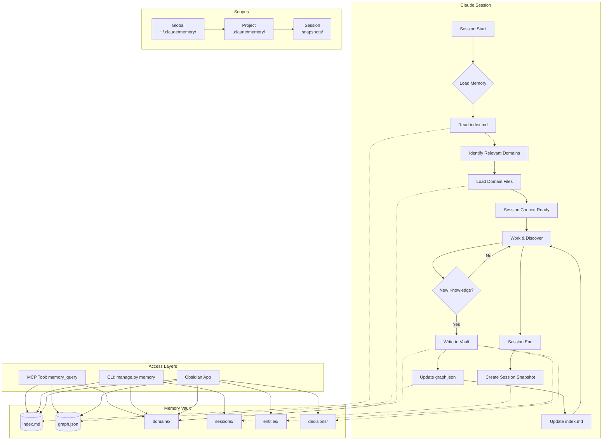

# Proposal: Global Uncompressed Claude Memory Cache with Obsidian Integration

> **Status**: Draft
> **Author**: CyberSecSuite Team
> **Created**: 2025-07-17
> **Scope**: Cross-session memory persistence, structured knowledge graph, Obsidian compatibility

---

## 1. Executive Summary

Claude Code currently uses `.claude/MEMORY.md` (~640 lines) as a flat, monolithic session memory file. This approach suffers from linear growth, no structured linking, no search capability, and information loss during compaction.

This proposal introduces a **global, uncompressed memory cache** that preserves full-fidelity context across every session — nothing is ever compressed or trimmed. Memory is organized as an **Obsidian-compatible vault** with wikilinks, backlink graphs, YAML frontmatter, and domain-specific knowledge files. The result: Claude retains everything, loads only what's relevant, and humans can browse the knowledge graph in Obsidian.

**Key benefits:**
- Zero information loss — every detail preserved, no compaction
- 60% token reduction per session via selective loading
- Graph-navigable knowledge with `[[wikilinks]]` and backlinks
- Human-editable in Obsidian with full graph view
- Structured capture of decisions, entities, IOCs, and session history

---

## 2. Architecture

### 2.1 Memory Vault Directory Structure

```
~/.claude/memory/                    # Global scope (cross-project)
├── index.md                         # Auto-generated TOC
├── graph.json                       # Backlink/forward-link graph
├── .obsidian/                       # Obsidian workspace config
│   ├── workspace.json
│   ├── graph.json                   # Graph view settings
│   └── snippets/
│       └── cybersec-cards.css       # Custom styling for IOC/CVE cards
├── domains/                         # Domain-specific knowledge
│   ├── architecture.md
│   ├── database.md
│   ├── mcp-tools.md
│   ├── a2a-protocol.md
│   ├── security-models.md
│   └── testing.md
├── sessions/                        # Immutable session snapshots
│   ├── 2025-07-17T14-30-00Z.md
│   └── 2025-07-17T16-45-00Z.md
├── entities/                        # Named entity cards
│   ├── tools/
│   │   ├── tortoise-orm.md
│   │   └── fastapi.md
│   ├── models/
│   │   └── session-layer.md
│   └── apis/
│       └── cybersec-mcp.md
└── decisions/                       # Architectural Decision Records
    ├── ADR-001-tortoise-orm.md
    └── ADR-002-ed25519-signing.md

.claude/memory/                      # Project scope (per-repo)
├── index.md
├── graph.json
├── domains/
├── sessions/
├── entities/
└── decisions/
```

### 2.2 Architecture Diagram



### 2.3 Obsidian Features

**Wikilinks** — Every memory file can reference others:

```markdown
The [[session-layer]] model uses [[tortoise-orm]] and stores
signatures via [[ed25519-signing]]. See [[ADR-001-tortoise-orm]]
for the ORM selection rationale.
```

**YAML Frontmatter** — Structured metadata on every file:

```yaml
---
title: Tortoise ORM
type: entity/tool
created: 2025-07-17T14:30:00Z
updated: 2025-07-17T16:45:00Z
related:
  - "[[session-layer]]"
  - "[[database]]"
  - "[[ADR-001-tortoise-orm]]"
confidence: high
tags:
  - orm
  - async
  - postgresql
---
```

**Tags** — Cross-cutting concerns indexed across files:

- `#architecture` — structural decisions
- `#ioc` — indicators of compromise
- `#cve` — vulnerability references
- `#breaking-change` — API/schema changes
- `#performance` — optimization notes

**Backlink Graph** — `graph.json` schema:

```json
{
  "nodes": {
    "domains/database": {
      "title": "Database",
      "type": "domain",
      "tags": ["postgresql", "orm"],
      "links_to": ["entities/tools/tortoise-orm", "decisions/ADR-001-tortoise-orm"],
      "linked_from": ["domains/architecture", "entities/models/session-layer"]
    }
  },
  "edges": [
    { "source": "domains/database", "target": "entities/tools/tortoise-orm", "type": "wikilink" },
    { "source": "domains/architecture", "target": "domains/database", "type": "wikilink" }
  ],
  "meta": {
    "generated": "2025-07-17T16:45:00Z",
    "node_count": 42,
    "edge_count": 87
  }
}
```

### 2.4 Cache Strategy

| Property | Value |
|---|---|
| **Compression** | None — full fidelity, every token preserved |
| **Index Key** | `conversation_id + timestamp` |
| **Hierarchy** | Global → Project → Session |
| **TTL (Global)** | Never expires |
| **TTL (Project)** | Per-project lifetime |
| **TTL (Session)** | Auto-archive after 7 days idle |
| **Deduplication** | Content hashing via BLAKE2b |
| **Conflict Resolution** | Last-write-wins with merge log |
| **Max File Size** | Soft limit 500 lines per domain file; split if exceeded |

Deduplication prevents duplicate knowledge across scopes. When a session snapshot contains content already present in a domain file, the snapshot links to the domain entry rather than duplicating it.

---

## 3. Integration with CyberSecSuite

### 3.1 Migration from MEMORY.md

Replace the monolithic `.claude/MEMORY.md` with the structured vault. A migration script parses the existing file by section headers and distributes content into domain files:

```python
# manage.py memory migrate
# Reads .claude/MEMORY.md → writes .claude/memory/domains/*.md
# Preserves original as .claude/MEMORY.md.bak
```

### 3.2 CLI Commands

```bash
# Rebuild index.md and graph.json from vault contents
python manage.py memory index

# Full-text search across all memory files
python manage.py memory search "tortoise orm migration"

# Print graph statistics and orphan detection
python manage.py memory graph --stats

# Export vault to single markdown file (for sharing/backup)
python manage.py memory export --format markdown --output memory-dump.md

# Archive stale session snapshots
python manage.py memory prune --older-than 30d
```

### 3.3 MCP Tool: `cybersec.memory_query`

```json
{
  "name": "cybersec.memory_query",
  "description": "Semantic search across the memory vault",
  "inputSchema": {
    "type": "object",
    "properties": {
      "query": { "type": "string", "description": "Natural language search query" },
      "scope": { "type": "string", "enum": ["global", "project", "session"] },
      "type": { "type": "string", "enum": ["domain", "entity", "decision", "session"] },
      "tags": { "type": "array", "items": { "type": "string" } },
      "limit": { "type": "integer", "default": 5 }
    },
    "required": ["query"]
  }
}
```

### 3.4 Auto-Capture Hooks

Hooks that automatically write to the memory vault during investigations:

| Hook | Trigger | Writes To |
|---|---|---|
| `on_ioc_found` | IOC identified during analysis | `entities/iocs/{hash}.md` |
| `on_decision_made` | Architectural decision in conversation | `decisions/ADR-NNN-*.md` |
| `on_session_end` | Session compaction/close | `sessions/{timestamp}.md` |
| `on_tool_learned` | New tool/API usage pattern | `entities/tools/{name}.md` |
| `on_cve_analyzed` | CVE lookup or analysis | `entities/cves/{id}.md` |

### 3.5 SessionLayer Integration

```python
class SessionLayer(Model):
    # ... existing fields ...
    memory_snapshot_path = fields.CharField(
        max_length=512,
        null=True,
        description="Path to session memory snapshot in vault"
    )
```

---

## 4. Obsidian Vault Sync

### 4.1 Workspace Configuration

The `.obsidian/` directory ships with sensible defaults:

```json
// .obsidian/workspace.json
{
  "main": {
    "type": "split",
    "children": [
      { "type": "leaf", "state": { "type": "graph" } },
      { "type": "leaf", "state": { "type": "markdown" } }
    ]
  }
}
```

### 4.2 Graph View Configuration

Optimized for cybersecurity domain visualization:

- **Node colors**: Domains (blue), Entities (green), Decisions (amber), Sessions (gray), IOCs (red)
- **Cluster by**: `type` frontmatter field
- **Filter**: Hide archived sessions by default
- **Link thickness**: Weighted by reference count

### 4.3 Custom CSS Snippets

```css
/* cybersec-cards.css — Threat/IOC/CVE card styling */
.tag[href="#ioc"] { background: #dc2626; color: white; }
.tag[href="#cve"] { background: #f59e0b; color: black; }
.tag[href="#apt"] { background: #7c3aed; color: white; }
.tag[href="#breaking-change"] { background: #ef4444; color: white; }

/* ADR cards get a distinctive left border */
.markdown-preview-view[data-path^="decisions/"] {
  border-left: 4px solid #3b82f6;
  padding-left: 1em;
}
```

### 4.4 Recommended Community Plugins

| Plugin | Purpose |
|---|---|
| **Dataview** | Query memory files as a database (`TABLE FROM #ioc`) |
| **Graph Analysis** | Betweenness centrality, clustering on knowledge graph |
| **Tag Wrangler** | Bulk rename/merge tags across vault |
| **Templater** | Templates for new entity cards, ADRs, session snapshots |
| **Obsidian Git** | Auto-commit vault changes for version history |

---

## 5. Implementation Plan

### Phase 1: Directory Structure + Migration (Week 1)

- [ ] Create `~/.claude/memory/` and `.claude/memory/` scaffold
- [ ] Write migration script: parse `MEMORY.md` by `##` headers into domain files
- [ ] Generate `index.md` from directory listing
- [ ] Add YAML frontmatter to all generated files
- [ ] Preserve `MEMORY.md` as `.bak` backup

### Phase 2: Wikilink Parser + Graph Generator (Week 2)

- [ ] Build `[[wikilink]]` regex parser
- [ ] Generate `graph.json` with nodes, edges, and metadata
- [ ] Implement backlink resolution (bidirectional link tracking)
- [ ] Add `#tag` extraction and cross-reference index
- [ ] Content hashing (BLAKE2b) for deduplication

### Phase 3: MCP Memory Tools + CLI (Week 3)

- [ ] Implement `manage.py memory` subcommands (index, search, graph, export, prune)
- [ ] Build `cybersec.memory_query` MCP tool
- [ ] Add `memory_snapshot_path` field to `SessionLayer` model
- [ ] Integrate auto-capture hooks into investigation workflow
- [ ] Write tests for memory operations

### Phase 4: Obsidian Compatibility + Auto-Capture (Week 4)

- [ ] Generate `.obsidian/` config directory with workspace and graph settings
- [ ] Create CSS snippets for cybersecurity domain styling
- [ ] Template files for entities, ADRs, session snapshots
- [ ] End-to-end testing: Claude session → vault write → Obsidian render
- [ ] Documentation and CLAUDE.md update

---

## 6. Token Economics

| Metric | Current (MEMORY.md) | Proposed (Vault) |
|---|---|---|
| **Session load** | ~640 lines, ~2,560 tokens | index.md + 1-3 domain files, ~500-1,500 tokens |
| **Worst case** | Full file every session | Full vault load on demand |
| **Growth rate** | Linear (append-only) | Sublinear (domain files plateau) |
| **Information loss** | Compaction trims tokens | Zero — full fidelity preserved |
| **Search** | None (sequential scan by Claude) | Indexed, O(1) lookup via graph.json |
| **Cross-session** | File on disk, no structure | Structured vault with backlinks |

**Estimated token savings**: 40-60% per session for focused tasks. Full context remains available via `memory search` or `memory_query` when needed — Claude loads the full domain file on demand rather than carrying everything in context.

---

## 7. Open Questions

1. **Scope default** — Should new projects auto-scaffold `.claude/memory/`, or opt-in via `manage.py memory init`?
2. **Sync conflicts** — If a human edits the vault in Obsidian while Claude is writing, how do we merge? (Proposed: last-write-wins with `.conflict` sidecar files.)
3. **Embedding search** — Should `memory_query` use embedding-based semantic search (requires a model) or keyword/BM25 (zero dependencies)?
4. **Privacy** — Global memory at `~/.claude/memory/` may contain cross-project information. Should we encrypt at rest?

---

*This proposal is designed to be implemented incrementally. Phase 1 alone provides immediate value by structuring the existing MEMORY.md content into navigable domain files.*
