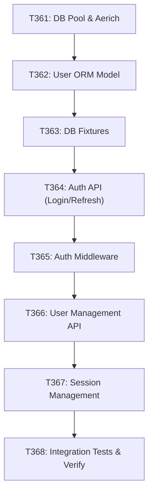

# T374: Parallel Track 1 - Scope Foundation (Phase 2 Backend Infrastructure)

**Status:** IN_PROGRESS (Phase 1 Documentation Phase → Awaiting Phase 2 Commencement)  
**Created:** 2026-04-26  
**Purpose:** Define the sequential execution plan for T361–T368 (Backend Infrastructure Phase)  
**Owner:** python-developer  
**Blocker:** This todo must complete before parallel work can begin

---

## Overview

**T374** is a **meta-todo** that:
1. ✅ Documents what T361–T368 will accomplish
2. ✅ Specifies the sequence (serial, no parallelism)
3. ✅ Marks prerequisites and blockers
4. ⏳ Awaits commencement (Phase 2 kickoff)

**Why Serial?** T361–T368 have **hard dependencies** — each todo must complete before the next can begin. Any attempt to parallelize will result in conflicts.

---

## Phase 2 Backend Infrastructure Todos (T361–T368)

### Execution Sequence

```
T361 (2–3h) — Setup
  ↓ (blocks T362)
T362 (3–4h) — User ORM Model
  ↓ (blocks T363)
T363 (2–3h) — Database Fixtures
  ↓ (blocks T364)
T364 (3–4h) — Authentication API
  ↓ (blocks T365)
T365 (2–3h) — Authorization Middleware
  ↓ (blocks T366)
T366 (3–4h) — User Management API
  ↓ (blocks T367)
T367 (2–3h) — Session Management
  ↓ (blocks T368)
T368 (2–3h) — Integration Tests & Verification
```

**Total Effort:** ~22–26 hours  
**Estimated Duration:** 5–7 business days (one agent, sequential)  
**Agent Lead:** python-developer  
**Reviewers:** python-code-reviewer (continuous)

---

## Detailed Todo Specifications

### T361: PostgreSQL Connection Pool & Aerich Migration Setup

**Owner:** python-developer  
**Prerequisites:** None (Phase 1 complete, DEPENDENCIES.md verified)  
**Effort:** 2–3 hours  
**Blocker Status:** ✅ No blockers (clear to start immediately)

**Objective:**
Set up PostgreSQL connection pooling, Aerich migration framework, and initial test database. All subsequent ORM work depends on this foundation.

**Files:**
- [ ] Create: `src/db/pool.py` — PostgreSQL connection pool configuration
- [ ] Create: `src/db/migrations/` — Aerich migration scaffolding
- [ ] Modify: `pyproject.toml` — Add Aerich config section
- [ ] Create: `tests/fixtures/db.py` — Test DB fixture setup
- [ ] Create: `tests/conftest.py` — Pytest configuration

**Implementation Details:**

Create async PostgreSQL connection pool using asyncpg with connection pooling (min/max connections). Initialize Aerich for schema migrations. Set up test database fixture that creates/tears down schema for each test suite.

**Code References:**
- Pattern: `src/db/__init__.py` (existing async patterns)
- Async pool pattern: Tortoise ORM + asyncpg integration
- Test fixture: `pytest_asyncio` patterns

**Acceptance Criteria:**
- [ ] Connection pool initializes without errors
- [ ] Aerich migrations directory scaffold created
- [ ] Test DB fixture works with pytest
- [ ] Can connect to both production and test DBs
- [ ] Connection pooling stats accessible
- [ ] Type hints complete (no `Any`)
- [ ] Documentation in code (docstrings)

**Verification:**
```bash
# Test connection pool
pytest tests/unit/db/pool_test.py -v

# Verify Aerich setup
aerich init --tortoise-orm config.TORTOISE_ORM

# Test fixture
pytest tests/fixtures/db_test.py -v --asyncio-mode=auto
```

**Blockers:**
- PostgreSQL server must be running (external service)
- `.env` file must have `DATABASE_URL` set

---

### T362: User ORM Model (Tortoise ORM + Pydantic)

**Owner:** python-developer  
**Prerequisites:** T361 (connection pool ready)  
**Effort:** 3–4 hours  
**Blocker Status:** ⏳ Blocked until T361 complete

**Objective:**
Create the User ORM model with Tortoise ORM, Pydantic validation schemas, and comprehensive test coverage. This is the foundation for all user-related features.

**Files:**
- [ ] Create: `src/db/models/user.py` — Tortoise User model
- [ ] Create: `src/schemas/user.py` — Pydantic validation schemas
- [ ] Create: `tests/unit/models/user_model_test.py` — Unit tests
- [ ] Create: `tests/integration/db/user_crud_test.py` — Integration tests

**Implementation Details:**

Tortoise User model with fields: `id`, `email` (unique), `username` (unique), `password_hash`, `created_at`, `updated_at`, `is_active`, `role`. Use Argon2id for password hashing (256 MiB, 4 iterations). Implement BLAKE2b-256 content hashing for audit. Pydantic schemas for input validation (CreateUserSchema, UpdateUserSchema, UserReadSchema).

**Code References:**
- Pattern: Existing models in `src/db/models/`
- Crypto: Argon2id usage in `src/crypto/` (existing)
- Tests: `tests/unit/models/` pattern

**Acceptance Criteria:**
- [ ] Model fields match spec (email, username, password_hash, timestamps)
- [ ] Email/username uniqueness enforced at DB level
- [ ] Password hashing uses Argon2id (256 MiB, 4 iterations)
- [ ] Pydantic schemas typed and strict
- [ ] CRUD methods: create, read, update, delete
- [ ] Tests cover: creation, validation, hashing, uniqueness
- [ ] Coverage >80%
- [ ] No type errors (mypy strict)

**Verification:**
```bash
# Type checking
mypy src/db/models/user.py --strict

# Unit tests
pytest tests/unit/models/user_model_test.py -v --cov=src/db/models/user --cov-fail-under=80

# Integration tests
pytest tests/integration/db/user_crud_test.py -v --asyncio-mode=auto
```

**Blockers:**
- T361 must be complete (connection pool)
- Argon2id crypto library must be available

---

### T363: Database Fixtures (Seeders for Testing)

**Owner:** python-developer  
**Prerequisites:** T362 (User model complete)  
**Effort:** 2–3 hours  
**Blocker Status:** ⏳ Blocked until T362 complete

**Objective:**
Create test data fixtures (users, roles, permissions) that all subsequent tests depend on. Enables deterministic integration testing.

**Files:**
- [ ] Create: `tests/fixtures/users.py` — User factory and fixtures
- [ ] Create: `tests/fixtures/roles.py` — Role/permission fixtures
- [ ] Modify: `tests/conftest.py` — Register fixtures with pytest
- [ ] Create: `tests/integration/fixtures_test.py` — Verify fixtures work

**Implementation Details:**

Pytest fixtures that create test users (admin, regular user, guest). Use factory pattern to generate unique data. Ensure fixtures are async-compatible and isolated per test.

**Code References:**
- Pattern: `tests/fixtures/` existing patterns
- Factory: pytest-factoryboy or manual factory functions
- Async fixtures: `pytest_asyncio.fixture` decorator

**Acceptance Criteria:**
- [ ] Fixtures create users without conflicts
- [ ] Fixtures can be reused across multiple tests
- [ ] Fixtures clean up after each test
- [ ] Deterministic data (reproducible)
- [ ] Type-safe (no untyped fixtures)
- [ ] Documentation for each fixture

**Verification:**
```bash
# Test fixtures
pytest tests/integration/fixtures_test.py -v --asyncio-mode=auto

# Verify isolation
pytest tests/integration/fixtures_test.py::test_user_fixture_isolation -v
```

**Blockers:**
- T362 (User model) must be complete

---

### T364: Authentication API (JWT Token Generation & Validation)

**Owner:** python-developer  
**Prerequisites:** T363 (fixtures ready)  
**Effort:** 3–4 hours  
**Blocker Status:** ⏳ Blocked until T363 complete

**Objective:**
Implement JWT-based authentication with Ed25519 signing. Create `/api/auth/login` and `/api/auth/refresh` endpoints.

**Files:**
- [ ] Create: `src/auth/jwt.py` — JWT encoding/decoding with Ed25519
- [ ] Create: `src/auth/credentials.py` — Pydantic models for auth requests
- [ ] Create: `src/dashboard/api/auth.py` — FastAPI auth endpoints
- [ ] Create: `tests/unit/auth/jwt_test.py` — JWT unit tests
- [ ] Create: `tests/integration/api/auth_api_test.py` — Integration tests

**Implementation Details:**

JWT tokens signed with Ed25519 (not RS256). Access tokens (15min), refresh tokens (7 days). Endpoints:
- `POST /api/auth/login` — email + password → access token + refresh token
- `POST /api/auth/refresh` — refresh token → new access token
- `POST /api/auth/logout` — invalidate refresh token

All requests/responses validated with Pydantic v2.

**Code References:**
- Ed25519 signing: `src/crypto/signing.py` (existing patterns)
- FastAPI endpoints: `src/dashboard/api/` pattern
- JWT payload schema: Pydantic model

**Acceptance Criteria:**
- [ ] JWT tokens signed with Ed25519
- [ ] Access token expiry enforced (15 min)
- [ ] Refresh token expiry enforced (7 days)
- [ ] `/api/auth/login` returns both tokens
- [ ] `/api/auth/refresh` rotates tokens
- [ ] Invalid tokens rejected
- [ ] Coverage >85%
- [ ] Type-safe (no `Any`)

**Verification:**
```bash
# Unit tests
pytest tests/unit/auth/jwt_test.py -v --cov=src/auth/jwt --cov-fail-under=85

# Integration tests
pytest tests/integration/api/auth_api_test.py -v --asyncio-mode=auto

# Type checking
mypy src/auth/ --strict
```

**Blockers:**
- T363 (fixtures) must be complete
- Ed25519 crypto library available

---

### T365: Authorization Middleware (JWT Token Verification)

**Owner:** python-developer  
**Prerequisites:** T364 (auth API complete)  
**Effort:** 2–3 hours  
**Blocker Status:** ⏳ Blocked until T364 complete

**Objective:**
Create FastAPI middleware to verify JWT tokens on protected routes. All subsequent API endpoints depend on this.

**Files:**
- [ ] Create: `src/auth/middleware.py` — JWT verification middleware
- [ ] Create: `src/auth/dependencies.py` — FastAPI dependency injection
- [ ] Create: `tests/integration/api/middleware_test.py` — Middleware tests

**Implementation Details:**

FastAPI middleware that:
- Extracts JWT from `Authorization: Bearer <token>` header
- Verifies Ed25519 signature
- Checks expiry
- Injects user context into request state

Provides FastAPI `Depends()` helper for routes requiring auth.

**Code References:**
- Middleware pattern: FastAPI docs
- Token verification: ED25519 validation in `src/crypto/`

**Acceptance Criteria:**
- [ ] Valid tokens pass verification
- [ ] Invalid tokens return 401
- [ ] Expired tokens return 401
- [ ] Missing tokens return 401 on protected routes
- [ ] User context injected into request
- [ ] Coverage >80%

**Verification:**
```bash
pytest tests/integration/api/middleware_test.py -v --asyncio-mode=auto
```

**Blockers:**
- T364 (auth API) must be complete

---

### T366: User Management API (CRUD Endpoints)

**Owner:** python-developer  
**Prerequisites:** T365 (middleware complete)  
**Effort:** 3–4 hours  
**Blocker Status:** ⏳ Blocked until T365 complete

**Objective:**
Create user CRUD API endpoints protected by JWT middleware. Endpoints for creating, reading, updating, deleting users.

**Files:**
- [ ] Create: `src/dashboard/api/users.py` — User CRUD endpoints
- [ ] Create: `tests/integration/api/users_api_test.py` — API tests

**Implementation Details:**

Endpoints:
- `POST /api/users` — Create user (admin only)
- `GET /api/users/{user_id}` — Get user (auth required)
- `PUT /api/users/{user_id}` — Update user (self or admin)
- `DELETE /api/users/{user_id}` — Delete user (admin only)
- `GET /api/users` — List users (admin only, paginated)

All endpoints protected by `@requires_auth` decorator.

**Code References:**
- Endpoint pattern: `src/dashboard/api/` pattern
- Pagination: Existing patterns in other handlers

**Acceptance Criteria:**
- [ ] Create, read, update, delete all working
- [ ] Admin-only endpoints enforced
- [ ] Self-edit allowed
- [ ] Pagination working (list users)
- [ ] All inputs validated with Pydantic
- [ ] Coverage >85%

**Verification:**
```bash
pytest tests/integration/api/users_api_test.py -v --asyncio-mode=auto
```

**Blockers:**
- T365 (middleware) must be complete

---

### T367: Session Management (Refresh Token Rotation & Blacklisting)

**Owner:** python-developer  
**Prerequisites:** T366 (user API complete)  
**Effort:** 2–3 hours  
**Blocker Status:** ⏳ Blocked until T366 complete

**Objective:**
Implement refresh token rotation and blacklisting. Prevent token reuse after logout.

**Files:**
- [ ] Create: `src/auth/sessions.py` — Session/token management
- [ ] Modify: `src/dashboard/api/auth.py` — Add logout endpoint
- [ ] Create: `tests/integration/api/sessions_test.py` — Session tests

**Implementation Details:**

Redis-backed session store. When refresh token used:
1. Verify token validity
2. Issue new access + refresh tokens
3. Invalidate old refresh token
4. Track logout tokens in blacklist

**Code References:**
- Redis patterns: `src/cache/` (existing patterns)
- Session tokens: Store in Redis with TTL

**Acceptance Criteria:**
- [ ] Tokens rotated on refresh
- [ ] Old refresh tokens invalidated
- [ ] Logout invalidates tokens
- [ ] Blacklist checked on validation
- [ ] Coverage >80%

**Verification:**
```bash
pytest tests/integration/api/sessions_test.py -v --asyncio-mode=auto
```

**Blockers:**
- T366 (user API) must be complete
- Redis must be running

---

### T368: Integration Tests & Verification (Full Auth Flow)

**Owner:** python-developer  
**Prerequisites:** T367 (session management complete)  
**Effort:** 2–3 hours  
**Blocker Status:** ⏳ Blocked until T367 complete

**Objective:**
Create comprehensive integration tests covering the entire auth flow. Verify all pieces work together end-to-end.

**Files:**
- [ ] Create: `tests/integration/auth_flow_e2e_test.py` — Full auth flow E2E
- [ ] Create: `tests/integration/auth_security_test.py` — Security edge cases

**Implementation Details:**

E2E tests:
1. Register user
2. Login → get access + refresh tokens
3. Access protected endpoint with access token
4. Refresh token → get new tokens
5. Logout → tokens invalidated
6. Try to use old token → 401 rejected

Security tests:
- Expired tokens rejected
- Tampered tokens rejected
- Reused refresh tokens rejected
- Invalid signatures rejected

**Code References:**
- Test patterns: `tests/integration/` existing tests

**Acceptance Criteria:**
- [ ] Full auth flow works (register → login → logout)
- [ ] Security tests pass (token tampering detected)
- [ ] Coverage >85%
- [ ] All previous tests still pass
- [ ] Ruff linting clean
- [ ] Type checking clean (mypy --strict)

**Verification:**
```bash
# Full auth flow test
pytest tests/integration/auth_flow_e2e_test.py -v --asyncio-mode=auto

# Security tests
pytest tests/integration/auth_security_test.py -v --asyncio-mode=auto

# Full test suite (all T361–T368 tests)
pytest tests/integration/ tests/unit/ -v --cov=src --cov-fail-under=80

# Linting
ruff check src/ --fix && ruff format src/

# Type checking
mypy src/ --strict
```

**Blockers:**
- T367 (session management) must be complete

---

## Dependency Graph



**Cannot parallelize:** Each todo has single hard dependency on previous todo.

---

## Success Criteria for Phase 2

### By End of T361
- ✅ PostgreSQL connection pool working
- ✅ Aerich migrations initialized
- ✅ Test DB fixtures working

### By End of T362
- ✅ User ORM model complete with Pydantic schemas
- ✅ Password hashing with Argon2id verified
- ✅ CRUD operations working

### By End of T363
- ✅ Test fixtures deterministic and reusable
- ✅ No data conflicts between tests

### By End of T364
- ✅ JWT token generation working
- ✅ Ed25519 signing verified
- ✅ Login/refresh endpoints working

### By End of T365
- ✅ Middleware protecting routes
- ✅ Invalid tokens rejected
- ✅ User context injected

### By End of T366
- ✅ User CRUD endpoints all working
- ✅ Admin/permission checks enforced
- ✅ Pagination working

### By End of T367
- ✅ Token rotation working
- ✅ Logout invalidates tokens
- ✅ Blacklist protecting against reuse

### By End of T368
- ✅ Full auth flow E2E test passing
- ✅ All security tests passing
- ✅ Coverage >80% across all modules
- ✅ Type checking clean (mypy --strict)
- ✅ Linting clean (ruff check + format)
- ✅ Ready to merge Phase 2 branch

---

## Quality Gates

| Gate | Threshold | Metric |
|------|-----------|--------|
| Test Coverage | 80%+ | Line + branch coverage |
| Type Safety | 100% | mypy --strict (no errors) |
| Linting | 0 errors | ruff check (only warnings allowed) |
| Security | Ed25519 ✓ | All crypto patterns verified |
| Performance | <200ms | Token generation + verification |

---

## Reporting & Sign-Off

### Weekly Status

Each Friday, python-developer reports:

```
## Phase 2 Backend Infrastructure — Weekly Status

**Week 1 (2026-04-29):**
- T361: ✅ DONE (connection pool + migrations)
- T362: ✅ DONE (User ORM model)
- T363: ⏳ IN_PROGRESS (fixtures 80% complete)

**Metrics:**
- Coverage: 82%
- Type errors: 0
- Lint errors: 0

**Blockers:** None
**ETA Completion:** 2026-05-07
```

### Phase Completion Sign-Off

When all T361–T368 complete, python-developer signs off:

```
## T368 Complete — Phase 2 Backend Infrastructure Ready

All acceptance criteria met. Full auth flow verified. Coverage 85%+. Merge-ready.

Agent: python-developer ✓
Reviewer: python-code-reviewer ✓
Security: Ed25519 ✓

Ready for Phase 3 (Frontend Migration).
```

---

## References

- **DEPENDENCIES.md:** Python stack specifications
- **AGENT-DELEGATION.md:** Agent roles and communication
- **plans/plan.md:** Master project plan
- **docs/AGENT-DELEGATION.md:** Validation criteria for deliverables

---

## Next Steps

1. ✅ **Phase 1 (Now):** Mark T374 as `done` once this document is reviewed
2. ⏳ **Phase 2 Kickoff:** Assign T361 to python-developer
3. ⏳ **T361 Commencement:** Begin immediately (no dependencies)
4. ⏳ **Weekly Reviews:** Check progress every Friday
5. ✅ **Phase 3 Prep:** Prepare frontend migration todos (T###) in parallel while Phase 2 executes

---

**Status:** IN_PROGRESS (Documentation Phase 1)  
**Date Created:** 2026-04-26  
**Awaiting:** Phase 2 kickoff (python-developer assignment of T361)
