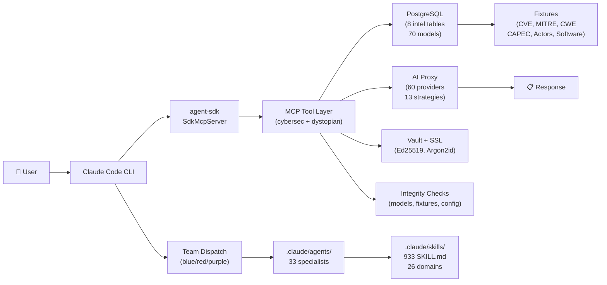
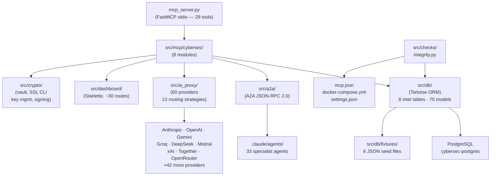

# CyberSecSuite — Architecture

## Overview

CyberSecSuite is a cybersecurity forensics platform built around two complementary subsystems:

| Subsystem | Purpose | Entry point |
|-----------|---------|-------------|
| **A2A Protocol** | External HTTP agent-to-agent communication (JSON-RPC 2.0) | `src/a2a/` |
| **Agent SDK** | Internal AI query execution with in-process MCP tools | `src/a2a/agent_sdk.py` |

Both subsystems are served by a single Starlette ASGI application (`src/proxy/asgi.py`).

---

## System Diagram

```
External clients
      │
      ▼
┌─────────────────────────────────────────────────────────────┐
│  ASGI Application  (src/proxy/asgi.py)                      │
│                                                             │
│  GET /health          → health check (DB status)            │
│  /dashboard/*         → Dashboard UI + REST API             │
│  /v1/*                → AI Proxy (OpenAI-compatible)        │
│  /a2a/*               → A2A JSON-RPC 2.0 server             │
│  /.well-known/        → Agent card discovery                 │
└──────┬──────────┬────────────┬────────────────┬────────────┘
       │          │            │                │
       ▼          ▼            ▼                ▼
  ┌─────────┐ ┌──────────┐ ┌──────────┐  ┌──────────────┐
  │Dashboard│ │ AI Proxy │ │   A2A    │  │   Health     │
  │ routes  │ │ /v1/*    │ │ server   │  │   check      │
  │         │ │          │ │          │  └──────────────┘
  └────┬────┘ └────┬─────┘ └────┬─────┘
       │           │            │
       ▼           ▼            ▼
  ┌─────────────────────────────────────────┐
  │          PostgreSQL (Tortoise ORM)      │
  │  50 models across 30 files              │
  │  MITRE ATT&CK · CVE · CWE · CAPEC      │
  │  Findings · IOCs · Cases · Artifacts    │
  └─────────────────────────────────────────┘
  ┌─────────────────────────────────────────┐
  │      OpenSearch  (port 9200/5601)       │
  │  cybersecsuite-telemetry-YYYY.MM.DD     │
  │  cybersecsuite-audit-YYYY.MM.DD         │
  │  cybersecsuite-api-usage-YYYY.MM.DD     │
  └─────────────────────────────────────────┘
```

---

## Two AI Execution Paths

These paths are **complementary**, not alternatives:

### Path A — Agent SDK (internal)

```
request → run_agent_query() → Claude API
                                    │
                         ┌──────────┴──────────┐
                         │  in-process MCP      │
                         │  (29 cybersec tools) │
                         └─────────────────────┘
                                    │
                         ┌──────────┴──────────┐
                         │  subagents           │
                         │  (.claude/agents/*)  │
                         └─────────────────────┘
```

`agent_sdk.py` → `query()` → Claude model → MCP tools + subagents. All runs in-process. No HTTP between agent calls.

### Path B — A2A Protocol (external)

```
POST /a2a (tasks/send JSON-RPC)
        │
        ▼
  CybersecA2AAgent
        │
        ├── keyword routing → skill handler
        │         │
        │         ▼
        │   run_agent_query()  → SDK → Proxy
        │
        └── no match → _handle_generic()
                              │
                              ▼
                     run_agent_query("cybersec-analyst")
                              │
                              ▼
                        AI Proxy → Provider
```

External clients call `/a2a` via JSON-RPC 2.0. `CybersecA2AAgent` is the sole A2A agent; it routes to any `.claude/agents/*.md` agent via the SDK. Results stream via SSE.

---

## Module Map

```
cybersecsuite/
├── src/
│   ├── a2a/              A2A protocol implementation
│   │   ├── agent.py        BaseA2AAgent
│   │   ├── server.py       A2AServer (Starlette router)
│   │   ├── client.py       A2AClient (async HTTP)
│   │   ├── orchestrator.py OrchestratorAgent (routing + fanout)
│   │   ├── registry.py     AgentRegistry (local + remote)
│   │   ├── agent_loader.py .claude/agents/*.md frontmatter parser
│   │   ├── agent_sdk.py    Agent SDK bridge (caching, model routing, query)
│   │   ├── cybersec_agent.py CybersecA2AAgent (sole A2A agent)
│   │   ├── task_store.py   In-memory task state machine
│   │   ├── models.py       Pydantic A2A protocol models
│   │   └── enums.py        TaskState, MessageRole, etc.
│   │
│   ├── ai_proxy/         Multi-provider AI routing
│   │   ├── routes.py       OpenAI-compatible /v1/* endpoints
│   │   ├── routing/
│   │   │   └── combo.py    13 routing strategies + circuit breaker
│   │   ├── providers/
│   │   │   └── registry.py 9 provider definitions + ProviderConfig
│   │   ├── services/
│   │   │   ├── rate_limiter.py  Per-provider RPM/TPM enforcement
│   │   │   └── usage_tracker.py Token + cost tracking (DB-backed)
│   │   ├── translators/    Request/response format adapters per provider
│   │   └── executors/      Async HTTP execution per provider
│   │
│   ├── crypto/           Cryptographic utilities
│   │   ├── key_manager.py  Ed25519 key generation and storage
│   │   ├── artifact_manager.py Artifact signing + verification
│   │   ├── ssl_signer.py   TLS certificate generation (Phase C)
│   │   ├── cache.py        Encrypted cache layer
│   │   ├── config.py       settings.json loader
│   │   ├── pydantic_models.py Crypto data models
│   │   └── template_renderer.py Report templating
│   │
│   ├── dashboard/        Monitoring dashboard
│   │   └── routes.py       ~30 REST + SSE endpoints + HTML page
│   │
│   ├── db/               Database layer (Tortoise ORM)
│   │   ├── bootstrap.py    init_tortoise_async, create_db, health check
│   │   ├── intel_loader.py MITRE/CVE/CWE/CAPEC intelligence seeding
│   │   ├── settings.py     DB connection config from env
│   │   └── models/         ~50 ORM models across 30 files
│   │
│   ├── proxy/            ASGI application
│   │   └── asgi.py         Starlette app, mounts, startup/shutdown
│   │
│   ├── mcp/              MCP package (Phase A — in progress)
│   │   └── __init__.py     (empty — tools currently in mcp_server.py)
│   │
│   └── manage.py         CLI: schema, seed, status, shell, dashboard, ssl-*
│
├── mcp_server.py         Standalone MCP server (FastMCP, stdio)
│                         29 tool implementations — source of truth
├── mcps/
│   ├── dystopian-crypto-mcp/   Crypto tools MCP (stub)
│   ├── playwright-stealth-mcp/ Browser automation MCP
│   └── token-optimization-mcp/ Token caching/compression MCP
│
├── .claude/
│   ├── agents/           33 specialist agent definitions (.md)
│   │   └── teams/        blue-team.md, red-team.md, purple-team.md
│   └── settings.json     Claude Code project settings
│
├── Dockerfile
├── docker-compose.yml
└── Makefile
```

---

## Port Configuration

| Port | Protocol | Purpose | Env var |
|------|----------|---------|---------|
| `8000` | HTTP | Primary ASGI server | `ASGI_PORT` |
| `8080` | HTTP | Alt HTTP (exposed in Docker) | — |
| `8433` | HTTPS | TLS proxy (Phase C) | `ASGI_TLS_PORT` |
| `5432` | TCP | PostgreSQL | `DB_PORT` |
| `6379` | TCP | Redis cache | `REDIS_URL` |
| `9200` | HTTP | OpenSearch REST API | `OPENSEARCH_HOST`/`OPENSEARCH_PORT` |
| `5601` | HTTP | OpenSearch Dashboards UI | — |
| `20128` | HTTP | OmniRoute AI gateway | `OMNIROUTE_BASE_URL` |

TLS is activated automatically when `ASGI_TLS_CERT` + `ASGI_TLS_KEY` exist. See [configuration.md](configuration.md).

---

## AI Providers

60 providers supported by the AI proxy (9 core + 51 extended):

| Provider | Models | Notes |
|----------|--------|-------|
| Anthropic | Claude 3.5/3 Haiku/Sonnet/Opus | Primary for agent execution |
| OpenAI | GPT-4o, o1, o3 | OpenAI-native + compat endpoint |
| Google Gemini | 1.5 Pro/Flash, 2.0 Flash | Multimodal |
| DeepSeek | V3, R1 | Cost-optimized |
| Groq | Llama-3.3, Mixtral | Ultra-low latency |
| Mistral | mistral-large, codestral | EU/code-focused |
| xAI | Grok-2, Grok-beta | High context |
| Together AI | 60+ open models | BYOM |
| OpenRouter | 200+ models | Aggregator |

Plus 51 extended providers: AI21, AIML API, Alibaba, Baseten, Cerebras, Chutes, Cloudflare, Cohere, Databricks, DeepInfra, Featherless, Fireworks, FriendliAI, Galadriel, Heroku, HuggingFace, Hyperbolic, Kimi, Lambda, LM Studio, Lepton AI, Meta Llama, MiniMax, Moonshot, NanoGPT, Nebius, Novita, Nscale, NVIDIA, OVHcloud, Ollama, Perplexity, Perplexity Search, Pollinations, Qwen, Reka AI, Replicate, RunPod, SambaNova, Scaleway, SiliconFlow, StepFun, Upstage, Venice, Volcengine, W&B, Writer, Yi (01.AI), Zhipu AI, and browser-based Grok (x.com + grok.com).

---

## Database Models (50 models)

Models are grouped by domain:

| Domain | Models |
|--------|--------|
| **Core** | Workspace, Project, Session |
| **Investigations** | Finding, IOC, Case, Investigation |
| **Intelligence** | MitreAttackTechnique, CVEEntry, CWEEntry, CAPECEntry |
| **Forensics** | ForensicArtifact, NetworkConnection, ProcessEntry, FileEntry |
| **Compliance** | ComplianceControl, ComplianceResult |
| **Audit** | AuditLog, ApiUsageLog, A2ATask |
| **Artifacts** | Artifact, ArtifactSignature |

---

## Agent Tiers

| Tier | Model | Examples |
|------|-------|---------|
| Haiku (fast) | claude-haiku-4.5 | watchdog, command-verifier, layer2-6 specialists |
| Sonnet (standard) | claude-sonnet-4 | most analysts, developers |
| Opus (heavy) | claude-opus-4.5 | firmware-analyst, reverse-engineer |

33 agents total. 1 orchestrator (`cybersec-agent`). See [agents.md](agents.md).

---

## Flowcharts

### Ultimate — Target Architecture



### Actual — Current Execution Path


