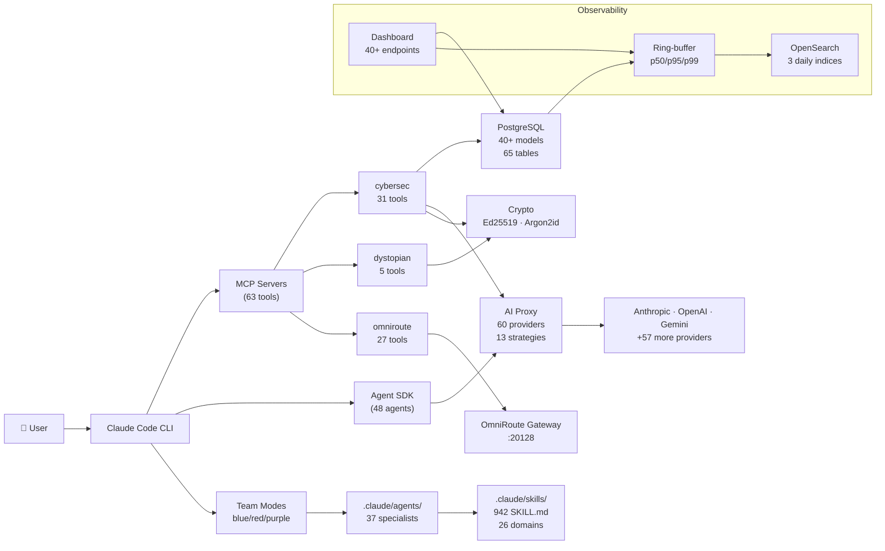
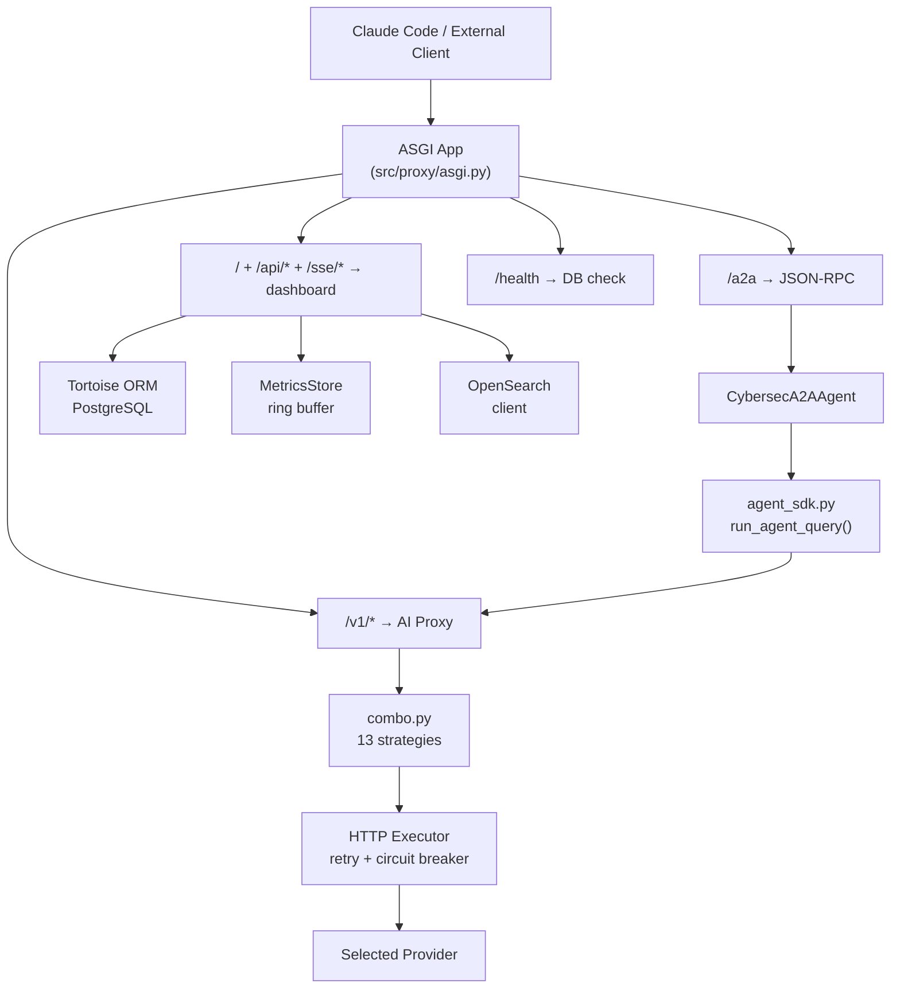

# CyberSecSuite — Architecture

_Last updated: 2026-04-19_

## Overview

CyberSecSuite is a full-stack cybersecurity forensics platform with 7 interconnected layers:

| Layer                | Purpose                                                  | Entry point                         |
|----------------------|----------------------------------------------------------|-------------------------------------|
| **ASGI Application** | HTTP entry point, mounts all subsystems                  | `src/proxy/asgi.py`                 |
| **AI Proxy**         | Multi-provider LLM routing (60 providers, 13 strategies) | `src/ai_proxy/`                     |
| **MCP Tools**        | 63 tools across 4 servers (stdio + bun)                  | `src/csmcp/` + `src/omniroute_mcp/` |
| **A2A Protocol**     | External agent-to-agent communication (JSON-RPC 2.0)     | `src/a2a/`                          |
| **Agent System**     | 48 agents, 942 skills, 3 team modes                      | `.claude/agents/`                   |
| **Database**         | PostgreSQL — 40+ models, Tortoise ORM (asyncpg)          | `src/db/`                           |
| **Observability**    | Telemetry, OpenObserve, 40+ endpoint dashboard            | `src/telemetry/` + `src/dashboard/` |

See also: [layer-integration.md](layer-integration.md) for detailed data flow between layers.

---

## System Diagram

```
External clients / Claude Code CLI
      │
      ▼
┌───────────────────────────────────────────────────────────────┐
│  ASGI Application  (src/proxy/asgi.py, port 8000)             │
│                                                               │
│  GET /health          → DB health check (200/503)             │
│  /                    → Dashboard UI                           │
│  /api/* + /sse/*      → Dashboard REST/SSE endpoints           │
│  /v1/*                → AI Proxy (OpenAI-compatible)           │
│  /a2a                 → A2A JSON-RPC 2.0 server                │
│  /.well-known/        → Agent card discovery                   │
└──────┬──────────┬────────────┬────────────────┬───────────────┘
       │          │            │                │
       ▼          ▼            ▼                ▼
  ┌─────────┐ ┌──────────┐ ┌──────────┐  ┌──────────────┐
  │Dashboard│ │ AI Proxy │ │   A2A    │  │   Health     │
  │ 40+ APIs│ │ 13 strat │ │ JSON-RPC │  │   check      │
  │ 5+ SSE  │ │ 60 prov  │ │ SSE      │  └──────────────┘
  └────┬────┘ └────┬─────┘ └────┬─────┘
       │           │            │
       ▼           ▼            ▼
  ┌──────────────────────────────────────────────┐
  │  PostgreSQL (Tortoise ORM, asyncpg)          │
  │  40+ models · 65 tables · cybersec_forensics │
  │  MITRE ATT&CK · CVE · CWE · CAPEC · NIST    │
  │  Findings · IOCs · Cases · Artifacts         │
  └──────────────────────────────────────────────┘
  ┌──────────────────────────────────────────────┐
│ OpenObserve (port 5080)                      │
  │  cybersecsuite-telemetry-YYYY.MM.DD          │
  │  cybersecsuite-audit-YYYY.MM.DD              │
  │  cybersecsuite-api-usage-YYYY.MM.DD          │
  └──────────────────────────────────────────────┘
```

### MCP Servers (Claude Code stdio)

```
Claude Code
  ├── cybersec server      31 tools  (uv run python -m csmcp.cybersec.server)
  ├── dystopian-crypto      5 tools  (uv run python -m csmcp.dystopian_server)
  ├── omniroute            27 tools  (bun run src/omniroute_mcp/server.ts)
  └── kerneldev             — tools  (external, python -m kerneldev_mcp.server)
                           ══════
                           63 tools total
```

---

## Two AI Execution Paths

These paths are **complementary**, not alternatives:

### Path A — Agent SDK (internal)

```
request → run_agent_query() → Claude API (via AI Proxy localhost:8000/v1)
                                    │
                         ┌──────────┴──────────┐
                         │  36 in-process MCP   │
                         │  (31 cybersec +      │
                         │   5 dystopian)       │
                         └─────────────────────┘
                                    │
                         ┌──────────┴──────────┐
                         │  subagents           │
                         │  (.claude/agents/*)  │
                         │  48 total            │
                         └─────────────────────┘
```

`agent_sdk.py` → `build_agent_options()` → loads agents + 36 MCP tools → `claude_agent_sdk.query()` → Claude model → tool calls + subagent dispatch. All in-process.

### Path B — A2A Protocol (external)

```
POST /a2a (tasks/send JSON-RPC)
        │
        ▼
  CybersecA2AAgent
        │
        ├── keyword routing → skill handler (CVE/IOC/MITRE/artifact/threat)
        │         │
        │         ▼
        │   run_agent_query()  → SDK → AI Proxy → Provider
        │
        └── no match → _handle_generic()
                              │
                              ▼
                     run_agent_query("cybersec-analyst")
                              │
                              ▼
                        AI Proxy → Provider
```

External clients call `/a2a` via JSON-RPC 2.0. `CybersecA2AAgent` routes to any `.claude/agents/*.md` agent via the SDK. Results stream via SSE at `/a2a/stream/{task_id}`.

---

## Module Map

```
cybersecsuite/
├── src/
│   ├── a2a/              A2A protocol + agent SDK
│   │   ├── agent.py        BaseA2AAgent (stream + execute)
│   │   ├── server.py       A2AServer (Starlette router, JSON-RPC dispatch)
│   │   ├── client.py       A2AClient (async HTTP for remote agents)
│   │   ├── registry.py     AgentRegistry (skill-based lookup)
│   │   ├── agent_loader.py .claude/agents/*.md YAML frontmatter parser
│   │   ├── agent_sdk.py    SDK bridge (caching, model routing, MCP wiring)
│   │   ├── cybersec_agent.py CybersecA2AAgent (sole A2A agent, 5 skills)
│   │   ├── task_store.py   In-memory + DB task state machine
│   │   ├── models.py       Pydantic A2A protocol models
│   │   └── enums.py        TaskState, MessageRole, PartType, AuthScheme
│   │
│   ├── agent/            Agent execution runtime
│   │   ├── runner.py       AgentRunner (multi-turn, mode support)
│   │   ├── sessions.py     SessionManager (case mapping, forking)
│   │   ├── streaming.py    SSE adapter for SDK async generators
│   │   └── hooks.py        SDK-level hooks (security, audit, IOC, cost)
│   │
│   ├── ai_proxy/         Multi-provider AI routing
│   │   ├── routes.py       OpenAI-compatible /v1/* endpoints
│   │   ├── routing/
│   │   │   └── combo.py    13 routing strategies + circuit breaker (574 lines)
│   │   ├── providers/
│   │   │   ├── registry.py   ProviderConfig loader (319 lines)
│   │   │   └── _providers.py 60 built-in provider definitions (855 lines)
│   │   ├── services/
│   │   │   ├── rate_limiter.py  Per-provider RPM/TPM token bucket
│   │   │   └── usage_tracker.py Token + cost tracking (DB-backed)
│   │   ├── translators/    Request/response format adapters (OpenAI↔Anthropic↔Gemini)
│   │   └── executors/      Async HTTP execution with retry + circuit breaker
│   │
│   ├── csmcp/            MCP tool package (renamed from src/mcp/ to avoid pip conflict)
│   │   ├── _sdk_compat.py  @tool decorator, SdkMcpServer shim, create_sdk_mcp_server()
│   │   ├── cybersec/       31 tools across 9 modules
│   │   │   ├── server.py     Stdio entry point
│   │   │   ├── helpers.py    Scope utils, sdk_result(), sdk_error()
│   │   │   ├── findings.py   add_finding, add_ioc, query_findings, update_risk_register
│   │   │   ├── db.py         db_healthcheck, bootstrap_intelligence
│   │   │   ├── intelligence.py suggest_mitre, get_project_memory
│   │   │   ├── layers.py     share_to_layers, get_layer_value
│   │   │   ├── cache.py      cache_lookup/store/analytics/invalidate
│   │   │   ├── proxy.py      proxy_chat/providers/models/usage/cost + routing tools
│   │   │   ├── session.py    session_snapshot, agent_registry, best_provider
│   │   │   ├── cases.py      case_open, case_status
│   │   │   └── poc.py        query_pocs, add_poc
│   │   └── dystopian.py    5 crypto tools (Ed25519, signing, verification)
│   │
│   ├── omniroute_mcp/    Self-contained OmniRoute MCP server (TypeScript/Bun)
│   │   ├── server.ts       27 tools, all OmniRoute utilities inlined (~1100 lines)
│   │   ├── package.json    @modelcontextprotocol/sdk, zod, better-sqlite3
│   │   └── tsconfig.json   Bun-compatible (moduleResolution: bundler)
│   │
│   ├── crypto/           Cryptographic utilities
│   │   ├── key_manager.py  Ed25519 key generation, Argon2id encryption, rotation
│   │   ├── artifact_manager.py BLAKE2b hashing + Ed25519 signing/verification
│   │   ├── ssl_signer.py   TLS certificate generation
│   │   └── ...             cache, config, pydantic_models, template_renderer
│   │
│   ├── dashboard/        Monitoring dashboard (Starlette)
│   │   ├── routes.py       40+ endpoints (REST + SSE)
│   │   ├── _handlers.py    Re-export shim (from dashboard.api import *)
│   │   ├── api/            9+ endpoint modules
│   │   │   ├── core.py       overview, providers, usage, health, crypto
│   │   │   ├── agents.py     a2a, agents, routing, factory, agent-query
│   │   │   ├── agent_stream.py streaming chat start/stop + SSE bridge
│   │   │   ├── forensic.py   findings, iocs, yara, network, intel, audit, compliance, NIST
│   │   │   ├── ops.py        cases, tasks, task lifecycle, PoCs
│   │   │   ├── tables.py     db counts, models, generic table, prompts, telemetry
│   │   │   ├── settings.py   GET/PATCH settings with access control
│   │   │   ├── team_builder.py team agents, skills, teams
│   │   │   ├── openobserve_stats.py stream health + stats
│   │   │   └── sse.py        /sse/cases, /sse/tasks, /sse/health, /sse/telemetry (+ agent-run stream route in routes.py)
│   │   ├── _schema.py      Tortoise model introspector (40+ models)
│   │   └── templates/      HTML dashboard assembler (base, tabs, panels, JS)
│   │
│   ├── db/               Database layer (Tortoise ORM + asyncpg)
│   │   ├── bootstrap.py    init_tortoise_async(), health check, DB creation
│   │   ├── settings.py     Connection config from env vars
│   │   ├── seeds/          Live seeders (MITRE, NVD, CWE, CAPEC)
│   │   └── models/         40+ ORM models across 30+ files
│   │
│   ├── telemetry/        In-process metrics
│   │   ├── store.py        MetricsStore (ring buffer, p50/p95/p99, dual-write)
│   │   ├── middleware.py   ASGI TelemetryMiddleware (path normalization)
│   │   └── collector.py    TelemetryCollector (15s polling, rolling history)
│   │
│   ├── openobserve/     OpenObserve integration (streams instead of indices)
│   │   ├── client.py       Async singleton, index templates
│   │   └── bulk_writer.py  Buffered bulk writer (100 docs / 5s flush)
│   │
│   ├── proxy/            ASGI application
│   │   └── asgi.py         Starlette app, mount map, startup/shutdown lifecycle
│   │
│   ├── hooks/            Filesystem event hooks (subprocess-based)
│   │   └── ...             30 Python modules, 15+ event types
│   │
│   └── manage.py         CLI dispatcher: schema, seed-*, status, ssl-*, vault, migrate-*
│
├── .claude/
│   ├── agents/           48 agent definitions
│   │   ├── *.md            37 main specialists (YAML frontmatter)
│   │   ├── teams/          blue-team.md, red-team.md, purple-team.md
│   │   └── sub_agents/     8 sub-agent copies for nested dispatch
│   ├── skills/           942 SKILL.md across 26 domains
│   ├── hooks/            10 workspace-level hooks (settings.json-wired)
│   └── settings.json     Agent config, hooks, MCP, proxy settings
│
├── data/fixtures/        Seed data (NIST CSF 2.0, NIST AI RMF 1.0)
├── mcp.json              MCP server wiring (4 servers)
├── docker-compose.yml    5 services (postgres, dashboard, redis, opensearch, OS dashboards)
├── pyproject.toml        Python 3.14, uv, dependencies
└── Makefile              Dev commands
```

---

## Port Configuration

| Port    | Protocol | Service                               | Env var              |
|---------|----------|---------------------------------------|----------------------|
| `8000`  | HTTP     | Primary ASGI server (uvicorn)         | `ASGI_PORT`          |
| `8080`  | HTTP     | Alt HTTP (Docker exposed)             | —                    |
| `8433`  | HTTPS    | TLS proxy (auto-activates with certs) | `ASGI_TLS_PORT`      |
| `5432`  | TCP      | PostgreSQL                            | `CYBERSEC_DB_PORT`   |
| `6379`  | TCP      | Redis cache                           | `REDIS_URL`          |
| `5080`  | HTTP     | OpenObserve UI + ingestion API        | `OPENOBSERVE_HOST`  |
| `20128` | HTTP     | OmniRoute AI gateway                  | `OMNIROUTE_BASE_URL` |

TLS is activated automatically when `ASGI_TLS_CERT` + `ASGI_TLS_KEY` exist. See [configuration.md](configuration.md).

---

## MCP Tool Inventory (63 tools)

| Server               | Tools | Runtime          | Transport        |
|----------------------|-------|------------------|------------------|
| **cybersec**         | 31    | Python (uv)      | stdio            |
| **dystopian-crypto** | 5     | Python (uv)      | stdio            |
| **omniroute**        | 27    | TypeScript (Bun) | stdio            |
| **kerneldev**        | —     | Python           | stdio (external) |

Tool prefixes: `mcp__cybersec__*` · `mcp__dystopian__*` · `mcp__omniroute__*`

See [mcp-tools.md](mcp-tools.md) for full reference, [omniroute-mcp.md](omniroute-mcp.md) for OmniRoute details.

---

## AI Providers

60 providers supported by the AI proxy (9 core + 51 extended):

| Provider      | Models                       | Notes                           |
|---------------|------------------------------|---------------------------------|
| Anthropic     | Claude Haiku/Sonnet/Opus 4.x | Primary for agent execution     |
| OpenAI        | GPT-4o, o1, o3               | OpenAI-native + compat endpoint |
| Google Gemini | 1.5 Pro/Flash, 2.0 Flash     | Multimodal                      |
| DeepSeek      | V3, R1                       | Cost-optimized                  |
| Groq          | Llama-3.3, Mixtral           | Ultra-low latency               |
| Mistral       | mistral-large, codestral     | EU/code-focused                 |
| xAI           | Grok-2, Grok-beta            | High context                    |
| Together AI   | 60+ open models              | BYOM                            |
| OpenRouter    | 200+ models                  | Aggregator                      |

Plus 51 extended providers including AI21, Cerebras, Cloudflare, Cohere, DeepInfra, Fireworks, HuggingFace, Lambda, NVIDIA, Ollama, Perplexity, Replicate, SambaNova, and more.

### 13 Routing Strategies

`PRIORITY` · `ROUND_ROBIN` · `COST_OPTIMIZED` · `WEIGHTED` · `RANDOM` · `LEAST_USED` · `FILL_FIRST` · `P2C` · `STRICT_RANDOM` · `AUTO` · `LKGP` · `CONTEXT_OPTIMIZED` · `CONTEXT_RELAY`

---

## Database Models (40+ models, 65 tables)

| Domain                 | Count | Key Models                                                                     |
|------------------------|-------|--------------------------------------------------------------------------------|
| **Scope**              | 4     | Workspace, Project, Session, ScopedEntry (abstract)                            |
| **Investigation**      | 6     | Finding, IOC, Risk, Baseline, WatchlistItem, SharedEntry                       |
| **Intel — MITRE**      | 3     | MitreTechniqueIntel, MitreThreatActorIntel, MitreSoftwareFamilyIntel           |
| **Intel — Vulns**      | 3     | CVEIntel, CWEIntel, CapecAttackPatternIntel                                    |
| **Intel — Compliance** | 2     | NistCsfControl (185 controls), NistAiRmfControl (72 controls)                  |
| **Forensics**          | 5     | ForensicProject, ForensicSession, IOCEntry, ForensicWatchlistItem, ClearedItem |
| **Network**            | 7     | Network, Host, IPAddress, Domain, Certificate, NetworkConnection, Machine      |
| **Hardware**           | 5     | CPUInfo, MemoryModule, NetworkInterface, InterfaceAddress, StorageDrive        |
| **Artifacts**          | 2     | Artifact (versioned + signed), ArtifactSignatureLog                            |
| **Audit**              | 3     | AuditLog (immutable), ApiUsageLog (UUID PK), CaseIntake                        |
| **Other**              | 4     | Vulnerability, POCIntel, Tag, YaraRule                                         |

---

## Agent Tiers

| Tier              | Model            | Examples                                     |
|-------------------|------------------|----------------------------------------------|
| Haiku (fast)      | claude-haiku-4.5 | watchdog, command-verifier                   |
| Sonnet (standard) | claude-sonnet-4  | most analysts, developers, layer specialists |
| Opus (heavy)      | claude-opus-4.5  | firmware-analyst, reverse-engineer           |

48 agents total: 37 main specialists + 3 team modes + 8 sub-agents. 1 orchestrator (`cybersec-agent`). See [agents.md](agents.md).

---

## Cryptography Stack

| Algorithm       | Purpose                          | Parameters                       |
|-----------------|----------------------------------|----------------------------------|
| **Ed25519**     | Key generation, artifact signing | 256-bit keys                     |
| **BLAKE2b**     | Content hashing                  | 256-bit digests                  |
| **Argon2id**    | Password KDF, key encryption     | mem=256MB, iters=4, lanes=4      |
| **AES-256-GCM** | Authenticated encryption         | Random 12-byte nonce per message |

Keys stored at `DYSTOPIAN_KEYS_DIR` (default `/etc/dystopian-crypto/keys`). Vault secrets at `~/.dystopian-crypto/vault/`.

---

## Docker Compose Services

| Service                        | Image                        | Port             | Healthcheck           | Depends    |
|--------------------------------|------------------------------|------------------|-----------------------|------------|
| cybersec-postgres              | custom                       | 5432             | pg_isready            | —          |
| cybersec-dashboard             | custom (Python 3.14)         | 8000, 8080, 8433 | curl /health          | postgres   |
| cybersec-redis                 | custom                       | 6379             | redis-cli ping        | —          |
| cybersec-opensearch            | opensearch:2.17.1            | 9200             | curl /_cluster/health | —          |
| cybersec-opensearch-dashboards | opensearch-dashboards:2.17.1 | 5601             | —                     | opensearch |

---

## Flowcharts

### System Architecture



### Request Execution Flow


