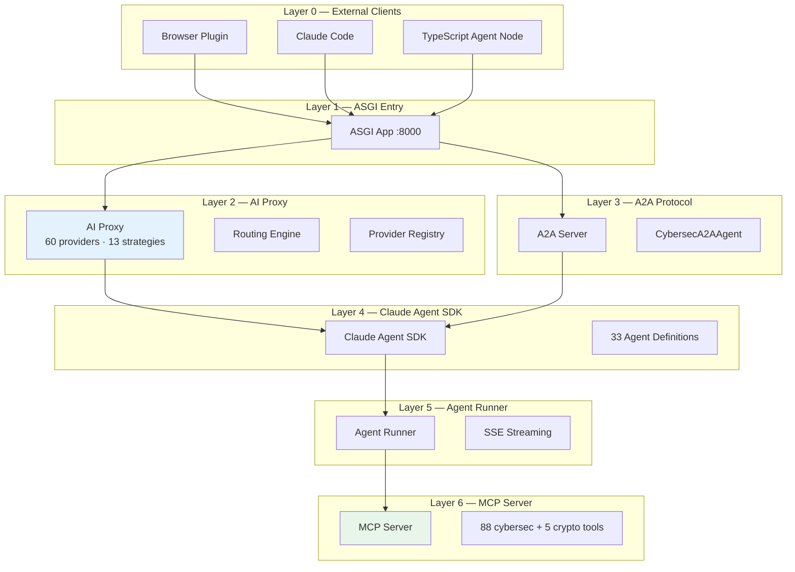

# CyberSecSuite — Core Processing Layers (0-6)

```mermaid
flowchart TD
    subgraph L0["Layer 0 — External Clients"]
        BP["Browser Plugin"]
        CC["Claude Code"]
        TS["TypeScript Agent Node"]
    end

    subgraph L1["Layer 1 — ASGI Entry"]
        ASGI["ASGI App :8000"]
    end

    subgraph L2["Layer 2 — AI Proxy"]
        PROXY["AI Proxy\n60 providers · 13 strategies"]
        ROUTING["Routing Engine"]
        PROVIDERS["Provider Registry"]
    end

    subgraph L3["Layer 3 — A2A Protocol"]
        A2A["A2A Server"]
        CYBAGENT["CybersecA2AAgent"]
    end

    subgraph L4["Layer 4 — Claude Agent SDK"]
        SDK["Claude Agent SDK"]
        AGENTDEFS["33 Agent Definitions"]
    end

    subgraph L5["Layer 5 — Agent Runner"]
        RUNNER["Agent Runner"]
        STREAMING["SSE Streaming"]
    end

    subgraph L6["Layer 6 — MCP Server"]
        MCP["MCP Server"]
        TOOLS["88 cybersec + 5 crypto tools"]
    end

    BP --> ASGI
    CC --> ASGI
    TS --> ASGI

    ASGI --> PROXY
    ASGI --> A2A

    PROXY --> SDK
    A2A --> SDK
    SDK --> RUNNER
    RUNNER --> MCP

    style PROXY fill:#e3f2fd
    style MCP fill:#e8f5e9
```