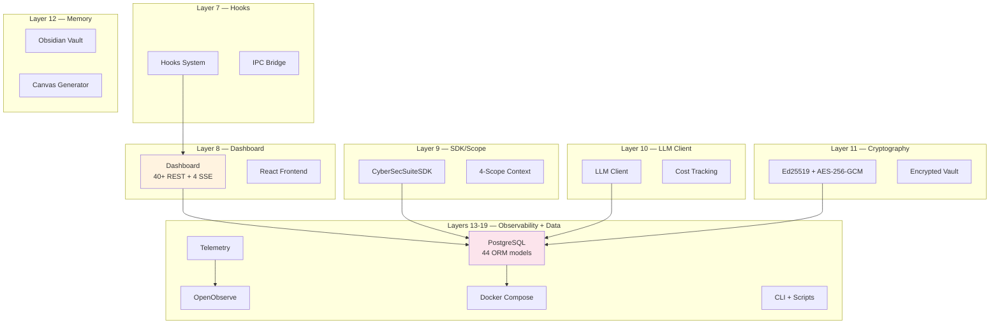

# CyberSecSuite — Data, UI & Infrastructure Layers (7-19)

```mermaid
flowchart TD
    subgraph L7["Layer 7 — Hooks"]
        HOOKS["Hooks System"]
        IPC["IPC Bridge"]
    end

    subgraph L8["Layer 8 — Dashboard"]
        DASH["Dashboard\n40+ REST + 4 SSE"]
        REACT["React Frontend"]
    end

    subgraph L9["Layer 9 — SDK/Scope"]
        CSSDK["CyberSecSuiteSDK"]
        SCOPE["4-Scope Context"]
    end

    subgraph L10["Layer 10 — LLM Client"]
        LLM["LLM Client"]
        PRICING["Cost Tracking"]
    end

    subgraph L11["Layer 11 — Cryptography"]
        CRYPTO["Ed25519 + AES-256-GCM"]
        VAULT["Encrypted Vault"]
    end

    subgraph L12["Layer 12 — Memory"]
        OBSIDIAN["Obsidian Vault"]
        CANVAS["Canvas Generator"]
    end

    subgraph L13to19["Layers 13-19 — Observability + Data"]
        TELEMETRY["Telemetry"]
        DB["PostgreSQL\n44 ORM models"]
        OO["OpenObserve"]
        INFRA["Docker Compose"]
        TOOLS["CLI + Scripts"]
    end

    HOOKS --> DASH
    DASH --> DB
    CSSDK --> DB
    LLM --> DB
    CRYPTO --> DB
    TELEMETRY --> OO
    DB --> INFRA

    style DASH fill:#fff3e0
    style DB fill:#fce4ec
```