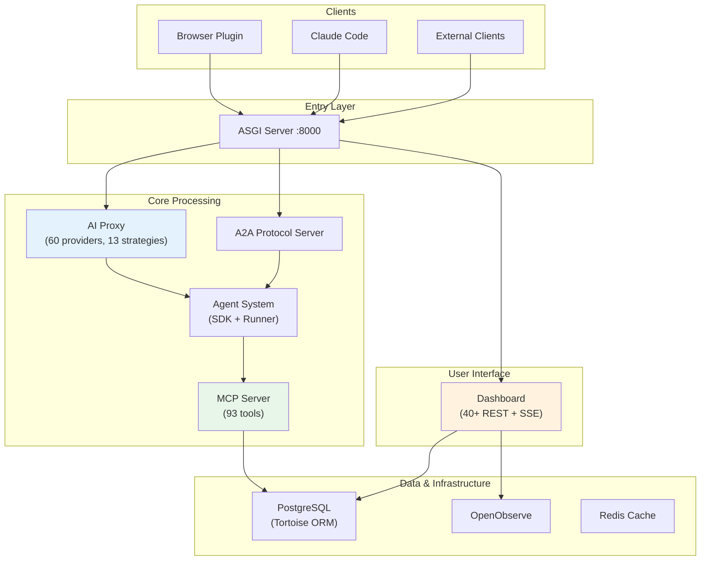

# CyberSecSuite — High-Level Architecture Overview

```mermaid
flowchart TD
    subgraph Clients["Clients"]
        Browser["Browser Plugin"]
        Claude["Claude Code"]
        External["External Clients"]
    end

    subgraph Entry["Entry Layer"]
        ASGI["ASGI Server :8000"]
    end

    subgraph Core["Core Processing"]
        AIProxy["AI Proxy\n(60 providers, 13 strategies)"]
        A2A["A2A Protocol Server"]
        AgentSystem["Agent System\n(SDK + Runner)"]
        MCP["MCP Server\n(93 tools)"]
    end

    subgraph UI["User Interface"]
        Dashboard["Dashboard\n(40+ REST + SSE)"]
    end

    subgraph Data["Data & Infrastructure"]
        PostgreSQL["PostgreSQL\n(Tortoise ORM)"]
        OpenObserve["OpenObserve"]
        Redis["Redis Cache"]
    end

    Browser --> ASGI
    Claude --> ASGI
    External --> ASGI

    ASGI --> AIProxy
    ASGI --> A2A
    ASGI --> Dashboard

    AIProxy --> AgentSystem
    A2A --> AgentSystem
    AgentSystem --> MCP

    MCP --> PostgreSQL
    Dashboard --> PostgreSQL
    Dashboard --> OpenObserve

    style AIProxy fill:#e3f2fd
    style MCP fill:#e8f5e9
    style Dashboard fill:#fff3e0
```