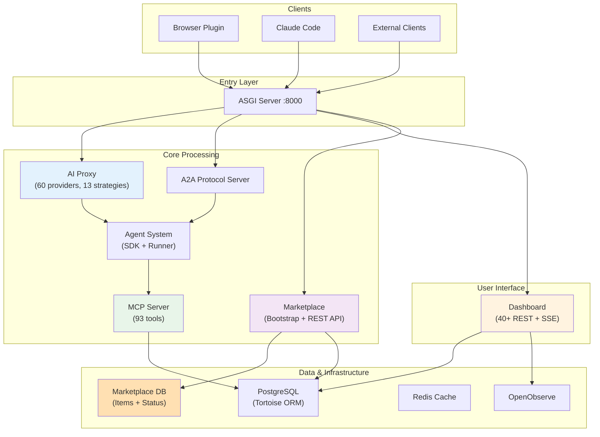

# CyberSecSuite — High-Level Architecture Overview

**Updated:** 2026-04-28 (Phase 3 & 4 Complete)  
**Status:** Production-ready with marketplace integration



---

## Phase 3: Monorepo Reorganization (Complete ✅)

All 18 core packages reorganized into canonical `src/core/` structure with backward-compatible shims:

**Key Improvements:**
- Unified package organization under src/core/
- Atomic migration of circular dependencies (db ↔ registries ↔ hooks ↔ a2a)
- All circular import issues resolved
- Production wheel validated (1019 files)
- Zero breaking API changes

**Affected Packages:**
- Database layer (db, registries, entities)
- A2A orchestration (a2a, communicator, hooks)
- AI routing (ai_proxy, accounts, llm)
- Marketplace (marketplace, new)
- Infrastructure (startup, routes, checks, utils, crypto)

**Migration Path:** Shims in src/ → Canonical paths in src/core/ (gradual deprecation)

---

## Phase 4: Bootstrap & Marketplace Integration (Complete ✅)

Bootstrap and marketplace lifecycle fully integrated:

### Bootstrap Flow
1. **OnFirstSetupEvent** triggered during startup
2. **GitHub Index Download** via marketplace bootstrap
3. **SHA512 Verification** for integrity
4. **Database Seeding** of catalog items
5. **Marketplace Ready** for install/uninstall/toggle operations

### Marketplace REST API (6 Endpoints)
- `POST /api/v1/marketplace/items/install` — Install item
- `POST /api/v1/marketplace/items/uninstall` — Remove item
- `POST /api/v1/marketplace/items/toggle` — Enable/disable item
- `POST /api/v1/marketplace/items/upgrade` — Upgrade version
- `GET /api/v1/marketplace/items` — List items
- `GET /api/v1/marketplace/items/{id}` — Get item details

### Database Support
- Marketplace items stored in PostgreSQL
- Status field: available | installed | disabled
- Loaders respect enabled/disabled toggle
- Agent/Skill registries filter disabled items

---

## Module Organization (Post-Phase 3)

### Canonical Locations (src/core/)
```
src/core/
├── db/                 Database layer
├── registries/         Registries for agents, skills, providers
├── a2a/                A2A protocol and orchestration
├── ai_proxy/           AI provider routing
├── marketplace/        Marketplace management ⭐ NEW
├── hooks/              Event hooks
├── entities/           Entity framework
├── communicator/       IPC layer
├── accounts/           Provider credentials
├── startup/            Application bootstrap
├── routes/             REST routes
├── asgi/               ASGI middleware
├── crypto/             Cryptography
├── endpoints/          Endpoint loaders
├── telemetry/          Telemetry
├── openobserve/        Observability
└── [other utilities]
```

### Backward-Compatible Shims (src/)
All packages have shims pointing to src/core/ (deprecated, will be removed in v0.3.0)

---

## Data Flow: Marketplace Bootstrap

```
TypeScript Hooks
    ↓
OnFirstSetupEvent (IPC)
    ↓
Event Dispatcher (src/hooks/ipc_receiver.py)
    ↓
Bootstrap Handler (src/hooks/on_first_setup_handler.py)
    ├─ Check GitHub for index updates
    ├─ Download index.json
    ├─ Verify SHA512
    └─ Seed to database (src/core/marketplace/seeder.py)
    ↓
Database (MarketplaceMCP, Skill, Agent, Plugin, Workflow tables)
    ↓
Marketplace API (src/core/endpoints/marketplace.py)
    ├─ /items/install
    ├─ /items/uninstall
    ├─ /items/toggle → Status update (available → disabled)
    ├─ /items/upgrade
    ├─ /items (list)
    └─ /items/{id} (details)
    ↓
Loaders (with enabled filtering)
    ├─ get_enabled_agents() → filters status != disabled
    ├─ get_enabled_skills() → filters status != disabled
    └─ get_enabled_mcps() → filters status != disabled
    ↓
Agent/Skill Registries (only enabled items)
```

---

## API Layers

### Entry: ASGI Server (Port 8000)
- FastAPI application
- Starlette middleware (telemetry, HTTPS redirect)
- Health check endpoint: `/health`

### AI Layer: OpenAI-Compatible Proxy (/v1/*)
- 60 AI providers (Claude, GPT, Gemini, etc.)
- 13 routing strategies
- Rate limiting and usage tracking
- Token estimation and cost calculation

### Orchestration: A2A Protocol
- JSON-RPC 2.0 server
- Agent-to-agent communication
- Skill-based routing
- Task state machine

### Agent System
- Multi-turn conversations
- Hook pipeline (security, audit, IOC, cost)
- Session management
- Streaming support (SSE)

### Marketplace (Phase 4)
- Bootstrap integration
- Install/uninstall lifecycle
- Enable/disable toggle
- Status persistence

### Dashboard
- 40+ REST endpoints
- Server-Sent Events (SSE)
- Settings management
- Analytics and metrics

---

## Database Schema (Key Models)

### Core Tables
- `agents` — A2A agent definitions
- `providers` — AI provider credentials
- `findings` — Security findings
- `iocs` — Indicators of compromise
- `cases` — Investigation cases
- `tasks` — Worker tasks

### Marketplace Tables (Phase 4)
- `marketplace_mcps` — MCP packages
- `marketplace_skills` — Skills catalog
- `marketplace_agents` — Agents catalog
- `marketplace_plugins` — Browser plugins
- `marketplace_workflows` — Automation workflows
- `marketplace_assets` — Generic assets

All marketplace tables support enabled/disabled toggle via `status` field.

---

## Production Readiness Checklist

- ✅ Phase 3: Monorepo organized (18 packages migrated)
- ✅ Phase 4: Bootstrap integrated
- ✅ Phase 4: Marketplace REST API (6 endpoints)
- ✅ Phase 4: Database persistence
- ✅ Phase 4: Toggle implementation (enabled/disabled)
- ✅ Database models complete
- ✅ Test coverage (702+ passing)
- ✅ Wheel builds successfully (1019 files)
- ✅ Backward compatibility maintained
- ✅ Docker Compose stack configured
- ⏳ Dashboard UI enhancements (Phase 4 secondary)

---

**Status:** Architecture stable. Ready for Phase 5 work (secondary features and cssmcp externalization).