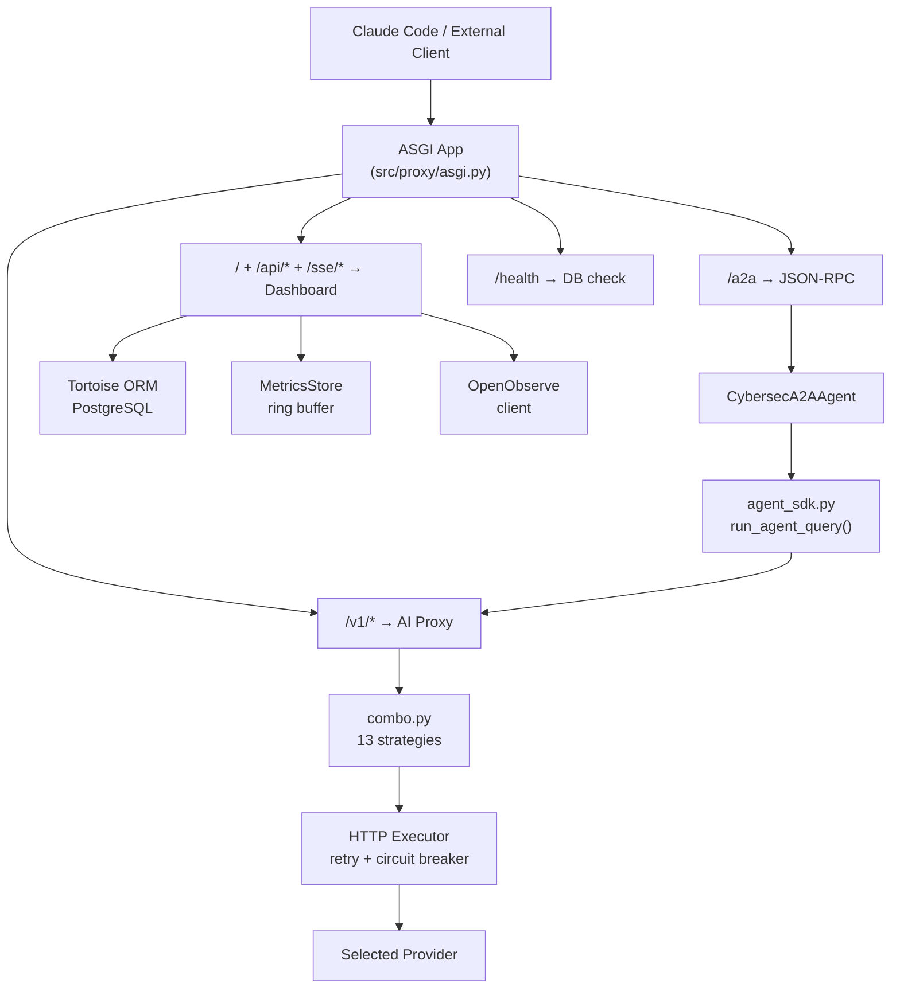

# Data Flow & Integration Points

Request flow examples and how the 7 layers connect.

---

## Request Flow Examples

### Example 1 — Agent Query via Dashboard

```
Browser
  │
  │  POST /api/agent-query
  │  Body: {prompt: "Analyze suspicious binary", agent_name: "reverse-engineer"}
  │
  ▼
api_agent_query()                          ← src/dashboard/api/agents.py
  │
  ▼
run_agent_query("reverse-engineer", prompt)  ← src/a2a/agent_sdk.py
  │
  ▼
build_agent_options()
  ├─ Loads .claude/agents/sub_agents/reverse-engineer.md
  ├─ Parses frontmatter → model: opus
  ├─ Creates SDK MCP server with 93 tools (88 cybersec + 5 dystopian)
  └─ Sets ANTHROPIC_BASE_URL = http://localhost:8000/v1
  │
  ▼
claude_agent_sdk.query()
  │
  │  POST http://localhost:8000/v1/chat/completions
  │
  ▼
AI Proxy combo.py
  ├─ Strategy: COST_OPTIMIZED (or configured default)
  ├─ Selects provider: e.g., Anthropic Claude Opus
  └─ Forwards to provider API
  │
  ▼
Claude model processes prompt
  ├─ May invoke MCP tool: add_finding(title, severity, description)
  │    → findings.py → Finding.create() → PostgreSQL INSERT
  ├─ May invoke MCP tool: suggest_mitre(technique_name)
  │    → intelligence.py → MitreTechniqueIntel.filter() → PostgreSQL SELECT
  └─ Returns analysis result
  │
  ▼
Response streams back:
  SDK → agent_sdk.py → api_agent_query() → HTTP response → Browser
```

### Example 2 — External A2A Request

```
External A2A Client
  │
  │  POST /a2a
  │  Body: {"jsonrpc": "2.0", "method": "tasks/send",
  │         "params": {"message": "Analyze CVE-2024-1234"}, "id": 1}
  │
  ▼
A2AServer.handle_rpc()                     ← src/a2a/server.py
  │
  ▼
CybersecA2AAgent.execute()                 ← src/a2a/cybersec_agent.py
  │
  ├─ Keyword routing: "cve" detected
  ▼
_handle_cve()
  │
  ▼
run_agent_query("cybersec-analyst", enriched_prompt)
  │
  ▼
Agent SDK → AI Proxy → Claude → MCP tools → DB queries
  │
  ├─ Task stored in DB + in-memory store
  │
  ▼
JSON-RPC response:
  {"jsonrpc": "2.0", "result": {"task_id": "abc-123", "status": "completed"}, "id": 1}

Client can also poll:
  GET /a2a/stream/abc-123  →  SSE updates in real time
```

### Example 3 — MCP Tool Execution (Claude Code)

```
Claude Code (local IDE)
  │
  │  stdio transport
  │  uv run python -m csmcp.cybersec.server
  │
  ▼
MCP Server (in-process)
  │
  │  Tool call: add_finding
  │  Args: {title: "Suspicious SUID binary", severity: "high",
  │         description: "Found /usr/local/bin/backdoor with SUID bit"}
  │
  ▼
findings.py → add_finding()
  │
  ▼
Finding.create(title=..., severity=..., description=...)
  │
  │  Tortoise ORM → asyncpg → PostgreSQL INSERT
  │
  ▼
sdk_result({"id": 42, "title": "Suspicious SUID binary", ...})
  │
  │  JSON response via stdio
  │
  ▼
Claude Code receives result and continues investigation
```

---

## Layer Integration Points

### ASGI → AI Proxy

```
src/proxy/asgi.py
  └─ mounts create_proxy_router() at /v1
       └─ POST /v1/chat/completions
            → routes.chat_completions()
            → combo.py (strategy selection)
            → provider executor
            → response
```

13 routing strategies govern provider selection. Custom headers (`x-provider`, `x-prefer-free`, `x-max-cost-per-1k`) allow per-request routing overrides.

---

### ASGI → Dashboard

```
src/proxy/asgi.py
  └─ mounts create_dashboard_router() at /
       └─ 40+ endpoints across 9 API modules + 4 SSE streams
            → Tortoise ORM queries (Layer 6)
            → AI Proxy status queries (Layer 2)
            → Telemetry snapshots (Layer 7)
```

---

### ASGI → A2A

```
src/proxy/asgi.py
  └─ mounts A2AServer at /
       ├─ POST /a2a
       │    → JSON-RPC dispatch → CybersecA2AAgent → skill handler
       │    → run_agent_query() → Agent SDK → AI Proxy
       │
       ├─ GET /a2a/stream/{task_id}
       │    → SSE streaming
       │
       └─ GET /.well-known/agent.json
            → Agent card
```

---

### Agent SDK → MCP Tools

```
src/csmcp/_sdk_compat.py
  └─ @tool decorator registers tools into SdkMcpServer._tools

src/a2a/agent_sdk.py
  └─ create_sdk_mcp_server()
       └─ Builds in-process MCP server from all decorated tools (93 tools)
       └─ Injected into agent options
```

---

### Telemetry → OpenObserve

```
src/telemetry/store.py
  └─ Dual-write on every event:
       ├─ In-process ring buffer  →  immediate stats (p50/p95/p99)
       └─ openobserve/writer.py   →  async bulk writer
            └─ Buffered: 100 docs OR 5-second flush
            └─ 3 daily-rollover streams:
                 ├─ telemetry-YYYY.MM.DD
                 ├─ audit-YYYY.MM.DD
                 └─ api-usage-YYYY.MM.DD
```

---

### Hooks Pipeline

Two complementary hook systems run in parallel:

```
┌──────────────────────────────┐    ┌──────────────────────────────┐
│  FILESYSTEM HOOKS            │    │  SDK HOOKS                   │
│  .claude/hooks/              │    │  src/agent/hooks.py          │
│  Execution: subprocess       │    │  Execution: in-process       │
└──────────────┬───────────────┘    └──────────────┬───────────────┘
               │                                   │
               ▼                                   ▼
       ┌───────────────────────────────────────────────────┐
       │  PreToolUse:  security_hook (blocks dangerous cmds)│
       │               audit_hook (logs all tool calls)     │
       │  PostToolUse: ioc_hook (extracts IOCs from output) │
       │  Stop:        cost_hook (logs session cost)        │
       └───────────────────────────────────────────────────┘
```

---

### Memory Hierarchy

```
~/.cybersecsuite/memory/system/    ← Global defaults (read-only)
~/.cybersecsuite/memory/project/   ← Project-level context
~/.cybersecsuite/memory/session/   ← Ephemeral session state (highest priority)
```

See [../configuration/scope-model.md](../configuration/scope-model.md) for the full scope model.

---

## Mermaid Flowchart


