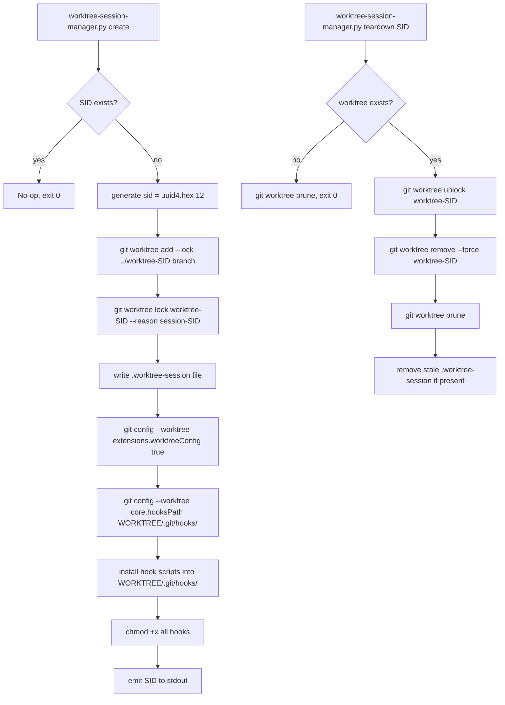

# Git Worktree + Session-ID + Conditional Hooks — Project Plan

## 1. Project Overview

Two agents (a human developer and an AI coding agent, or two automated agents) must work simultaneously on the same Git repository without triggering index-lock collisions, hook conflicts, or cross-contamination of working-tree state. The chosen solution leverages **Git worktrees** with a strict `worktree-<sid>` naming convention, where `<sid>` is a 12-character lowercase hexadecimal session ID derived from `uuid.uuid4().hex[:12]`. Each agent owns one worktree for the duration of its session. Hook isolation is achieved by setting `core.hooksPath` in the per-worktree Git config to that worktree's private `.git/hooks/` directory, enabled through `extensions.worktreeConfig true`. A central Python 3 manager script (`worktree-session-manager.py`) automates creation, configuration, hook installation, and teardown. All operations are idempotent, race-condition-safe, and designed for production use.

---

## 2. Detailed Requirements

### Functional Requirements

- **Unique session IDs**: Every worktree MUST be identified by a 12-character lowercase hex session ID (`[0-9a-f]{12}`) generated via `uuid.uuid4().hex[:12]`.
- **Strict naming**: Worktree directories MUST follow the pattern `worktree-<sid>` relative to the parent of the main repository root.
- **Marker file**: Each worktree root MUST contain a `.worktree-session` file with the single-line content `<sid>`.
- **Per-worktree hooks**: Each worktree MUST configure `core.hooksPath` pointing to `<worktree-root>/.git/hooks/` so hooks installed there fire only for that agent's operations.
- **Hook lifecycle**:
  - Hooks are installed at worktree creation time.
  - Hooks are removed (or the directory is wiped) at teardown time.
  - Hooks in one worktree MUST NEVER fire in another worktree.
- **Conditional hook fallback**: For shared hooks (e.g., project-wide quality gates), a `get_current_worktree_sid()` helper allows a hook to identify its owning session and conditionally skip non-owning work.
- **Teardown safety**: `worktree-session-manager.py teardown <sid>` MUST run `git worktree remove` and `git worktree prune`, and clean up the marker file and any stale lock files.
- **Idempotency**: Running `create` for the same `<sid>` twice MUST be a no-op on the second call (detect existing worktree and skip).
- **Alias integration**: Shell aliases `gwt-create`, `gwt-teardown`, `gwt-sid` MUST be provided for zsh and bash.

### Non-Functional Requirements

- **Race-condition safety**: Worktree creation MUST use `git worktree add --lock` to prevent concurrent pruning of a partially-initialised worktree.
- **Python version**: All scripts MUST be compatible with Python 3.9+.
- **No external dependencies**: The manager script MUST use only the Python standard library + `subprocess`.
- **Logging**: All operations MUST emit structured log lines to stderr (`[WSM] <level> <message>`).
- **Exit codes**: The manager script MUST exit non-zero on any unrecoverable error.
- **Portability**: Must work on Linux, macOS, and WSL2 (Windows paths are out of scope).
- **Config hygiene**: `extensions.worktreeConfig true` MUST be set exactly once in the main repo; the manager script MUST be idempotent when re-setting it.
- **Security**: Hook scripts MUST NOT contain hardcoded credentials or tokens.

---

## 3. Architecture & Best Practices

### Why Per-Worktree `core.hooksPath` Is Superior

The naive approach — shared hooks with runtime `if` guards checking which worktree is active — has three critical flaws:

1. **Race window**: Two agents reading the same shared hook file simultaneously can observe inconsistent state.
2. **Maintenance burden**: Every new hook must remember to add the conditional guard; it is trivially omitted.
3. **Blast radius**: A bug in the shared hook kills both agents' workflows simultaneously.

The per-worktree `core.hooksPath` approach eliminates all three problems:

- The hooks directory lives inside `<worktree>/.git/hooks/`, which is physically isolated.
- Git automatically reads `core.hooksPath` from the worktree-specific config when `extensions.worktreeConfig true` is set.
- Each agent installs exactly the hooks it needs; other agents are entirely unaffected.

### Git Documentation References

- **`extensions.worktreeConfig`** (Git 2.20+): When set to `true` in the main repository's `.git/config`, Git reads an additional `config.worktree` file inside each worktree's private `.git/` directory. This is the mechanism that allows per-worktree `core.hooksPath`. See: `git help worktree` and `git help config` §`extensions.worktreeConfig`.
- **`core.hooksPath`** (Git 2.9+): Overrides the default `$GIT_DIR/hooks` location with an arbitrary directory. When set per-worktree, hooks fire only for that worktree's Git operations.

### Architecture Diagram

```
┌─────────────────────────────────────────────────────────────────────┐
│                         Filesystem Layout                           │
│                                                                     │
│  ~/projects/                                                        │
│  ├── myrepo/                          ← main worktree (bare clone)  │
│  │   ├── .git/                                                      │
│  │   │   ├── config                  ← extensions.worktreeConfig=true │
│  │   │   ├── hooks/                  ← main worktree hooks (agent A) │
│  │   │   └── worktrees/                                             │
│  │   │       └── worktree-<sid-B>/                                  │
│  │   │           ├── gitdir          ← pointer to linked worktree   │
│  │   │           └── config.worktree ← core.hooksPath for agent B   │
│  │   ├── .worktree-session           ← "main" or absent             │
│  │   └── worktree-session-manager.py                                │
│  │                                                                  │
│  └── worktree-<sid-B>/               ← agent B's isolated worktree  │
│      ├── .git                        ← file: gitdir=../myrepo/.git/  │
│      │                                          worktrees/<sid-B>/  │
│      ├── .worktree-session           ← contains "<sid-B>"           │
│      └── (full working tree)                                        │
│                                                                     │
│  Hook Resolution:                                                   │
│  Agent A operation → reads .git/config.worktree for main worktree  │
│                    → core.hooksPath = .git/hooks/  (main hooks)     │
│  Agent B operation → reads .git/worktrees/<sid-B>/config.worktree  │
│                    → core.hooksPath = /path/to/worktree-<sid-B>/.git/hooks/ │
└─────────────────────────────────────────────────────────────────────┘
```



---

## 4. Repository File Structure

```
myrepo/                                    ← main repository root
├── .git/
│   ├── config                             ← main config (extensions.worktreeConfig = true)
│   ├── hooks/                             ← main worktree hooks (agent A / human dev)
│   │   ├── pre-commit
│   │   ├── post-checkout
│   │   └── pre-push
│   └── worktrees/
│       ├── worktree-a3f1c8d20b4e/
│       │   ├── gitdir
│       │   ├── HEAD
│       │   └── config.worktree            ← [core] hooksPath = /abs/path/to/worktree-a3f1c8d20b4e/.git/hooks/
│       └── worktree-7b9e2f051d6a/
│           ├── gitdir
│           ├── HEAD
│           └── config.worktree
│
├── .worktree-session                      ← absent in main, or contains "main"
├── worktree-session-manager.py            ← THE central manager script
├── scripts/
│   ├── hooks/                             ← hook templates (copied at create time)
│   │   ├── pre-commit.tpl
│   │   ├── post-checkout.tpl
│   │   ├── post-merge.tpl
│   │   ├── pre-push.tpl
│   │   └── commit-msg.tpl
│   └── gwt-aliases.sh                     ← source this in .bashrc / .zshrc
│
├── plan.md                                ← this file
└── (project source files...)

../worktree-a3f1c8d20b4e/                 ← agent A's worktree (sibling directory)
├── .git                                   ← file pointing to myrepo/.git/worktrees/worktree-a3f1c8d20b4e/
├── .git/                                  ← NOTE: linked worktrees expose a merged .git/ view
│   └── hooks/                             ← agent A's PRIVATE hooks (installed by manager)
│       ├── pre-commit
│       ├── post-checkout
│       └── pre-push
├── .worktree-session                      ← "a3f1c8d20b4e"
└── (working tree files)

../worktree-7b9e2f051d6a/                 ← agent B's worktree (sibling directory)
├── .git
├── .git/
│   └── hooks/
│       ├── pre-commit
│       └── pre-push
├── .worktree-session                      ← "7b9e2f051d6a"
└── (working tree files)
```

---

## 5. Detailed Implementation Plan

### Phase 0 — Prerequisites & Verification

1. Verify Git version ≥ 2.20 (`git --version`). Extensions.worktreeConfig and per-worktree config require 2.20+.
2. Verify Python ≥ 3.9 (`python3 --version`).
3. Confirm the repository is NOT a bare clone (bare clones already support multiple worktrees differently).
4. Ensure no existing conflicting `core.hooksPath` in main `.git/config`.

### Phase 1 — Enable Per-Worktree Configuration

1. Run once in the main repository:
   ```bash
   git config extensions.worktreeConfig true
   ```
2. Verify with:
   ```bash
   git config --get extensions.worktreeConfig
   # expected output: true
   ```
3. Optionally commit a `.gitconfig-setup.sh` bootstrapping script so future contributors can replicate the setup.

### Phase 2 — Create Central Manager Script

1. Create `./worktree-session-manager.py` with the following commands:
   - `create [--sid SID] [--branch BRANCH] [--hooks-template DIR]`
   - `teardown <sid> [--force]`
   - `list`
   - `sid` (print SID for current working directory)
   - `install-hooks <sid> [--template DIR]`
   - `remove-hooks <sid>`
2. Implement all helper functions (see §6 for full signatures).
3. Add a `__main__` block with `argparse`.
4. Add structured logging to stderr throughout.
5. Make the file executable: `chmod +x worktree-session-manager.py`.

### Phase 3 — Create Hook Templates

1. Create `./scripts/hooks/` directory.
2. Create the following template hook scripts:
   - `pre-commit.tpl` — runs linters/formatters for the session's context
   - `post-checkout.tpl` — emits the session SID and branch name on checkout
   - `post-merge.tpl` — runs post-merge validation steps
   - `pre-push.tpl` — runs tests before push; respects CI skip tokens
   - `commit-msg.tpl` — enforces conventional commit format
3. Each template MUST contain the token `@@SID@@` which is replaced at install time with the actual session ID.
4. Each hook script MUST be self-contained (no external library imports beyond Python stdlib).

### Phase 4 — Shell Aliases

1. Create `./scripts/gwt-aliases.sh`.
2. Implement the following aliases:
   - `gwt-create [branch]` → calls `worktree-session-manager.py create --branch <branch>`; exports `GWT_SID`
   - `gwt-teardown [sid]` → calls `worktree-session-manager.py teardown <sid or $GWT_SID>`
   - `gwt-sid` → calls `worktree-session-manager.py sid`
   - `gwt-list` → calls `worktree-session-manager.py list`
   - `gwt-hooks-install [sid]` → calls `worktree-session-manager.py install-hooks <sid>`
3. Add instructions for sourcing in `~/.bashrc` or `~/.zshrc`.

### Phase 5 — Integration Testing

1. Write `./tests/test_worktree_manager.py` using `unittest` + `tempfile.TemporaryDirectory`:
   - `test_create_generates_valid_sid` — SID matches `[0-9a-f]{12}`
   - `test_create_idempotent` — second `create` with same SID is a no-op
   - `test_worktree_directory_named_correctly` — directory is `worktree-<sid>`
   - `test_marker_file_contains_sid` — `.worktree-session` contains exact SID
   - `test_hooks_path_config_set` — `core.hooksPath` in worktree config points to correct dir
   - `test_hooks_installed_and_executable` — all template hooks exist and have `+x` bit
   - `test_hooks_do_not_fire_in_sibling_worktree` — create two worktrees, trigger pre-commit in one, assert the other's hook is NOT invoked
   - `test_teardown_removes_worktree` — teardown + prune leaves no stale dirs
   - `test_teardown_idempotent` — teardown on already-removed SID exits 0
   - `test_get_current_worktree_sid_returns_correct_value`
   - `test_concurrent_create_no_race` — spawn two processes creating worktrees simultaneously, assert both succeed without lock errors

2. Run full test suite:
   ```bash
   python3 -m pytest tests/test_worktree_manager.py -v
   ```

### Phase 6 — Documentation Update

1. Update `README.md` with a "Multi-Agent Worktree Workflow" section.
2. Document the `.worktree-session` marker file format.
3. Document the `GWT_SID` environment variable convention.
4. Add a "Troubleshooting" section covering: stale `.git/worktrees/` entries, lock file conflicts, `extensions.worktreeConfig` missing.

### Phase 7 — CI Integration (Optional)

1. Add a GitHub Actions workflow step that sets `GWT_SID` for each parallel job.
2. Ensure the CI runner does NOT share a `.git/` directory across parallel jobs (each job checks out fresh).
3. If sharing a mounted repo in CI, apply the worktree manager pattern identically.

---

## 6. Code Files to Create

### 6.1 `./worktree-session-manager.py`

**Purpose**: Central Python 3 CLI tool for the entire worktree lifecycle.

**Key functions and signatures**:

```python
import argparse
import logging
import os
import re
import shutil
import stat
import subprocess
import sys
import uuid
from pathlib import Path
from typing import Optional

SID_PATTERN = re.compile(r'^[0-9a-f]{12}$')
MARKER_FILE = '.worktree-session'
LOG_PREFIX = '[WSM]'

def generate_sid() -> str:
    """Generate a fresh 12-char lowercase hex session ID."""
    return uuid.uuid4().hex[:12]

def validate_sid(sid: str) -> None:
    """Raise ValueError if sid does not match [0-9a-f]{12}."""

def get_repo_root() -> Path:
    """Return the absolute path to the main repository root (not a worktree root)."""

def get_worktree_root(sid: str, repo_root: Optional[Path] = None) -> Path:
    """Return the expected absolute path for worktree-<sid>."""

def enable_worktree_config(repo_root: Path) -> None:
    """Idempotently set extensions.worktreeConfig = true in main config."""

def worktree_exists(sid: str, repo_root: Optional[Path] = None) -> bool:
    """Return True if git reports a worktree named worktree-<sid>."""

def create_worktree(
    sid: str,
    branch: str,
    repo_root: Optional[Path] = None,
    hooks_template_dir: Optional[Path] = None,
) -> Path:
    """
    Main create entrypoint. Idempotent.
    Steps:
      1. validate_sid(sid)
      2. enable_worktree_config(repo_root)
      3. if worktree_exists(sid): log and return existing path
      4. git worktree add --lock ../worktree-<sid> <branch>
      5. write_marker_file(worktree_path, sid)
      6. set_hooks_path(sid, worktree_path, repo_root)
      7. install_hooks(sid, worktree_path, hooks_template_dir)
    Returns the worktree Path.
    """

def write_marker_file(worktree_path: Path, sid: str) -> None:
    """Write sid to <worktree>/.worktree-session (atomic via tmp + rename)."""

def set_hooks_path(sid: str, worktree_path: Path, repo_root: Path) -> None:
    """
    Set core.hooksPath in the worktree-specific config.
    Uses: git -C <repo_root> config --worktree -f <worktrees/<sid>/config.worktree> core.hooksPath <abs_hooks_dir>
    The hooks dir is: <worktree_path>/.git/hooks/   (resolved via the .git file pointer)
    """

def resolve_worktree_git_hooks_dir(worktree_path: Path) -> Path:
    """
    Read <worktree>/.git (a file) to find gitdir, then append /hooks.
    Returns the absolute path to the worktree's private hooks directory.
    """

def install_hooks(
    sid: str,
    worktree_path: Path,
    template_dir: Optional[Path] = None,
) -> None:
    """
    Copy hook templates from template_dir (default: ./scripts/hooks/) into
    the worktree's private hooks dir. Replace @@SID@@ token with sid.
    Set chmod +x on each installed hook.
    """

def remove_hooks(sid: str, worktree_path: Path) -> None:
    """Remove all hook files from the worktree's private hooks directory."""

def teardown_worktree(
    sid: str,
    repo_root: Optional[Path] = None,
    force: bool = False,
) -> None:
    """
    Idempotent teardown.
    Steps:
      1. validate_sid(sid)
      2. if not worktree_exists(sid): git worktree prune, exit 0
      3. git worktree unlock worktree-<sid>  (ignore if already unlocked)
      4. git worktree remove [--force] ../worktree-<sid>
      5. git worktree prune
      6. remove stale marker file if any
    """

def get_current_worktree_sid(cwd: Optional[Path] = None) -> Optional[str]:
    """
    Read .worktree-session from cwd (default: os.getcwd()) and return sid,
    or None if not in a managed worktree. Used by shared hook scripts for
    conditional execution.
    """

def list_worktrees(repo_root: Optional[Path] = None) -> list[dict]:
    """
    Return a list of dicts with keys: name, sid, path, branch, locked, HEAD.
    Uses: git worktree list --porcelain
    """

def cmd_create(args: argparse.Namespace) -> int:
    """CLI handler for 'create' subcommand. Prints generated SID to stdout."""

def cmd_teardown(args: argparse.Namespace) -> int:
    """CLI handler for 'teardown' subcommand."""

def cmd_list(args: argparse.Namespace) -> int:
    """CLI handler for 'list' subcommand. Prints table to stdout."""

def cmd_sid(args: argparse.Namespace) -> int:
    """CLI handler for 'sid' subcommand. Prints current SID or error."""

def cmd_install_hooks(args: argparse.Namespace) -> int:
    """CLI handler for 'install-hooks' subcommand."""

def cmd_remove_hooks(args: argparse.Namespace) -> int:
    """CLI handler for 'remove-hooks' subcommand."""

def build_parser() -> argparse.ArgumentParser:
    """Build and return the CLI argument parser."""

def main() -> int:
    """Entry point. Returns exit code."""

if __name__ == '__main__':
    sys.exit(main())
```

**Error handling contract**:
- All `subprocess.run()` calls MUST use `check=False` and inspect `returncode`.
- On subprocess failure, log the stderr output and raise a `RuntimeError` or return non-zero exit code.
- Never use `shell=True` with user-supplied arguments.

---

### 6.2 `./scripts/hooks/pre-commit.tpl`

**Purpose**: Template pre-commit hook installed into each agent's private hooks dir.

**Key sections**:
```bash
#!/usr/bin/env bash
# Worktree session: @@SID@@
# This hook fires ONLY in worktree-@@SID@@

SID="@@SID@@"
MARKER="$(git rev-parse --show-toplevel)/.worktree-session"
if [ -f "$MARKER" ] && [ "$(cat "$MARKER")" != "$SID" ]; then
  echo "[WSM] pre-commit: SID mismatch — skipping (expected $SID)" >&2
  exit 0
fi

# --- Project-specific checks below ---
# e.g.: run linter, formatter check, secrets scan
```

---

### 6.3 `./scripts/hooks/post-checkout.tpl`

**Purpose**: Emits session info on checkout; can trigger environment re-activation.

```bash
#!/usr/bin/env bash
# Worktree session: @@SID@@
SID="@@SID@@"
BRANCH="$(git rev-parse --abbrev-ref HEAD)"
echo "[WSM] post-checkout: session=$SID branch=$BRANCH" >&2
```

---

### 6.4 `./scripts/hooks/pre-push.tpl`

**Purpose**: Runs tests before any push from this session's worktree.

```bash
#!/usr/bin/env bash
# Worktree session: @@SID@@
SID="@@SID@@"
# Fast guard: skip in wrong worktree
MARKER="$(git rev-parse --show-toplevel)/.worktree-session"
[ -f "$MARKER" ] && [ "$(cat "$MARKER")" != "$SID" ] && exit 0

# Run project tests
# python3 -m pytest --tb=short -q || exit 1
```

---

### 6.5 `./scripts/hooks/commit-msg.tpl`

**Purpose**: Enforce Conventional Commits format.

```bash
#!/usr/bin/env bash
# Worktree session: @@SID@@
MSG_FILE="$1"
PATTERN='^(feat|fix|docs|style|refactor|perf|test|build|ci|chore|revert)(\(.+\))?: .{1,100}'
if ! grep -qE "$PATTERN" "$MSG_FILE"; then
  echo "[WSM] commit-msg: does not match Conventional Commits pattern" >&2
  echo "  Expected: type(scope): description" >&2
  exit 1
fi
```

---

### 6.6 `./scripts/gwt-aliases.sh`

**Purpose**: Shell aliases for daily worktree operations. Source in `.bashrc`/`.zshrc`.

```bash
#!/usr/bin/env bash
# Git Worktree Session Manager — shell aliases
# Usage: source ./scripts/gwt-aliases.sh

_GWT_MANAGER="$(git rev-parse --show-toplevel 2>/dev/null)/worktree-session-manager.py"

gwt-create() {
  local branch="${1:-$(git rev-parse --abbrev-ref HEAD)}"
  local sid
  sid=$(python3 "$_GWT_MANAGER" create --branch "$branch") || return 1
  export GWT_SID="$sid"
  echo "[gwt] Created worktree-$sid on branch $branch"
  echo "[gwt] Run: cd ../worktree-$sid"
}

gwt-teardown() {
  local sid="${1:-$GWT_SID}"
  [ -z "$sid" ] && { echo "[gwt] No SID. Pass one or set GWT_SID." >&2; return 1; }
  python3 "$_GWT_MANAGER" teardown "$sid"
  [ "$sid" = "$GWT_SID" ] && unset GWT_SID
}

gwt-sid() {
  python3 "$_GWT_MANAGER" sid
}

gwt-list() {
  python3 "$_GWT_MANAGER" list
}

gwt-hooks-install() {
  local sid="${1:-$GWT_SID}"
  [ -z "$sid" ] && { echo "[gwt] No SID." >&2; return 1; }
  python3 "$_GWT_MANAGER" install-hooks "$sid"
}
```

---

### 6.7 `./tests/test_worktree_manager.py`

**Purpose**: Comprehensive unittest suite covering all lifecycle operations.

**Key test classes**:
```python
class TestSIDGeneration(unittest.TestCase):
    def test_generate_sid_format(self): ...
    def test_generate_sid_uniqueness(self): ...
    def test_validate_sid_rejects_uppercase(self): ...
    def test_validate_sid_rejects_short(self): ...

class TestWorktreeCreate(unittest.TestCase):
    def setUp(self): ...  # init temp git repo
    def test_create_directory_name(self): ...
    def test_create_marker_file(self): ...
    def test_create_hooks_path_config(self): ...
    def test_create_idempotent(self): ...
    def test_create_hooks_executable(self): ...

class TestWorktreeTeardown(unittest.TestCase):
    def test_teardown_removes_directory(self): ...
    def test_teardown_idempotent(self): ...
    def test_teardown_prunes_stale_entries(self): ...

class TestHookIsolation(unittest.TestCase):
    def test_hook_fires_only_in_owner_worktree(self): ...
    def test_sibling_worktree_hook_not_triggered(self): ...

class TestGetCurrentSID(unittest.TestCase):
    def test_returns_sid_in_managed_worktree(self): ...
    def test_returns_none_outside_managed_worktree(self): ...

class TestConcurrency(unittest.TestCase):
    def test_concurrent_create_both_succeed(self): ...  # threading.Thread x2
```

---

## 7. Risk Register & Mitigations

| Risk | Likelihood | Impact | Mitigation | Owner |
|---|---|---|---|---|
| Git version < 2.20 on some machines (no `extensions.worktreeConfig`) | Medium | High | Add version check in manager script; fail with clear message | Manager script |
| `.git/worktrees/<sid>/` directory not cleaned up after crash | Medium | Medium | `git worktree prune` called on every `create` and `teardown`; CI cleanup job | Manager script + CI |
| Two agents generate same 12-char SID (birthday collision) | Very Low | Medium | Collision probability ~1 in 2^48; add `worktree_exists()` guard + retry loop (max 3) | Manager script |
| `core.hooksPath` set to non-existent dir after worktree removal | Low | Medium | Teardown clears `core.hooksPath` config entry before removing directory | Teardown function |
| Hook template contains `@@SID@@` replacement error (e.g. literal `@@SID@@` left in) | Low | Low | Post-install verification: grep for `@@SID@@` in installed hooks; fail if found | `install_hooks()` |
| Agent A accidentally `cd`s into Agent B's worktree and commits | Low | High | `.worktree-session` marker + optional `post-checkout` warning; directory naming makes it obvious | Hooks + convention |
| `git worktree add --lock` not respected across NFS mounts | Medium | Medium | Document: NFS mounts not supported; use local filesystem only | Documentation |
| Stale lock file prevents `git worktree remove` | Low | Medium | `--force` flag in teardown; log warning when used | Teardown function |
| Hook script has syntax error, blocking ALL commits in that worktree | Low | High | Lint all templates with `bash -n` during install; abort if lint fails | `install_hooks()` |
| `extensions.worktreeConfig` incompatible with repo used as a submodule | Low | Medium | Document: do not use worktree manager in submodules; check `git rev-parse --is-inside-work-tree` | Manager script guard |

---

## 8. Setup & Usage Instructions

### 8.1 One-Time Repository Setup

```bash
# 1. Clone (or enter) the repository
cd ~/projects/myrepo

# 2. Verify Git version (must be >= 2.20)
git --version

# 3. Enable per-worktree configuration
git config extensions.worktreeConfig true

# 4. Verify
git config --get extensions.worktreeConfig
# → true

# 5. Make manager script executable
chmod +x worktree-session-manager.py

# 6. Source the aliases (add this to ~/.bashrc or ~/.zshrc)
echo 'source ~/projects/myrepo/scripts/gwt-aliases.sh' >> ~/.zshrc
source ~/.zshrc
```

### 8.2 Creating a New Session / Worktree

```bash
# Option A: Using alias (recommended)
gwt-create main
# → [gwt] Created worktree-a3f1c8d20b4e on branch main
# → [gwt] Run: cd ../worktree-a3f1c8d20b4e
# → GWT_SID=a3f1c8d20b4e is now exported in your shell

# Option B: Direct script invocation
SID=$(python3 worktree-session-manager.py create --branch main)
echo "Session: $SID"

# Option C: Specify your own SID (e.g. for reproducible CI runs)
SID=$(python3 worktree-session-manager.py create --sid a3f1c8d20b4e --branch feature/my-feature)

# Navigate to the new worktree
cd ../worktree-$SID
```

### 8.3 Querying the Current Session ID

```bash
# From inside a managed worktree
gwt-sid
# → a3f1c8d20b4e

# Or directly
python3 ~/projects/myrepo/worktree-session-manager.py sid
# → a3f1c8d20b4e

# From a hook script (Python)
import sys
sys.path.insert(0, '/path/to/repo')
from worktree_session_manager import get_current_worktree_sid
sid = get_current_worktree_sid()
```

### 8.4 Listing All Active Worktrees

```bash
gwt-list
# → SID              BRANCH              PATH                          LOCKED
# → a3f1c8d20b4e     main                ../worktree-a3f1c8d20b4e      yes
# → 7b9e2f051d6a     feature/agents      ../worktree-7b9e2f051d6a      yes
```

### 8.5 Teardown

```bash
# Tear down current session
gwt-teardown
# → [WSM] INFO Unlocking worktree-a3f1c8d20b4e
# → [WSM] INFO Removing worktree-a3f1c8d20b4e
# → [WSM] INFO Pruning stale worktree entries
# → [WSM] INFO Done. GWT_SID unset.

# Tear down a specific session by SID
gwt-teardown 7b9e2f051d6a

# Force teardown (e.g. if uncommitted changes)
python3 worktree-session-manager.py teardown 7b9e2f051d6a --force
```

### 8.6 Re-installing Hooks (e.g. after template update)

```bash
gwt-hooks-install a3f1c8d20b4e
# → [WSM] INFO Removed 3 stale hooks
# → [WSM] INFO Installed pre-commit → worktree-a3f1c8d20b4e/.git/hooks/pre-commit
# → [WSM] INFO Installed pre-push   → worktree-a3f1c8d20b4e/.git/hooks/pre-push
# → [WSM] INFO Installed commit-msg → worktree-a3f1c8d20b4e/.git/hooks/commit-msg
# → [WSM] INFO Hook verification passed (no @@SID@@ tokens remaining)
```

### 8.7 Recommended Shell Aliases (copy to `~/.bashrc` or `~/.zshrc`)

```bash
# Add to ~/.zshrc or ~/.bashrc:
export GWT_REPO="$HOME/projects/myrepo"
source "$GWT_REPO/scripts/gwt-aliases.sh"

# Optional: auto-export SID when entering a worktree (via direnv or chpwd hook)
# zsh example:
chpwd() {
  local marker=".worktree-session"
  if [ -f "$marker" ]; then
    export GWT_SID="$(cat "$marker")"
    echo "[gwt] Session: $GWT_SID"
  fi
}
```

### 8.8 Troubleshooting

```bash
# Stale worktrees listed but directory missing
git worktree prune --verbose

# Locked worktree won't remove
git worktree unlock worktree-<sid>
git worktree remove --force worktree-<sid>

# extensions.worktreeConfig missing (hooks not isolated)
git config extensions.worktreeConfig true

# Hook not firing — check hooksPath
git -C /path/to/worktree-<sid> config --list | grep hookspath

# Verify SID in current dir
cat .worktree-session
```

---

## 9. Future Extensions

1. **C/C++ native session detector** (`get_session_id.c`): Compile a tiny shared library that reads `.worktree-session` from `$GIT_WORK_TREE` — callable from CMake/Makefile hooks for C++ build pipelines without spawning a Python process per hook invocation.

2. **Centralised hook template repository**: Move `./scripts/hooks/` to a separate Git repository (or Git submodule) so multiple projects share a single versioned set of hook templates. The manager script gains a `--hooks-repo <url>` flag to clone and use remote templates.

3. **GitHub Actions / GitLab CI integration**: Publish a composite GitHub Action `gwt-session-setup` that calls `worktree-session-manager.py create` for each parallel job matrix entry, exports `GWT_SID` as an output, and calls `teardown` in a `post` step.

4. **Hook audit log**: Each hook appends a JSON-L entry to `~/.gwt-audit.jsonl` with fields `{ts, sid, hook, repo, exit_code, duration_ms}`. A companion `gwt-audit` CLI command queries and displays the log.

5. **Automatic branch-from-sid**: When no `--branch` is specified, the manager script creates a new branch named `session/<sid>` and pushes it with `--set-upstream`, giving each agent a completely isolated branch lifecycle.

6. **Worktree health monitor** (`gwt-doctor`): A CLI command that inspects all registered worktrees, checks for: missing `.worktree-session`, mismatched `core.hooksPath`, stale lock files, hooks containing un-replaced `@@SID@@` tokens, and uncommitted changes older than N hours. Emits a colour-coded health report.

7. **VSCode / Cursor workspace integration**: Auto-generate a `.code-workspace` file per session that sets `git.path` to the worktree root, so the IDE's Source Control panel shows only the current session's changes without mixing in sibling worktrees.
