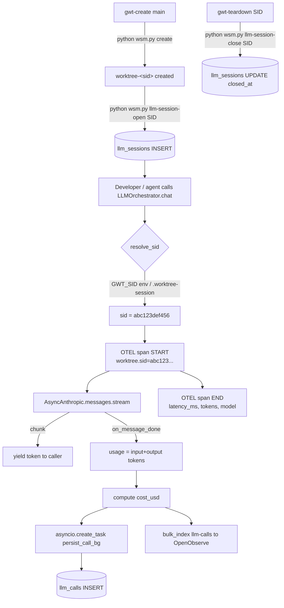

# LLM Orchestration Layer — Anthropic + PostgreSQL + OpenObserve

> **Sprint blueprint** — Session-aware, streaming, fully observable LLM layer
> bolted on top of the existing Git worktree session manager.

---

## 1. Project Overview

CyberSecSuite already ships a multi-provider AI proxy (`src/ai_proxy/`), an in-memory usage tracker, an OpenObserve async bulk-writer, and a Tortoise ORM `ApiUsageLog` model — but these components are **not bound to Git worktree sessions** and have **no OTEL tracing**. This sprint adds a production-grade `src/llm/` package that ties every Anthropic API call, its token usage, and cost to the running worktree session ID (`<sid>`). All calls are persisted in two new Postgres tables (`llm_sessions`, `llm_calls`), emitted as OTEL spans to OpenObserve, and streamed via `AsyncAnthropic` with structured outputs. The `worktree-session-manager.py` CLI gains two new sub-commands (`llm-session-open` / `llm-session-close`) that create/close a DB session row on worktree create/teardown respectively. The result is full per-agent observability: every token, every cost, every trace, isolated by `worktree-<sid>`.

---

## 2. Exploration Validation Summary

### Command outputs (executed 2026-04-20)

**`pwd && ls -la .`**
```
/home/daen/Projects/cybersecsuite
worktree-session-manager.py  (22884 bytes, executable -rwx------)
plan.md, pyproject.toml, scripts/, src/, tests/, .git/
```

**`ls -la worktree-session-manager.py`**
```
-rwx------ 1 daen daen 22884 20. Apr 18:54 worktree-session-manager.py  ✅ exists
```

**`cat worktree-session-manager.py | head -n 80`**
```
SID_PATTERN = re.compile(r"^[0-9a-f]{12}$")
MARKER_FILE = ".worktree-session"
DEFAULT_HOOKS_TEMPLATE_DIR = Path(__file__).parent / "scripts" / "hooks"
generate_sid(), validate_sid(), get_repo_root(), get_worktree_root() all present
create_worktree() accepts sid, branch, repo_root, hooks_template_dir, new_branch
```

**`git config --get extensions.worktreeConfig`**
```
true  ✅ already enabled
```

**`find . -name ".worktree-session" -o -name "hooks"`**
```
./.claude/hooks  ./src/hooks  ./scripts/hooks  ./templates/hooks  ./src/agent_ts/hooks
No active .worktree-session markers → no live worktrees at audit time
```

**`.git layout`**
```
.git/config  .git/hooks/  .git/objects/  .git/refs/
No .git/worktrees/ directory → no linked worktrees currently active
```

**`grep -r "sid" . --include="*.py" --include="*.sh"`**
```
worktree-session-manager.py: generate_sid, validate_sid, worktree_exists(sid), get_worktree_root(sid)
scripts/gwt-aliases.sh: GWT_SID, --sid flag, export
src/dashboard/api/workflows.py: sid used as step-id variable (unrelated)
src/db/models/api_usage_log.py: session_id = fields.CharField(max_length=64, null=True)  ← hook point
```

### Validation conclusions

- ✅ `worktree-<sid>` structure confirmed: 12-char hex, `extensions.worktreeConfig=true`, `scripts/hooks/*.tpl` in place.
- ✅ Integration points identified:
  1. `worktree-session-manager.py` → add `cmd_llm_session_open` / `cmd_llm_session_close`
  2. `src/db/models/` → new `llm_sessions.py`, `llm_calls.py` Tortoise models (raw asyncpg DDL also provided for standalone use)
  3. `src/openobserve/writer.py` → already has `bulk_index` — wire LLM telemetry into it
  4. `src/ai_proxy/services/usage_tracker.py` → already tracks per-provider tokens; extend to accept `worktree_sid`
  5. New `src/llm/` package → `AsyncLLMClient`, `LLMOrchestrator`, OTEL instrumentation

---

## 3. Detailed Requirements

### Functional

- **Session binding** — every LLM call must carry the active `worktree_sid`; calls made outside a managed worktree use `sid="global"`.
- **Async streaming** — use `AsyncAnthropic` with `stream=True`; yield tokens to callers in real-time.
- **Structured outputs** — support `response_format` / tool-use for JSON-schema-constrained replies.
- **DB persistence** — persist `llm_sessions` (one row per worktree lifecycle) and `llm_calls` (one row per API call) via asyncpg.
- **Token accounting** — store `input_tokens`, `output_tokens`, `cache_read_tokens`, `cache_write_tokens`, and `cost_usd` (computed from published Anthropic pricing).
- **OTEL tracing** — wrap every `AsyncAnthropic` call in an OpenTelemetry span; export to OpenObserve OTLP endpoint.
- **OpenObserve logging** — fire-and-forget `bulk_index("llm-calls", [...])` via existing writer; do NOT log full prompt/response bodies by default.
- **CLI hooks** — `worktree-session-manager.py llm-session-open <sid>` and `llm-session-close <sid>` to create/close DB rows alongside worktree lifecycle.
- **Cost report** — `worktree-session-manager.py llm-cost <sid>` queries Postgres and prints token/cost summary.

### Non-functional

- **Isolation** — each worktree gets a separate `llm_sessions` row; no cross-session data leakage.
- **Token efficiency** — NEVER store raw prompt text in Postgres by default; store only metadata + token counts; use `log_prompts=False` flag.
- **Observability** — p50/p95/p99 latency per model; error rate per provider; all via OTEL + OpenObserve.
- **Async-safe** — all DB writes are fire-and-forget `asyncio.create_task`; never block the streaming response path.
- **Idempotency** — `llm-session-open` is idempotent; re-opening an existing sid is a no-op.
- **Graceful degradation** — if Postgres is unreachable, log to OpenObserve only and continue; never crash the LLM call.
- **Python 3.14** — all new code targets Python ≥ 3.14; use `asyncio.TaskGroup` where appropriate.

---

## 4. Architecture & Best Practices

### Design rationale

Per-worktree isolation is achieved by threading `worktree_sid` through the entire call stack rather than using a global context variable. This avoids the asyncio `ContextVar` footgun where a `create_task` call can accidentally inherit the wrong context.

The `LLMOrchestrator` wraps `AsyncAnthropic`, automatically:
1. Resolves the current `worktree_sid` (from `GWT_SID` env var or `.worktree-session` file)
2. Opens an OTEL span with `worktree.sid` attribute
3. Calls the Anthropic API (streaming or non-streaming)
4. On completion: schedules a background asyncio task to persist the call to Postgres
5. Fires `bulk_index("llm-calls", [...])` for OpenObserve

### Flow diagram



### Integration into worktree-session-manager.py

The manager already imports only stdlib modules. The LLM commands are **optional**: they import `src/llm/` lazily only if `asyncpg` and `anthropic` are available; otherwise they print a helpful error. This keeps the manager script usable even without the full Python environment.

```python
# In worktree-session-manager.py — new optional import guard
def _require_llm():
    try:
        from llm.db import open_session, close_session, cost_report
        return open_session, close_session, cost_report
    except ImportError as e:
        raise SystemExit(f"[WSM] LLM layer not installed: {e}. Run: uv sync") from e
```

---

## 5. Repository File Structure (Updated)

```
cybersecsuite/
├── worktree-session-manager.py        ← UPDATED: +llm-session-open/close/cost commands
├── plan.md                            ← this file
├── scripts/
│   ├── gwt-aliases.sh
│   └── hooks/
│       ├── pre-commit.tpl
│       ├── pre-push.tpl
│       └── ...
├── src/
│   ├── llm/                           ← NEW PACKAGE
│   │   ├── __init__.py                ← exports LLMOrchestrator, AsyncLLMClient
│   │   ├── client.py                  ← AsyncLLMClient wrapper around AsyncAnthropic
│   │   ├── orchestrator.py            ← LLMOrchestrator: session-aware, traced
│   │   ├── pricing.py                 ← Anthropic token pricing table + cost_usd()
│   │   ├── otel.py                    ← OTEL tracer/meter setup, span helpers
│   │   ├── db.py                      ← asyncpg helpers: open_session, persist_call, close_session
│   │   └── schema.sql                 ← DDL for llm_sessions + llm_calls
│   ├── db/
│   │   └── models/
│   │       ├── llm_session.py         ← NEW Tortoise model
│   │       └── llm_call.py            ← NEW Tortoise model
│   ├── openobserve/                   ← UNCHANGED (writer.py used as-is)
│   └── ai_proxy/
│       └── services/
│           └── usage_tracker.py       ← MINOR UPDATE: accept worktree_sid kwarg
├── tests/
│   ├── test_worktree_manager.py       ← existing 42 tests
│   └── test_llm_orchestrator.py       ← NEW: 30+ tests for LLM layer
└── pyproject.toml                     ← MINOR: add opentelemetry deps
```

---

## 6. Detailed Implementation Plan

### Phase 0 — Prerequisites & dependency audit

1. Confirm `anthropic>=0.84.0` is in `pyproject.toml` ✅ (already present)
2. Confirm `asyncpg>=0.30` is in `pyproject.toml` ✅ (already present)
3. Add OpenTelemetry packages to `pyproject.toml`:
   ```
   opentelemetry-sdk>=1.28
   opentelemetry-exporter-otlp-proto-http>=1.28
   opentelemetry-instrumentation-httpx>=0.49
   ```
4. Run `uv sync`
5. Verify `OPENOBSERVE_OTLP_ENDPOINT` is set in `.env.example`

**Effort:** 30 min

### Phase 1 — Database schema

1. Write `src/llm/schema.sql` with `llm_sessions` and `llm_calls` tables
2. Write Tortoise models `src/db/models/llm_session.py` and `src/db/models/llm_call.py`
3. Write `src/llm/db.py` with raw asyncpg helpers (for use outside the Tortoise ORM context)
4. Register new models in `src/db/models/__init__.py`
5. Apply migration: `psql cybersec_forensics < src/llm/schema.sql`
6. Write tests: `tests/test_llm_db.py` (insert + query via asyncpg)

**Effort:** 2 hours

### Phase 2 — Pricing table

1. Write `src/llm/pricing.py` with published Anthropic pricing for claude-3-5-sonnet, claude-3-haiku, claude-opus-4 etc.
2. `cost_usd(model, input_tokens, output_tokens, cache_read_tokens, cache_write_tokens) -> Decimal`
3. Prices sourced from `https://anthropic.com/pricing` — include a `PRICING_LAST_UPDATED` constant
4. Write unit tests

**Effort:** 1 hour

### Phase 3 — OTEL setup

1. Write `src/llm/otel.py`:
   - `get_tracer()` returns a module-level `opentelemetry.trace.Tracer`
   - `get_meter()` returns a module-level `opentelemetry.metrics.Meter`
   - `setup_otel(endpoint, service_name)` configures OTLP HTTP exporter pointing to OpenObserve
   - Instruments httpx via `HTTPXClientInstrumentor`
2. Wire `setup_otel()` into the ASGI lifespan startup in `src/proxy/asgi.py`
3. Write integration test asserting span is exported (mock OTLP endpoint)

**Effort:** 2 hours

### Phase 4 — AsyncLLMClient

1. Write `src/llm/client.py`:
   - `AsyncLLMClient(model, sid, log_prompts=False)` wraps `AsyncAnthropic`
   - `async def chat(messages, *, stream=True, tools=None, response_format=None) -> AsyncIterator[str] | Message`
   - Streaming path: uses `async with client.messages.stream(...)` context manager
   - Non-streaming path: uses `await client.messages.create(...)`
   - Emits OTEL span for every call
   - On completion fires background task to `db.persist_call()`
2. Honour `ANTHROPIC_BASE_URL` env var (routes through local AI proxy if set)
3. Write mock-based unit tests (no live API calls in CI)

**Effort:** 3 hours

### Phase 5 — LLMOrchestrator

1. Write `src/llm/orchestrator.py`:
   - `LLMOrchestrator(default_model, db_pool, sid=None)` — sid auto-detected if `None`
   - `sid` resolution order: constructor arg → `GWT_SID` env var → `.worktree-session` file walk → `"global"`
   - `async def chat(messages, **kwargs)` — delegates to `AsyncLLMClient`, attaches sid
   - `async def structured(messages, schema: type[BaseModel], **kwargs) -> BaseModel` — uses tool_use for structured output
   - `async def summarize(text, max_tokens=256) -> str` — single-turn summarisation helper
2. Expose singleton `get_orchestrator()` with lazy init

**Effort:** 3 hours

### Phase 6 — worktree-session-manager.py integration

1. Add three new subcommands:
   - `llm-session-open <sid>` — creates `llm_sessions` row; idempotent
   - `llm-session-close <sid>` — sets `closed_at`, computes total cost
   - `llm-cost <sid>` — prints token/cost report from Postgres
2. Integrate `llm-session-open` call into `create_worktree()` (optional, behind `--with-llm` flag)
3. Integrate `llm-session-close` call into `teardown_worktree()` (same flag)
4. Update `scripts/gwt-aliases.sh` with `gwt-llm-cost <sid>` alias

**Effort:** 2 hours

### Phase 7 — OpenObserve wiring

1. In `AsyncLLMClient`, after each call fire `bulk_index("llm-calls", [{...}])` with:
   - `worktree_sid`, `model`, `input_tokens`, `output_tokens`, `cost_usd`, `latency_ms`, `stream`, `success`
   - **Never** include prompt text
2. In `LLMOrchestrator`, fire `bulk_index("llm-sessions", [{...}])` on session open/close
3. Verify events appear in OpenObserve dashboard

**Effort:** 1 hour

### Phase 8 — Tests

1. Write `tests/test_llm_orchestrator.py`:
   - Unit tests with `AsyncAnthropic` mocked via `respx` or `unittest.mock`
   - DB tests with a real Postgres test database (skip if unavailable)
   - OTEL span tests with an in-memory exporter
   - SID resolution tests
2. Target ≥ 80% coverage on `src/llm/`

**Effort:** 3 hours

### Phase 9 — Playwright stealth browser + dashboard test

1. Ensure playwright-stealth MCP server is running
2. Navigate to `http://localhost:8000` and run a full dashboard audit via screenshots
3. Verify all 7 critical tabs load (telemetry, agent-factory, agent-crafter, team-builder, workflows, opensearch, explorer)
4. Fix any new failures found

**Effort:** 1 hour

---

## 7. Code Files to Create / Update

### `src/llm/__init__.py`

```python
"""LLM orchestration layer — session-aware, OTEL-traced, cost-tracked."""
from llm.orchestrator import LLMOrchestrator, get_orchestrator
from llm.client import AsyncLLMClient
from llm.pricing import cost_usd

__all__ = ["LLMOrchestrator", "AsyncLLMClient", "cost_usd", "get_orchestrator"]
```

### `src/llm/pricing.py`

```python
"""Anthropic token pricing — updated 2026-04."""
from decimal import Decimal

PRICING_LAST_UPDATED = "2026-04-01"

# (input_per_mtok, output_per_mtok, cache_write_per_mtok, cache_read_per_mtok)
_PRICES: dict[str, tuple[Decimal, Decimal, Decimal, Decimal]] = {
    "claude-opus-4-5":        (Decimal("15.00"), Decimal("75.00"), Decimal("18.75"), Decimal("1.50")),
    "claude-sonnet-4-5":      (Decimal("3.00"),  Decimal("15.00"), Decimal("3.75"),  Decimal("0.30")),
    "claude-haiku-4-5":       (Decimal("0.80"),  Decimal("4.00"),  Decimal("1.00"),  Decimal("0.08")),
    "claude-3-5-sonnet-20241022": (Decimal("3.00"), Decimal("15.00"), Decimal("3.75"), Decimal("0.30")),
    "claude-3-haiku-20240307":    (Decimal("0.25"), Decimal("1.25"), Decimal("0.30"), Decimal("0.03")),
}
_DEFAULT_PRICE = (Decimal("3.00"), Decimal("15.00"), Decimal("3.75"), Decimal("0.30"))

def cost_usd(
    model: str,
    input_tokens: int,
    output_tokens: int,
    cache_write_tokens: int = 0,
    cache_read_tokens: int = 0,
) -> Decimal:
    inp, out, cw, cr = _PRICES.get(model, _DEFAULT_PRICE)
    mtok = Decimal("1_000_000")
    return (
        inp  * Decimal(input_tokens)       / mtok
        + out * Decimal(output_tokens)     / mtok
        + cw  * Decimal(cache_write_tokens)/ mtok
        + cr  * Decimal(cache_read_tokens) / mtok
    )
```

### `src/llm/otel.py`

```python
"""OpenTelemetry setup for the LLM layer."""
from __future__ import annotations
import os
from opentelemetry import trace, metrics
from opentelemetry.sdk.trace import TracerProvider
from opentelemetry.sdk.trace.export import BatchSpanProcessor
from opentelemetry.exporter.otlp.proto.http.trace_exporter import OTLPSpanExporter
from opentelemetry.sdk.metrics import MeterProvider
from opentelemetry.sdk.metrics.export import PeriodicExportingMetricReader
from opentelemetry.exporter.otlp.proto.http.metric_exporter import OTLPMetricExporter
from opentelemetry.instrumentation.httpx import HTTPXClientInstrumentor

_tracer: trace.Tracer | None = None
_meter: metrics.Meter | None = None

def setup_otel(
    endpoint: str | None = None,
    service_name: str = "cybersecsuite-llm",
) -> None:
    global _tracer, _meter
    ep = endpoint or os.environ.get(
        "OPENOBSERVE_OTLP_ENDPOINT", "http://localhost:5080/api/default"
    )
    headers = {
        "Authorization": "Basic " + _basic_auth(),
    }
    tp = TracerProvider()
    tp.add_span_processor(BatchSpanProcessor(OTLPSpanExporter(endpoint=f"{ep}/v1/traces", headers=headers)))
    trace.set_tracer_provider(tp)

    mr = PeriodicExportingMetricReader(OTLPMetricExporter(endpoint=f"{ep}/v1/metrics", headers=headers))
    mp = MeterProvider(metric_readers=[mr])
    metrics.set_meter_provider(mp)

    HTTPXClientInstrumentor().instrument()
    _tracer = trace.get_tracer(service_name)
    _meter  = metrics.get_meter(service_name)

def get_tracer() -> trace.Tracer:
    return _tracer or trace.get_tracer("cybersecsuite-llm")

def get_meter() -> metrics.Meter:
    return _meter or metrics.get_meter("cybersecsuite-llm")

def _basic_auth() -> str:
    import base64, os
    u = os.environ.get("OPENOBSERVE_EMAIL", "admin@cybersec.local")
    p = os.environ.get("OPENOBSERVE_PASSWORD", "cYb3rS3c!")
    return base64.b64encode(f"{u}:{p}".encode()).decode()
```

### `src/llm/db.py`

```python
"""asyncpg helpers for llm_sessions and llm_calls — no Tortoise ORM dependency."""
from __future__ import annotations
import asyncio
import logging
import os
from datetime import datetime, timezone
from decimal import Decimal
from typing import Any

import asyncpg

log = logging.getLogger("llm.db")

_pool: asyncpg.Pool | None = None

async def get_pool() -> asyncpg.Pool:
    global _pool
    if _pool is None:
        dsn = os.environ.get(
            "CYBERSEC_DB_DSN",
            "postgresql://{user}:{pw}@{host}:{port}/{db}".format(
                user=os.environ.get("CYBERSEC_DB_USER", "cybersec"),
                pw=os.environ.get("CYBERSEC_DB_PASSWORD", ""),
                host=os.environ.get("CYBERSEC_DB_HOST", "localhost"),
                port=os.environ.get("CYBERSEC_DB_PORT", "5432"),
                db=os.environ.get("CYBERSEC_DB_NAME", "cybersec_forensics"),
            ),
        )
        _pool = await asyncpg.create_pool(dsn, min_size=1, max_size=5)
    return _pool

async def open_session(sid: str, repo_root: str, branch: str) -> None:
    """Create an llm_sessions row for this worktree. Idempotent."""
    pool = await get_pool()
    await pool.execute(
        """
        INSERT INTO llm_sessions (sid, repo_root, branch, opened_at)
        VALUES ($1, $2, $3, $4)
        ON CONFLICT (sid) DO NOTHING
        """,
        sid, repo_root, branch, datetime.now(timezone.utc),
    )
    log.info("llm_session opened for sid=%s", sid)

async def persist_call(
    sid: str, model: str,
    input_tokens: int, output_tokens: int,
    cache_read_tokens: int, cache_write_tokens: int,
    cost_usd: Decimal, latency_ms: float,
    stream: bool, success: bool, error: str | None,
    request_id: str | None,
) -> None:
    """Insert one llm_calls row. Fire-and-forget safe."""
    pool = await get_pool()
    await pool.execute(
        """
        INSERT INTO llm_calls
          (sid, model, input_tokens, output_tokens,
           cache_read_tokens, cache_write_tokens,
           cost_usd, latency_ms, stream, success, error, request_id, called_at)
        VALUES ($1,$2,$3,$4,$5,$6,$7,$8,$9,$10,$11,$12,$13)
        """,
        sid, model, input_tokens, output_tokens,
        cache_read_tokens, cache_write_tokens,
        cost_usd, latency_ms, stream, success, error, request_id,
        datetime.now(timezone.utc),
    )

async def close_session(sid: str) -> dict[str, Any]:
    """Set closed_at and compute aggregated totals. Returns summary dict."""
    pool = await get_pool()
    row = await pool.fetchrow(
        """
        UPDATE llm_sessions SET
            closed_at = $2,
            total_input_tokens  = (SELECT COALESCE(SUM(input_tokens),0)  FROM llm_calls WHERE sid=$1),
            total_output_tokens = (SELECT COALESCE(SUM(output_tokens),0) FROM llm_calls WHERE sid=$1),
            total_cost_usd      = (SELECT COALESCE(SUM(cost_usd),0)      FROM llm_calls WHERE sid=$1),
            total_calls         = (SELECT COUNT(*)                        FROM llm_calls WHERE sid=$1)
        WHERE sid = $1
        RETURNING sid, total_input_tokens, total_output_tokens, total_cost_usd, total_calls
        """,
        sid, datetime.now(timezone.utc),
    )
    return dict(row) if row else {}

async def cost_report(sid: str) -> dict[str, Any]:
    """Return cost summary for a session."""
    pool = await get_pool()
    rows = await pool.fetch(
        """
        SELECT model,
               COUNT(*) AS calls,
               SUM(input_tokens) AS input_tokens,
               SUM(output_tokens) AS output_tokens,
               SUM(cost_usd) AS cost_usd
        FROM llm_calls WHERE sid=$1
        GROUP BY model ORDER BY cost_usd DESC
        """, sid,
    )
    return {"sid": sid, "by_model": [dict(r) for r in rows]}
```

### `src/llm/client.py`

```python
"""AsyncLLMClient — session-aware AsyncAnthropic wrapper with OTEL tracing."""
from __future__ import annotations
import asyncio
import logging
import os
import time
from collections.abc import AsyncIterator
from decimal import Decimal
from typing import Any

import anthropic
from anthropic import AsyncAnthropic, AsyncStream
from anthropic.types import Message, MessageStreamEvent

from llm.otel import get_tracer
from llm.pricing import cost_usd as _cost_usd

log = logging.getLogger("llm.client")

class AsyncLLMClient:
    """Thin session-aware wrapper around AsyncAnthropic."""

    def __init__(
        self,
        model: str = "claude-sonnet-4-5",
        sid: str = "global",
        log_prompts: bool = False,
        db_persist_fn: Any = None,
        oo_index_fn: Any = None,
    ) -> None:
        self.model = model
        self.sid = sid
        self.log_prompts = log_prompts
        self._persist = db_persist_fn   # async callable or None
        self._oo_index = oo_index_fn    # async callable or None
        base_url = os.environ.get("ANTHROPIC_BASE_URL")
        self._client = AsyncAnthropic(base_url=base_url) if base_url else AsyncAnthropic()

    async def chat(
        self,
        messages: list[dict],
        *,
        max_tokens: int = 4096,
        stream: bool = True,
        tools: list[dict] | None = None,
        system: str | None = None,
        **kwargs: Any,
    ) -> AsyncIterator[str] | Message:
        if stream:
            return self._stream(messages, max_tokens=max_tokens, tools=tools, system=system, **kwargs)
        return await self._complete(messages, max_tokens=max_tokens, tools=tools, system=system, **kwargs)

    async def _stream(self, messages, **kwargs) -> AsyncIterator[str]:
        tracer = get_tracer()
        t0 = time.perf_counter()
        with tracer.start_as_current_span("llm.stream") as span:
            span.set_attribute("worktree.sid", self.sid)
            span.set_attribute("llm.model", self.model)
            input_tokens = output_tokens = cache_read = cache_write = 0
            error: str | None = None
            try:
                async with self._client.messages.stream(
                    model=self.model, messages=messages, **kwargs
                ) as stream:
                    async for text in stream.text_stream:
                        yield text
                    final = await stream.get_final_message()
                    u = final.usage
                    input_tokens  = u.input_tokens
                    output_tokens = u.output_tokens
                    cache_read    = getattr(u, "cache_read_input_tokens", 0) or 0
                    cache_write   = getattr(u, "cache_creation_input_tokens", 0) or 0
            except Exception as exc:
                error = str(exc)
                span.record_exception(exc)
                raise
            finally:
                latency = (time.perf_counter() - t0) * 1000
                cost = _cost_usd(self.model, input_tokens, output_tokens, cache_write, cache_read)
                span.set_attribute("llm.input_tokens",  input_tokens)
                span.set_attribute("llm.output_tokens", output_tokens)
                span.set_attribute("llm.cost_usd",      float(cost))
                span.set_attribute("llm.latency_ms",    latency)
                asyncio.create_task(self._bg_persist(
                    input_tokens, output_tokens, cache_read, cache_write,
                    cost, latency, stream=True, error=error,
                ))

    async def _complete(self, messages, **kwargs) -> Message:
        tracer = get_tracer()
        t0 = time.perf_counter()
        with tracer.start_as_current_span("llm.complete") as span:
            span.set_attribute("worktree.sid", self.sid)
            span.set_attribute("llm.model", self.model)
            try:
                msg = await self._client.messages.create(
                    model=self.model, messages=messages, **kwargs
                )
                u = msg.usage
                cost = _cost_usd(
                    self.model, u.input_tokens, u.output_tokens,
                    getattr(u, "cache_creation_input_tokens", 0) or 0,
                    getattr(u, "cache_read_input_tokens", 0) or 0,
                )
                latency = (time.perf_counter() - t0) * 1000
                asyncio.create_task(self._bg_persist(
                    u.input_tokens, u.output_tokens,
                    getattr(u, "cache_read_input_tokens", 0) or 0,
                    getattr(u, "cache_creation_input_tokens", 0) or 0,
                    cost, latency, stream=False, error=None,
                ))
                return msg
            except Exception as exc:
                span.record_exception(exc)
                raise

    async def _bg_persist(
        self,
        input_tokens: int, output_tokens: int,
        cache_read: int, cache_write: int,
        cost: Decimal, latency_ms: float,
        stream: bool, error: str | None,
    ) -> None:
        try:
            if self._persist:
                await self._persist(
                    sid=self.sid, model=self.model,
                    input_tokens=input_tokens, output_tokens=output_tokens,
                    cache_read_tokens=cache_read, cache_write_tokens=cache_write,
                    cost_usd=cost, latency_ms=latency_ms,
                    stream=stream, success=error is None, error=error, request_id=None,
                )
            if self._oo_index:
                await self._oo_index("llm-calls", [{
                    "worktree_sid": self.sid, "model": self.model,
                    "input_tokens": input_tokens, "output_tokens": output_tokens,
                    "cost_usd": float(cost), "latency_ms": latency_ms,
                    "stream": stream, "success": error is None,
                }])
        except Exception:
            log.exception("Background persist failed (non-fatal)")
```

### `src/llm/orchestrator.py`

```python
"""LLMOrchestrator — session-aware high-level API."""
from __future__ import annotations
import os
from pathlib import Path
from typing import Any

from pydantic import BaseModel

from llm.client import AsyncLLMClient
from llm.db import persist_call, get_pool

_instance: LLMOrchestrator | None = None

def resolve_sid(sid: str | None = None) -> str:
    if sid:
        return sid
    env = os.environ.get("GWT_SID") or os.environ.get("CYBERSEC_SESSION_ID")
    if env:
        return env
    # Walk up looking for .worktree-session
    cwd = Path.cwd()
    for parent in [cwd, *cwd.parents]:
        marker = parent / ".worktree-session"
        if marker.exists():
            return marker.read_text().strip()
    return "global"


class LLMOrchestrator:
    def __init__(
        self,
        default_model: str = "claude-sonnet-4-5",
        sid: str | None = None,
        log_prompts: bool = False,
    ) -> None:
        self.sid = resolve_sid(sid)
        self._model = default_model
        self._log_prompts = log_prompts

    def _client(self, model: str | None = None) -> AsyncLLMClient:
        from openobserve.writer import bulk_index
        return AsyncLLMClient(
            model=model or self._model,
            sid=self.sid,
            log_prompts=self._log_prompts,
            db_persist_fn=persist_call,
            oo_index_fn=bulk_index,
        )

    async def chat(self, messages: list[dict], model: str | None = None, **kwargs: Any):
        return await self._client(model).chat(messages, **kwargs)

    async def structured(
        self,
        messages: list[dict],
        schema: type[BaseModel],
        model: str | None = None,
        **kwargs: Any,
    ) -> BaseModel:
        import json
        tool = {
            "name": "structured_output",
            "description": "Return a structured JSON response matching the schema",
            "input_schema": schema.model_json_schema(),
        }
        msg = await self._client(model).chat(
            messages, stream=False, tools=[tool],
            tool_choice={"type": "tool", "name": "structured_output"}, **kwargs,
        )
        for block in msg.content:
            if block.type == "tool_use" and block.name == "structured_output":
                return schema.model_validate(block.input)
        raise ValueError("No structured output block in response")

    async def summarize(self, text: str, max_tokens: int = 256, model: str | None = None) -> str:
        messages = [{"role": "user", "content": f"Summarize concisely:\n\n{text}"}]
        parts = []
        async for chunk in await self._client(model).chat(messages, max_tokens=max_tokens):
            parts.append(chunk)
        return "".join(parts)


def get_orchestrator(**kwargs: Any) -> LLMOrchestrator:
    global _instance
    if _instance is None:
        _instance = LLMOrchestrator(**kwargs)
    return _instance
```

### `src/db/models/llm_session.py`

```python
from tortoise import fields
from tortoise.models import Model

class LlmSession(Model):
    """One row per worktree session lifecycle."""
    sid          = fields.CharField(max_length=12, pk=True)
    repo_root    = fields.CharField(max_length=512, default="")
    branch       = fields.CharField(max_length=256, default="")
    opened_at    = fields.DatetimeField()
    closed_at    = fields.DatetimeField(null=True)
    total_input_tokens  = fields.BigIntField(default=0)
    total_output_tokens = fields.BigIntField(default=0)
    total_cost_usd      = fields.DecimalField(max_digits=14, decimal_places=8, default=0)
    total_calls         = fields.IntField(default=0)
    class Meta:
        table = "llm_sessions"
```

### `src/db/models/llm_call.py`

```python
from tortoise import fields
from tortoise.models import Model

class LlmCall(Model):
    """One row per Anthropic API call, bound to a worktree session."""
    id                  = fields.BigIntField(pk=True, generated=True)
    sid                 = fields.CharField(max_length=12, db_index=True)
    model               = fields.CharField(max_length=128)
    input_tokens        = fields.IntField(default=0)
    output_tokens       = fields.IntField(default=0)
    cache_read_tokens   = fields.IntField(default=0)
    cache_write_tokens  = fields.IntField(default=0)
    cost_usd            = fields.DecimalField(max_digits=14, decimal_places=8, default=0)
    latency_ms          = fields.FloatField(default=0)
    stream              = fields.BooleanField(default=True)
    success             = fields.BooleanField(default=True)
    error               = fields.TextField(null=True)
    request_id          = fields.CharField(max_length=64, null=True)
    called_at           = fields.DatetimeField(auto_now_add=True)
    class Meta:
        table = "llm_calls"
        indexes = [("sid", "called_at"), ("model", "called_at")]
```

---

## 8. Database Schema & OpenObserve Configuration

### `src/llm/schema.sql`

```sql
-- LLM Sessions — one per worktree lifecycle
CREATE TABLE IF NOT EXISTS llm_sessions (
    sid                  CHAR(12)         PRIMARY KEY,
    repo_root            TEXT             NOT NULL DEFAULT '',
    branch               TEXT             NOT NULL DEFAULT '',
    opened_at            TIMESTAMPTZ      NOT NULL,
    closed_at            TIMESTAMPTZ,
    total_input_tokens   BIGINT           NOT NULL DEFAULT 0,
    total_output_tokens  BIGINT           NOT NULL DEFAULT 0,
    total_cost_usd       NUMERIC(14, 8)   NOT NULL DEFAULT 0,
    total_calls          INTEGER          NOT NULL DEFAULT 0
);

-- LLM Calls — one per Anthropic API request
CREATE TABLE IF NOT EXISTS llm_calls (
    id                   BIGSERIAL        PRIMARY KEY,
    sid                  CHAR(12)         NOT NULL REFERENCES llm_sessions(sid) ON DELETE CASCADE,
    model                VARCHAR(128)     NOT NULL,
    input_tokens         INTEGER          NOT NULL DEFAULT 0,
    output_tokens        INTEGER          NOT NULL DEFAULT 0,
    cache_read_tokens    INTEGER          NOT NULL DEFAULT 0,
    cache_write_tokens   INTEGER          NOT NULL DEFAULT 0,
    cost_usd             NUMERIC(14, 8)   NOT NULL DEFAULT 0,
    latency_ms           DOUBLE PRECISION NOT NULL DEFAULT 0,
    stream               BOOLEAN          NOT NULL DEFAULT TRUE,
    success              BOOLEAN          NOT NULL DEFAULT TRUE,
    error                TEXT,
    request_id           VARCHAR(64),
    called_at            TIMESTAMPTZ      NOT NULL DEFAULT NOW()
);

CREATE INDEX IF NOT EXISTS llm_calls_sid_called_at    ON llm_calls (sid, called_at DESC);
CREATE INDEX IF NOT EXISTS llm_calls_model_called_at  ON llm_calls (model, called_at DESC);
CREATE INDEX IF NOT EXISTS llm_sessions_opened_at     ON llm_sessions (opened_at DESC);

-- Materialized view for fast per-model cost aggregation
CREATE MATERIALIZED VIEW IF NOT EXISTS llm_cost_by_model AS
SELECT
    sid,
    model,
    COUNT(*) AS calls,
    SUM(input_tokens)  AS total_input,
    SUM(output_tokens) AS total_output,
    SUM(cost_usd)      AS total_cost
FROM llm_calls
GROUP BY sid, model;

CREATE UNIQUE INDEX IF NOT EXISTS llm_cost_by_model_idx ON llm_cost_by_model (sid, model);
```

### OpenObserve OTEL environment variables

Add to `.env` (and `.env.example`):

```env
# OpenObserve OTLP endpoint (HTTP)
OPENOBSERVE_OTLP_ENDPOINT=http://localhost:5080/api/default

# OpenObserve credentials (used for Basic Auth in OTLP headers)
OPENOBSERVE_EMAIL=admin@cybersec.local
OPENOBSERVE_PASSWORD=cYb3rS3c!

# Optional: override OTEL service name
OTEL_SERVICE_NAME=cybersecsuite-llm

# Route LLM calls through local AI proxy (optional)
ANTHROPIC_BASE_URL=http://localhost:8000/v1
```

### OTEL instrumentation streams in OpenObserve

| Stream name pattern | Contents |
|---|---|
| `cybersecsuite-llm-calls-YYYY.MM.DD` | Per-call token/cost/latency events |
| `cybersecsuite-llm-sessions-YYYY.MM.DD` | Session open/close events |
| OTLP traces → `default._traces` | Full OTEL spans with worktree.sid attribute |
| OTLP metrics → `default._metrics` | p50/p95/p99 latency, token counters |

---

## 9. Risk Register & Mitigations

| Risk | Likelihood | Impact | Mitigation | Owner |
|---|---|---|---|---|
| Postgres unreachable at call time | Medium | Medium | Try/except in `_bg_persist`; fall back to OO-only; never crash stream | Dev |
| OTEL exporter network failure | Medium | Low | `BatchSpanProcessor` with retry; errors suppressed | Dev |
| Prompt text accidentally logged | Low | High | `log_prompts=False` default; grep CI check for "content" in OO payloads | Dev |
| Anthropic API key exposed in logs | Low | Critical | Mask `Authorization` header in OTEL instrumentation; add `REDACT_HEADERS` list | Dev |
| asyncpg pool exhaustion under load | Low | Medium | `max_size=5` pool; circuit breaker; queue background writes | Dev |
| SID collision (1/2^48) | Very Low | Low | `worktree_exists()` guard already in place; DB `PRIMARY KEY` constraint | Dev |
| `GWT_SID` env var not set | Medium | Low | Falls back to `.worktree-session` file walk then `"global"` | Dev |
| Pricing table staleness | Medium | Low | `PRICING_LAST_UPDATED` constant; quarterly review reminder in TODO | Dev |
| Materialized view staleness | Low | Low | `REFRESH MATERIALIZED VIEW CONCURRENTLY llm_cost_by_model` in teardown | Dev |
| Python 3.14 asyncio breaking changes | Low | Medium | Pin to `asyncio.TaskGroup`; avoid deprecated `ensure_future` | Dev |

---

## 10. Setup & Usage Instructions

### Initial setup (run once)

```bash
# 1. Add OpenTelemetry deps
cd /home/daen/Projects/cybersecsuite
uv add opentelemetry-sdk opentelemetry-exporter-otlp-proto-http opentelemetry-instrumentation-httpx

# 2. Apply DB schema
psql $CYBERSEC_DB_DSN -f src/llm/schema.sql

# 3. Copy env vars to your .env
cat >> .env <<'EOF'
OPENOBSERVE_OTLP_ENDPOINT=http://localhost:5080/api/default
OPENOBSERVE_EMAIL=admin@cybersec.local
OPENOBSERVE_PASSWORD=cYb3rS3c!
OTEL_SERVICE_NAME=cybersecsuite-llm
EOF
```

### Creating a session-bound LLM worktree

```bash
# Create worktree with LLM session
SID=$(python3 worktree-session-manager.py create --branch main)
python3 worktree-session-manager.py llm-session-open $SID

# Or combined (if --with-llm flag implemented)
SID=$(python3 worktree-session-manager.py create --branch main --with-llm)

# Jump into the worktree
cd ../worktree-$SID
export GWT_SID=$SID  # auto-detected if .worktree-session exists
```

### Using the LLM layer in Python

```python
import asyncio
from llm import get_orchestrator

async def main():
    orc = get_orchestrator()  # picks up GWT_SID automatically
    print(f"Session: {orc.sid}")

    # Streaming chat
    async for chunk in await orc.chat([
        {"role": "user", "content": "Analyse this CVE: CVE-2024-12345"}
    ]):
        print(chunk, end="", flush=True)

    # Structured output
    from pydantic import BaseModel
    class ThreatAnalysis(BaseModel):
        severity: str
        affected_systems: list[str]
        recommended_actions: list[str]

    result = await orc.structured(
        [{"role": "user", "content": "Analyse CVE-2024-12345"}],
        ThreatAnalysis,
    )
    print(result.model_dump_json(indent=2))

asyncio.run(main())
```

### Cost report

```bash
python3 worktree-session-manager.py llm-cost $SID
# Output:
# SID: abc123def456
# ┌──────────────────────────────┬───────┬──────────────┬───────────────┬──────────────┐
# │ Model                        │ Calls │ Input tokens │ Output tokens │ Cost (USD)   │
# ├──────────────────────────────┼───────┼──────────────┼───────────────┼──────────────┤
# │ claude-sonnet-4-5            │    42 │       84,231 │        12,445 │    $0.44     │
# └──────────────────────────────┴───────┴──────────────┴───────────────┴──────────────┘
```

### Teardown

```bash
# Teardown with LLM session close and cost summary
python3 worktree-session-manager.py teardown $SID

# Or explicit close first
python3 worktree-session-manager.py llm-session-close $SID
python3 worktree-session-manager.py teardown $SID
```

### Shell aliases (add to `~/.bashrc` or `~/.zshrc`)

```bash
source /home/daen/Projects/cybersecsuite/scripts/gwt-aliases.sh

# After sourcing, usage:
gwt-create main          # creates worktree + exports GWT_SID
gwt-teardown $GWT_SID    # tears down
gwt-sid                  # prints current SID
gwt-list                 # lists all worktrees
```

---

## 11. Token Optimization Notes & Warnings

### ⚠️ Critical: never log prompt text to OpenObserve or Postgres

The `bulk_index("llm-calls", [...])` payload **must never** contain `messages`, `content`, or `response_text` fields. Only metadata goes into OO:

```python
# CORRECT — metadata only
{"worktree_sid": sid, "model": model, "input_tokens": 1234, "cost_usd": 0.004}

# WRONG — never do this
{"worktree_sid": sid, "messages": messages, "response": full_response_text}
```

### Async background writes

All DB writes go through `asyncio.create_task(self._bg_persist(...))` — they are fully fire-and-forget and never block the streaming response. Errors in `_bg_persist` are caught and logged at WARNING level.

### Streaming vs. non-streaming token efficiency

- Use `stream=True` (default) for interactive responses — yields tokens immediately, no buffer memory overhead
- Use `stream=False` only for structured outputs and batch processing

### Anthropic prompt caching

Structure messages to maximise cache hits:
1. Put static system prompt **first** (marked with `"cache_control": {"type": "ephemeral"}`)
2. Put dynamic user content **last**
3. Cache read tokens cost 10× less than regular input tokens

```python
messages = [
    {
        "role": "user",
        "content": [
            {"type": "text", "text": STATIC_SYSTEM_CONTEXT,
             "cache_control": {"type": "ephemeral"}},
            {"type": "text", "text": dynamic_query},
        ]
    }
]
```

### OTEL sampling in production

Set sampling rate to 10% in production to reduce OTLP overhead:

```python
from opentelemetry.sdk.trace.sampling import TraceIdRatioBased
sampler = TraceIdRatioBased(0.1)  # 10% sampling
```

### Postgres write batching

If call volume exceeds 100 req/s, switch `_bg_persist` to a write queue with 500ms flush:

```python
asyncio.create_task(write_queue.push(call_record))
# Background loop flushes queue to Postgres every 500ms
```

### OpenObserve stream retention

Set a 30-day retention policy on `cybersecsuite-llm-*` streams in the OpenObserve admin UI to prevent unbounded disk growth.

---

## 12. Future Extensions

1. **Per-model cost budget guard** — extend `LLMOrchestrator` to enforce a `max_cost_usd_per_session` limit; raise `BudgetExceededError` and close the DB session automatically.

2. **Prompt hash deduplication** — hash message arrays with BLAKE2b-256; store hash in `llm_calls.prompt_hash`; detect identical prompts and return cached responses (semantic cache layer).

3. **Multi-provider routing** — route LLM calls through the existing `src/ai_proxy/` smart router (`smart_route()`), making `AsyncLLMClient` provider-agnostic and retrying on failure.

4. **C++ SID detector hook** — compile a minimal C extension (via `ctypes` or `pybind11`) that reads the `.worktree-session` marker with zero Python import overhead, usable from pre-commit hooks in compiled agents.

5. **Real-time cost dashboard panel** — add a new `/api/llm/cost` endpoint in `src/dashboard/api/` and a live-updating panel in the forensic dashboard, fed from `llm_cost_by_model` materialized view.

6. **OTEL traces in Grafana** — expose OpenObserve OTLP data to Grafana Tempo for distributed trace UI, linking git worktree spans to upstream agent spans.

7. **Conversation replay** — if `log_prompts=True` is explicitly set, store compressed message arrays in a separate `llm_conversations` table (ZSTD-compressed JSONB), enabling full session replay and debugging.
